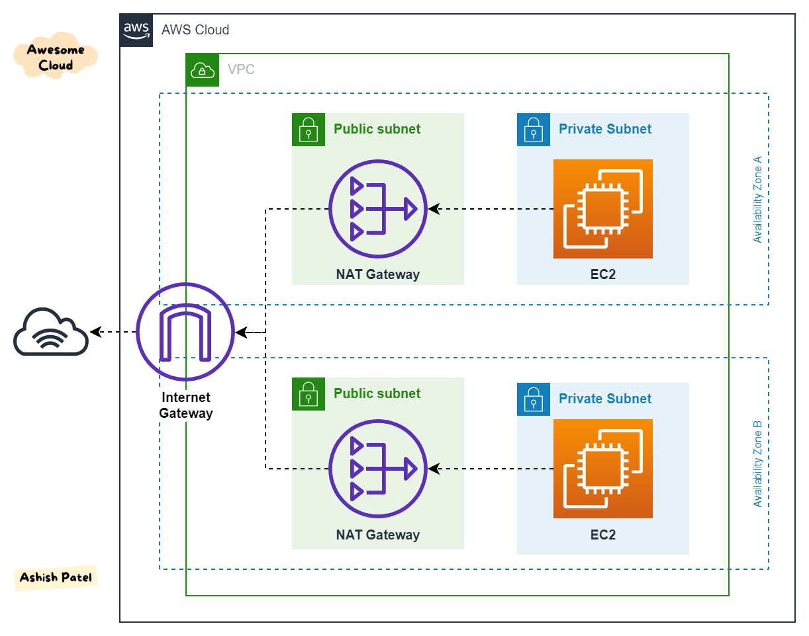
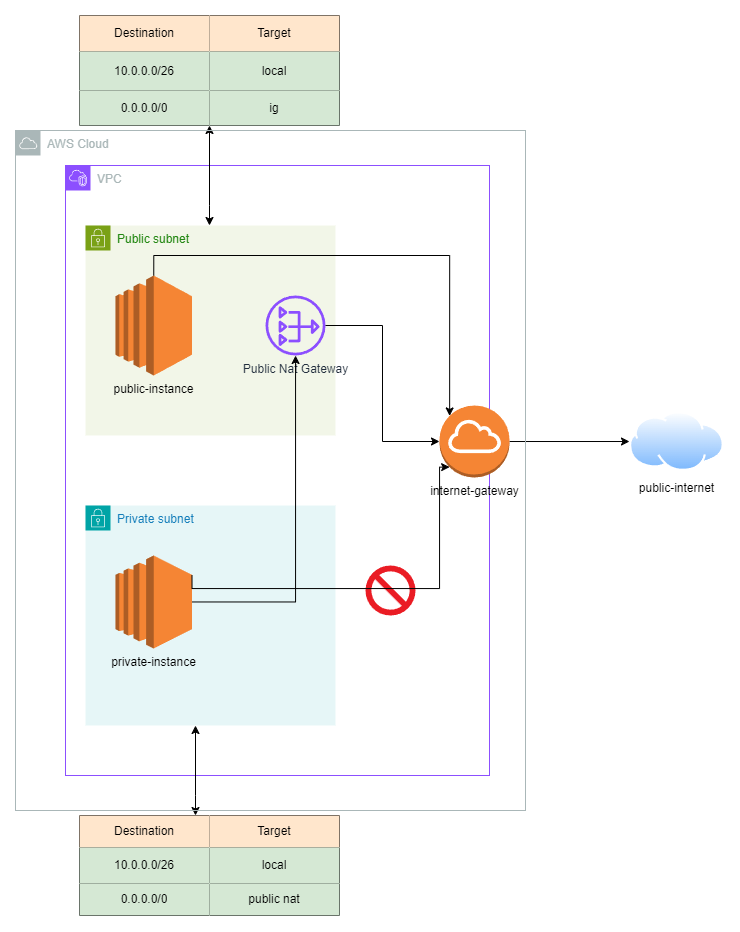
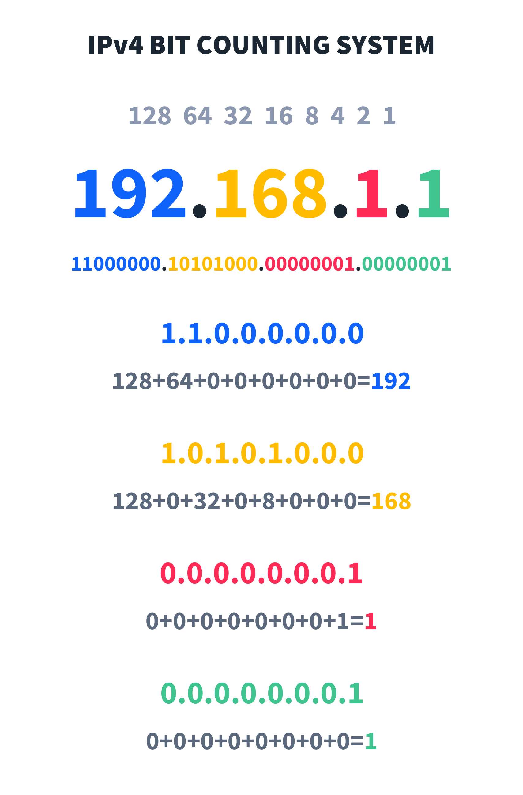
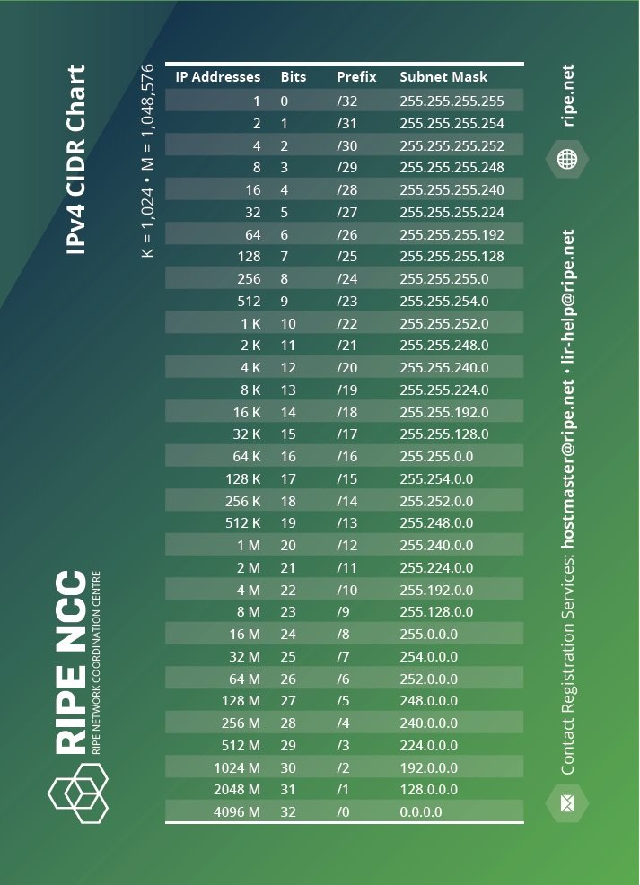
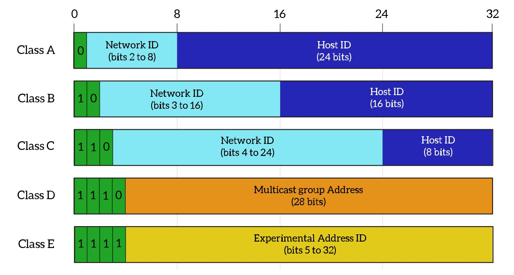

# Networking Fundamentals

## IP Address (Internet Protocol)

It is used to generate or to provide unique address to a device.

_How unique address look like ?_

- Represent in form of IPv4/IPv6
- IPv4
    - 192.168.12.14
    - 10.1.2.4
- Each dot separated value range from 0 to 255
- 0 - 255 \* 0 - 255 \* 0 - 255 \* 0 - 255
- For computer it does not understand number, it only understand bits
- one byte -> 8 bits -> 4 bytes or 32 bits
    - Example 192.168.12.14 in for bits
        - 11000000.10101000.00001100.00001110
- Here number is converted to Octet format

## Subnet

A subnet (short for subnetwork) is **a smaller network created from a bigger network**

The process of splitting network is called subnetting

_Think of it like this_

- A City -> big network
- Ares/blocks inside the city -> subnets

_Why do we need subnets_

Subnets help to:

- Organize devices better
- Reduce traffic (faster communication)
- Improve security
- Privacy
- Manage IP addresses efficiently

_Simple real-world analogy_

Image an office building:

- Building = Network
- Floors = Subnets
- People one each floor = Devices

_Subnet in networking terms_

- A network has many IP addresses
- A subnet divides those IPs into groups
- Example
    - 192.168.1.0
    - you can split it like:
        - Subnet A -> 192.168.1.0 - 192.168.1.127
        - Subnet B -> 192.168.1.128 - 192.168.1.255

_**Each subnet works like a mini network**_

### Types of subnets

#### Public subnet

A **Public subnet** is a subnet where:

- Devices **can send traffic to the internet**
- Devices **can receive traffic from the internet (if allowed)**

_How does that happens?_

A Subnet becomes **public** when:

1. It has route to an Internet Gateway
2. Devices inside it have **public IP addresses**

_**Internet Gateway = door between network and the internet**_



_What usually lives in a public subnet ?_

Public subnets contains resources that must reachable to users:

- Load Balancers
- Web servers (sometimes)
- Bastion / Jump Servers
- NAT Gateways

Example:

- You open <kbd>https://example.com</kbd>
- Your request reaches a public IP
- That IP belongs to a resource in a **public subnet**

#### Private subnet

A **private subnet** is a subnet where:

- Devices **cannot be directly accessed from the internet**
- Devices **do not have public IPs**

> _Important point_
>
> Private subnet does **does NOT mean not internet at all** (❌)
> It means **no direct internet exposure** (✅)



_How to private subnets access the internet then ?_

Private subnets use **a NAR Gateway or NAT instance**.

Flow:

1. Private server -> NAT Gateway
2. NAT Gateway -> Internet
3. Internet response -> NAT -> Private server

- Internet **cannot start** a connection to private subnet
- Private subnet **can start** outbound connections

_What usually lives in private subnet ?_

Private subnet contain **sensitive backend resources**:

- Application servers
- Databases
- Cache (Redis)
- Internal microservices
- Kubernetes worker nodes

These should never be _**exposed directly**_.

### Public vs Private

| Feature                   | Public Subnet        | Private Subnet  |
| ------------------------- | -------------------- | --------------- |
| Internet access           | Direct               | Via NAT         |
| Public IP                 | Yes                  | No              |
| Incoming internet traffic | Allowed (controlled) | Blocked         |
| Security risk             | Higher               | Lower           |
| Typical usage             | Entry point          | Backend systems |

_Example architecture_

1. Public subnet
    - Load Balancer (Public IP)
2. Private subnet
    - App servers
    - Databases

_Flow:_

> User -> Internet -> Load Balancer (Public)
> App server (private)
> Database (private)

### Common private subnets series starts with

_Private IPs start with 10, 172.16–31, and 192.168, and they are used inside networks, not on the public internet._

The three private IP ranges

#### 1. 10.X.X.X -> Large private networks

Range :

> 10.0.0.0 -> 10.255.255.255

Why it is exists:

- Supports **very large networks**
- Used heavily in cloud (AWS, Azure, GCP)

Example:

> 10.0.1.15  
> 10.1.5.22

- Common in **VPCs, kubernetes, microservices**

#### 2. 172.16.X.X - 172.31.X.X -> Medium-sized networks

Range:

> 172.16.0.0 -> 172.31.255.255

> _Important clarification:_
>
> ❌ Not all 172.\* are private  
> ✅ Only 172.16 - 172.32

- Used in **enterprises and corporate networks**

#### 192.168.X.X -> Small networks (home/office)

Range:

> 192.168.0.0 -> 192.168.255.255

This is most familiar range.

Example:

> 192.168.1.1 (router)  
> 192.168.1.10 (laptop)

### CIDR (Classless Inter-Domain Routing)

It is a way to **define how many IP addresses belong to a network**.

It uses this format:

> IP - address / prefix-length

Example :

> 192.168.1.0/24

- 192.168.1.0 -> network address
- /24 -> how may bits are for the network

_Why CIDR exits_

Before CIDR networks were fixed size (Class A/B/C).

CIDR allows **flexible subnet sizes,** so we don't waste IPs.

- CIDR answers two questions:
    1. How big is this network?
    2. How many devices can it hold?

- CIDR Counting System
- 

- CIDR Chart
- 

_*CIDR Calculation*_

An IPv4 address has 32 bits

- <kbd>/24</kbd> bits = network
- Remaining <kbd> 32 - 24 = 8 </kbd> bits = hosts (devices)

**Step 1 : Understand prefix length**

| CIDR | Network bits | Host bits |
| ---- | ------------ | --------- |
| /24  | 24           | 8         |
| /26  | 26           | 6         |
| /28  | 28           | 4         |
| /16  | 16           | 16        |

Rule :

> _**Host bits = 32 - CIDR**_

**Step 2: Calculate number of IPs**

Formula :

> Total IPs = 2 ^ (host bits)  
> Unusable IPs = 2 ^ (host bits) -2
>
> Why -2 ?  
> 1 IP -> Network address  
> 1 IP -> Broadcast address

Example :

```text
============================

1. 192.168.1.0/24

Step A : Host bits

    - 32 - 24 = 8

Step B : Total IPs

    - 2 ^ 8 = 256

Step C : Usable IPs

    - 256 - 2 = 254

Range

Network     :   192.168.1.0
First IP    :   192.168.1.1
Last IP     :   192.168.1.254
BroadCast IP:   192.168.1.255

============================

2. 10.0.0.0/16

32 - 16 = 16

2 ^ 16 = 65,534


============================

3 . 192.168.1.0/26

32 - 26 = 6

2 ^ 6 = 64

usable = 62

Each subnet size = 64 IPs

192.168.1.0     -   192.168.1.63
192.168.1.64    -   192.168.1.127
192.168.1.128   -   192.168.1.191
192.168.1.192   -   192.168.1.255

```

### Class A, B, C Address

IPs were divided into classes:

- Big networks -> Class A
- Medium networks -> Class B
- Small networks -> Class C

Each class fixed how much of the is IP is network vs host:

#### 1. Class A --- Very large networks

Range :

> 1.0.0.0 -> 126.255.255.255
>
> (0 and 127 are reserved)

Structure

> Network.Host.Host.Host
>
> Network part: first octet  
> Host part : last 3 octet

Default subnet mask

> 255.0.0.0 -> /8

Capacity

- Networks : 126
- Hosts per network : ~ 16 million

Example : 10.0.0.1

- Used for _huge networks_
- Private Class A range: 10.0.0.0/8

#### 2. Class B - medium networks

Range :

> 128.0.0.0 -> 191.255.255.255

Structure

> Network.Network.Host.Host
>
> Network part : first 2 octets
> Host part : last 2 octets

Default subnet mask

> 255.255.0.0 -> /16

Capacity

- Networks : ~ 16.000
- Hosts per network : 6,534

Example : 172.16.5.10

- Used for _enterprises_
- Private Class B range: 172.16.0.0 - 172.32.255.255

#### 3. Class C - Small networks

Range :

> 192.0.0.0 -> 223.255.255.255

Structure

> Network.Network.Network.Host
>
> Network part : first 3 octets
> Host part : last octet

Default subnet mask

> 255.255.255.0 -> /24

Capacity

- Networks : ~2 million
- Hosts per network : 254

Example : 192.168.1.10

- Used for _home, small offices_
- Private Class C range: 192.168.0.0/16

#### Classes A vs B vs C Comparison

| Class | Start range | Default CIDR | Hosts per network | Typical use |
| ----- | ----------- | ------------ | ----------------- | ----------- |
| A     | 1–126       | /8           | ~16 million       | Very large  |
| B     | 128–191     | /16          | 65k               | Medium      |
| C     | 192–223     | /24          | 254               | Small       |

#### Reference image (classes)



## Ports

What is a Port ?

A **port** is like a door number on a computer

- IP address -> identifies the building (computer/server)
- Port number -> identifies the specific door/service inside that computer

Example :

```
IP : 192.168.1.10
Port : 443
```

This means :

"Connect to service running on door(port) 443 of this computer."

_Why ports exists_

One server runs many services at the same time:

| Service           | Port |
| ----------------- | ---- |
| Web(HTTP)         | 80   |
| Secure Web(HTTPS) | 443  |
| SSH               | 22   |
| Database(MySQL)   | 3306 |

Without ports, the server wouldn't know which service should receive the data
