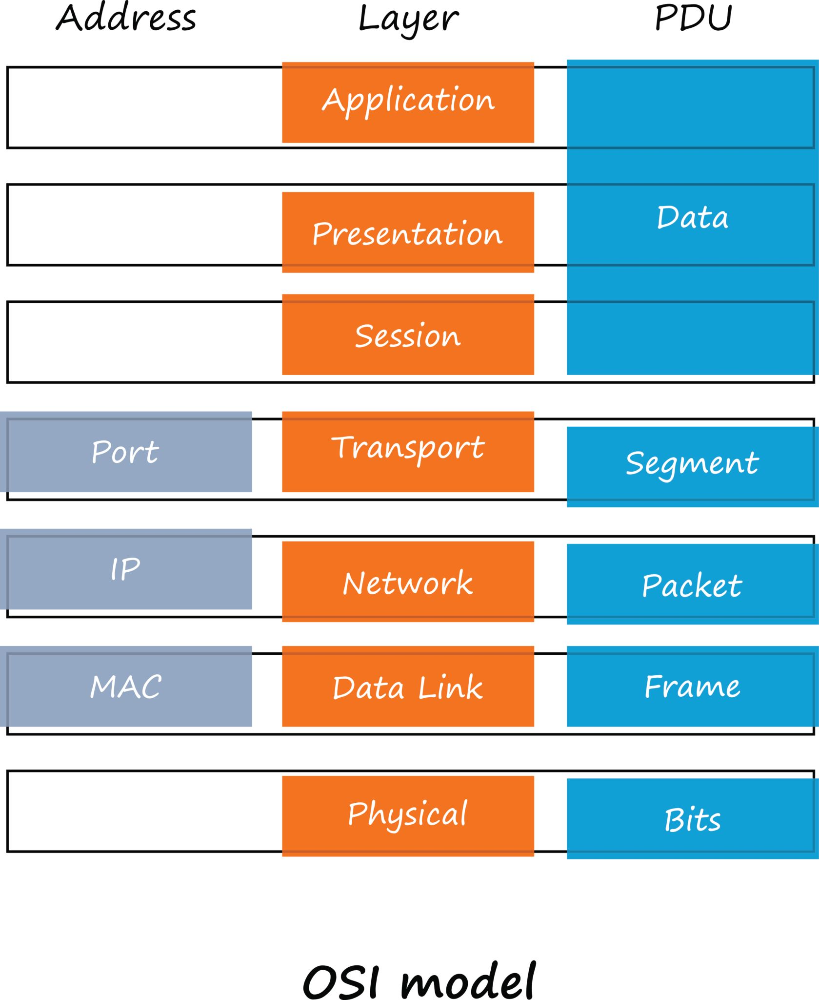

# OSI Model

## Introduction

### What networking means in real life

In Simple terms, networking is the act of computers talking to each other. When you open a website, send a message, watch a video, or call an API, your computer is not magically getting data. Instead, it is exchanging messages with another computer somewhere else in the world using a cables, Wi-Fi, routers, and servers.

### Why the OSI model was created

The OSI model was created as a **conceptual teaching and design model**, not as a software. Its purpose it to explain **how data moves from one system to another in a clean, logical way**.

Event though real systems mostly use the TCP/IP model, the OSI model is still taught becaus it:

- Forces clear thinking
- Separates responsibilities cleanly
- Helps engineers reason about failures

### How does data travels between computers

When your computer sends data:

1. The data starts as something meaningful, like a request for a webpage.
2. Each layer adds its own information, wrapping the data step by step.
3. The final form is converted into electrical or radio signals.
4. These signals travel across the network
5. The receiving computer unwrap the data layer by layer.
6. The original message is delivered to the application

This wrapping and unwrapping process is called encapsulation

## OSI Model

The **OSI (Open Systems Interconnection) Model** is a conceptual framework used to understand how data travels from one computer to another over a network. Developed by the International Organization for Standardization (ISO) in 1984, it divides the complex process of networking into **seven distinct layers**.

Each layer has a specific job and communicates with the layers directly above and below it.

---

### **The 7 Layers of the OSI Model**

#### **7. Application Layer**

- **Responsibility:** This is the only layer that interacts directly with the user. it provides the interface for applications (like web browsers or email clients) to access network services.
- **Key Functions:** Identifying communication partners, determining resource availability, and synchronizing communication.
- **Examples:** HTTP (Web), SMTP (Email), FTP (File Transfer), DNS.

#### **6. Presentation Layer**

- **Responsibility:** This layer acts as a translator. It ensures that data is in a format the application layer can understand.
- **Key Functions:** Data compression, encryption/decryption, and translation (e.g., converting EBCDIC to ASCII).
- **Examples:** SSL/TLS, JPEG, GIF, MPEG.

#### **5. Session Layer**

- **Responsibility:** It manages "sessions"—the opening, closing, and maintaining of a connection between two devices.
- **Key Functions:** Controlling the dialogue between computers (who speaks when), and setting "checkpoints" so if a connection drops, it can resume from the last successful point.
- **Examples:** NetBIOS, RPC, Sockets.

#### **4. Transport Layer**

- **Responsibility:** Ensures that data is delivered reliably, in order, and without errors from the sender to the receiver.
- **Key Functions:** Segmentation (breaking data into smaller pieces), flow control (matching sender speed to receiver capacity), and error correction.
- **Data Unit:** Segments.
- **Examples:** TCP (reliable), UDP (fast but "best-effort").

#### **3. Network Layer**

- **Responsibility:** Responsible for routing data between different networks. It finds the best physical path for the data to reach its destination.
- **Key Functions:** Logical addressing (IP addresses) and routing (choosing the best path).
- **Data Unit:** Packets.
- **Examples:** IPv4, IPv6, ICMP, Routers.

#### **2. Data Link Layer**

- **Responsibility:** Handles node-to-node data transfer (between two devices on the _same_ network).
- **Key Functions:** Physical addressing (MAC addresses), framing (packaging packets for the physical medium), and error detection on the physical link.
- **Sublayers:** **MAC** (Media Access Control) and **LLC** (Logical Link Control).
- **Data Unit:** Frames.
- **Examples:** Ethernet, Wi-Fi, Switches, Bridges.

#### **1. Physical Layer**

- **Responsibility:** The actual hardware layer. It deals with the physical transmission of raw bitstreams over a physical medium (cables, air, etc.).
- **Key Functions:** Defining electrical voltages, cable types, pin layouts, and bit-rate control.
- **Data Unit:** Bits.
- **Examples:** Hubs, Repeaters, Fiber Optics, Ethernet cables.

## 

### **How to Remember the Layers**

The easiest way to memorize them is using mnemonics:

- **Top-Down (Layer 7 to 1):**

    > **A**ll **P**eople **S**eem **T**o **N**eed **D**ata **P**rocessing
    > _(Application, Presentation, Session, Transport, Network, Data Link, Physical)_

- **Bottom-Up (Layer 1 to 7):**
    > **P**lease **D**o **N**ot **T**hrow **S**ausage **P**izza **A**way
    > _(Physical, Data Link, Network, Transport, Session, Presentation, Application)_

### **Why it Matters**

1.  **Troubleshooting:** It helps engineers isolate problems. If your Wi-Fi is connected but you can’t reach a website, the problem is likely at the Network or Application layer, not the Physical layer.
2.  **Standardization:** It allows different vendors (like Cisco, Apple, and Microsoft) to build hardware and software that can all talk to each other.
3.  **Security:** Different security tools operate at different layers (e.g., Firewalls work at Layer 3/4, while Web Application Firewalls work at Layer 7).

#### Protocols and technologies

- **HTTP (Hypertext Transfer Protocol)** defines how browsers request web resources.
- **HTTPS** is HTTP with encryption applied later.
- **FTP (File Transfer Protocol)** defines how files are uploaded and downloaded.
- **SMTP (Simple Mail Transfer Protocol)** defines how emails are sent.

Each protocol exists to serve a specific application purpose.

## OSI Flow

---

## Youtube

### 1. DNS Resolution

- Resolving IP address from Domain name

Example:

- https://www.goggle.com
- DNS resolve the IP address
- For google it is 8.8.8.8

### 2. TCP handshake

- 3 way handshake

### TCP/UDP

---

- Layer 7 -> Http/s requests -> Application layer
- Layer 6 -> encryption/Formatting -> presentation layer
- Layer 5 -> session -> session layer
- Layer 4 -> Segmentation (TCP/UDP) -> transport layer
- Layer 3 -> router(IP of source and destination)-> packet(router) -> Network layer 2
- Layer 2 -> Frames(switches -> MAC address) -> Data Link layer
- Layer 1 -> optical cables -> electronic signals-> physical layer

### TCP/IP Model

-> L7 , L6, L5 are combined
