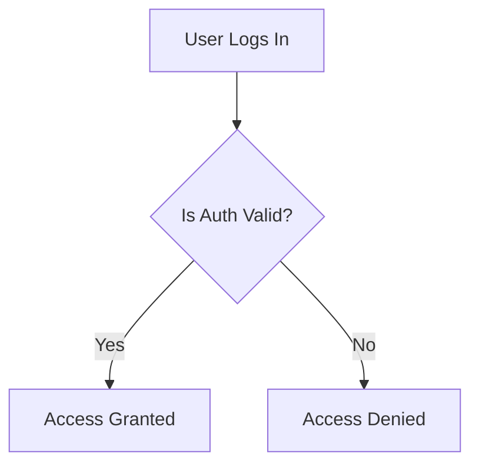

# Authentication and Authorization

## Table of Contents

- [Phase 0 – Cryptography Foundations](#phase-0---cryptography-foundations)
    - [0.1 Terminologies](#01-terminologies)
    - [0.2 Symmetric Cryptography](#02-symmetric-cryptography)
    - [0.3 Asymmetric Cryptography](#03-asymmetric-cryptography)
    - [0.4 Digital Signatures](#04-digital-signatures)
    - [0.5 Hashing & Password Security](#05-hashing--password-security)

- [Phase 1 – Authentication & Authorization Foundations](#phase-1---authentication--authorization-foundations)
    - [1.1 Authentication (AuthN)](#11-authentication-authn)
    - [1.2 Authorization (AuthZ)](#12-authorization-authz)
    - [1.3 Identity (Who)](#13-identity-who)
    - [1.4 Principal (What)](#14-principal-what)
    - [1.5 Policy](#15-policy)
    - [1.6 Permission](#16-permission)
    - [1.7 Analogy](#17-analogy)
    - [1.8 Flow](#18-flow)
    - [1.9 Express middleware responsibility code example](#19-express-middleware-responsibility-code-example)
    - [1.10 Request Lifecycle](#110-request-lifecycle)
    - [1.11 HTTP Semantics](#111-http-semantics)
- [Phase 2 – JWT (Indexed)](#phase-2---jwt-indexed)
- [Phase 3 – OAuth 2.0 (Indexed)](#phase-3---oauth-20-indexed)
- [Phase 4 – OpenID Connect (Indexed)](#phase-4---openid-connect-indexed)
- [Phase 5 – Express Implementation (Indexed)](#phase-5---express-implementation-indexed)

# Phase 0 - Cryptography Foundations

## 0.1 Terminologies

### Cryptography

- Cryptography is the science and practice of securing information by transforming it from readable plaintext into unreadable ciphertext using mathematical algorithms and keys

### Plain Text

- Data in its original, readable form.
- _Example:_ `password123`

### Ciphertext

- Unreadable, transformed version of plain text after cryptographic operation.
- _Example:_ `983089703n83ebx2z211097as349kw122`

### Key

- A Secret value used to transform data.
- This is the actual power in cryptography, **No Security without a key**.

### Encryption

- Converting **plaintext -> ciphertext** using a key, so it can be reversed later.
- **Important property:** Reversible.
- Used when data must be read again later.

### Decryption

- Converting **ciphertext -> plaintext** using a key.
- Only someone with the correct key can decrypt.

### Hash

- A one-way transformation of data.
- **Key properties:**
    - Cannot be reversed.
    - Same input -> Same output.
    - Small change -> Complete different output.
- **Note:** Hashing is not encryption.

### Salt

- Random data added to input before hashing.
- **Why it exists:** Prevents precomputed attacks (rainbow tables).
- **Note:** Salt is not secret -> it is stored with the hash.

### [Signature](#04-digital-signatures)

- Cryptographic proof that:
    - Data was created by a trusted party.
    - Data was not modified.
- A signature proves who sent it and that it hasn't been changed, but it does not hide the information from others.
- **Signature = integrity + authenticity, not secrecy.**
- **Integrity:**
    - It hasn't been tampered with.
    - It ensures that the data you received is exactly what was sent.
    - **How it works:** When a sender signs a document, a mathematical "fingerprint" (called a hash) is created based on the content.
    - **The Result:** If even a single comma or digit is changed in the document after it's signed, the "fingerprint" will no longer match.
- **Authenticity:**
    - It proves the identity of the person or system that created the signature.
    - **How it works:** It uses Asymmetric Cryptography. The sender uses their Private Key (which only they have) to create the signature.
    - **The Result:** Because the recipient uses the sender's public key to verify it, they can be 100% certain it was created by the owner of that specific key. This provides **Non-repudiation**.
- **Not Secrecy:**
    - This is the most common point of confusion. A digital signature is not encryption.
    - If you sign a <kbd>digital</kbd> letter but don't encrypt it, the letter is sent in "plain text".

---

### Core Problems Solved (Cryptography)

- **Keep data secret:** Solved by encryption.
- **Store secrets safely:** Solved by Hashing.
- **Prove trust:** Solved by Signatures.

### Why these are used?

- **Why encryption?** Protect data in transit (HTTPS) and data at rest (DB, backups).
- **Why hashing?** Password storage and verifying integrity.
- **Why signatures?** JWT trusts, OAuth tokens, and API authentication.

### The Signature Logic

- `data + private key -> signature`
- `data + public key -> verification`
- Private key signs data; Public key verifies signature.
- Data cannot be altered without breaking the signature.

---

### Node.js Primitive Examples

#### Hashing

```javascript
import crypto from "crypto";
/**
 * crypto is a built in node.js module
 * Provides cryptographic primitives (hashing, encryption, random bytes)
 *
 * createHash('sha256'):
 *  - creates a hash function using sha256 algorithm (256 bits)
 *
 * update(password)
 *  - Feed input data into the hash function
 *  - You can call update() multiple times for streams
 *
 * digest('hex')
 *  - Finalize the hash and convert binary output -> hex string
 *
 * In production, we do not use raw SHA-256 for passwords (use bcrypt or argon)
 */

function hashPassword(password) {
    const hash = crypto.createHash("sha256").update(password).digest("hex");
    console.log(hash);
    return hash;
}

hashPassword("password123");
```

#### Encrypt & Decrypt

```javascript
import crypto from "crypto";

/**
 * crypto.randomBytes(32)
 *  - Generate a random symmetric key
 *  - 32 bytes = 256 bits
 *  - Used by AES-256
 *
 * crypto.randomBytes(16)
 *  - IV = Initializer vector
 *  - Adds randomness
 *  - Prevents identical plaintext from production identical ciphertext
 *  - IV is not secret, but must be unique
 *
 * crypto.createCipheriv('aes-256-cbc', key, iv);
 *  - Creates an AES cipher
 *  - aws-256-cbc
 *      - AES algorithm
 *      - 256-bits
 *      - CBC mode -> Cipher Blocking chain
 *          - CBC is used here for demo; GCM is preferred in real systems
 * crypto.update(text,'utf-8','hex') + cipher.final('hex');
 *  - update() -> encrypt data
 *  - utf-8 -> input encoding
 *  - hex -> output encoding
 *  - final() -> finishes encryption
 *
 * crypto.createDecipheriv('aes-256-cbc', key, iv);
 *  - Uses same algorithm
 *  - Uses same key
 *  - Uses same IV
 *
 * - This is why symmetric crypto is called symmetric
 */

const key = crypto.randomBytes(32);
const iv = crypto.randomBytes(16);

function encrypt(text) {
    const cipher = crypto.createCipheriv("aes-256-cbc", key, iv);
    return cipher.update(text, "utf-8", "hex") + cipher.final("hex");
}

function decrypt(encrypted) {
    const decipher = crypto.createDecipheriv("aes-256-cbc", key, iv);
    return decipher.update(encrypted, "hex", "utf-8") + decipher.final("utf-8");
}

const secret = encrypt("hello");
console.log(decrypt(secret));
```

- **Block Cipher:** An Encryption algorithm that works on fixed-size blocks of data. Can encrypt only one block at a time.
- **Stream Cipher:** An Encryption algorithm that encrypts data bit-by-bit or byte-by-byte.
- **Block Cipher Mode:** A method that tells the cipher how to encrypt data longer than one block. (CBC one of them).
- **CBC (Cipher Block Chain):** A block cipher mode of operation. CBC chains blocks together so that,each block depends on the previous block
- **IV (Initialization vector):** A random value used only for first block of operation

---

## 0.2 Symmetric Cryptography

- A Cryptography method where the **same key** is used for both Encryption and Decryption.
- **Symmetric Key / Shared secret:** Known to both sender and receiver. whoever has this key can encrypt and decrypt data. Both parties must already trust each other
- **Blocker Cipher:**
    - An algorithm that encrypts data in fixed-size blocks - Example: AES (16-byte block)
- **Stream Cipher:**
    - An algorithm that encrypts data byte-by-byte or bit-by-bit
    - Example: ChaCha20
- **Simple flow:**
    - Plaintext -> Encrypt(key) -> Ciphertext
    - Ciphertext -> Decrypt(key) -> Plaintext
- **Pros:** Fast, efficient, low CPU cost.
- **Cons:** The "Big Problem" — How do two parties securely share the same secret key? If the key is stolen, all data is compromised, Attackers can decrypt everything

### AES (Advanced Encryption Standard)

- It is Encryption algorithm used to convert plaintext to ciphertext using a key.
- A symmetric encryption algorithm used worldwide.
- Default choice for HTTPS, Disk encryption, DBs, and JWT (JWE).

### Authentication Tag (AuthTag) & GCM

- **AuthTag:** Proves data was not modified and the correct key was used.
- **Authenticated Encryption (AEAD):** Provides confidentiality + Integrity + Authenticity.
- **GCM (Galois/Counter Mode):** Preferred today because it provides encryption and authentication at the same time.
- **AES-GCM Outputs:**
    1. Ciphertext
    2. Auth Tag
- A short cryptographic value produced during encryption that proves:
    - That data was not modified
    - The correct key was used
- Authenticate Encryption
    - Encryption that provides:
        - confidentiality (secrecy)
        - Integrity (tamper detection)
        - Authenticity (correct key)
- In Node.js, getAuthTag() and setAuthTag() are methods used specifically with AEAD (Authenticated Encryption with Associated Data) ciphers, such aes-256-gcm or chacha20-ploy305
- With auth tag:
    - Any modification = decryption fails
    - Wrong key = decryption fails
    - Wrong IV = decryption fails
- This is why GCM is preferred today
    - GCM stands for Galois/Counter Mode. It is a "mode of operation" for symmetric key block ciphers(most commonly AES)
    - In simple terms, GCM is a "two-in-one" technology. It provides Encryption(secrecy) and Authentication(Integrity) at the same time.
- AES-GCM produces two outputs
    1. Ciphertext -> encrypted data
    2. Auth Tag -> integrity proof
    - Key + IV + plaintext -> ciphertext + tag
    - The auth tag is calculated using
        - Encrypted data
        - Key
        - IV
        - Optional associated data
    - During decryption
        - Recalculate authTag -> compare with provided authTag
        - If they match -> decrypt
        - If not -> throw error

---

### Complete picture

- `getAuthTag` (The Creation — **Sender Side**)
    - This happens at the end of the **Encryption** process.
    - **Action:** After the computer finishes turning your "hello" into encrypted hex, it generates the final mathematical fingerprint.
    - **The Result:** You call `getAuthTag()` to "pick up" this fingerprint (usually 16 bytes).
    - **Your Job:** You must send this tag along with the encrypted message to the recipient. Without it, they have no way to verify the data.

- `setAuthTag` (The Target — **Receiver Side**)
    - This happens at the start of the **Decryption** process.
    - **Action:** The receiver takes the tag they received and stores it in the `decipher` object.
    - **The Status:** The computer just "holds onto it" and waits. It hasn't checked anything yet; it just knows what the "Target" fingerprint should look like.

- `update` (The Calculation — **Receiver Side**)
    - **Action:** As the computer decrypts the ciphertext, it calculates its own "actual" fingerprint byte-by-byte from the data it is currently processing.
    - **The Status:** It is building a new fingerprint from scratch to see if it matches the one you provided in Step 2.
- `final` (The Comparison — **Receiver Side**)
    - **Action:** The computer puts the two fingerprints side-by-side:
        - **Tag A:** The one you "picked up" via **`getAuthTag`** and "stored" via **`setAuthTag`**.
        - **Tag B:** The one the computer just **calculated** itself during `update`.
    - **The Result:**
        - **If they are identical:** Everything is fine. The data is authentic and hasn't been changed.
        - **If they are different:** It throws an error (`Unsupported state`) and prevents the data from being trusted.

### Summary Table

| Method       | Side     | Purpose                       | Analogy                                           |
| :----------- | :------- | :---------------------------- | :------------------------------------------------ |
| _getAuthTag_ | Sender   | **Create** the proof.         | Printing the "official weight" on a shipping box. |
| _setAuthTag_ | Receiver | **Store** the expected proof. | Telling the guard, "The box should weigh 10kg."   |
| _update_     | Receiver | **Calculate** the new proof.  | The guard putting the box on a scale.             |
| _final_      | Receiver | **Compare** the proofs.       | The guard checking if the scale matches the 10kg. |

This is why **Signature = Integrity + Authenticity**.

- **Integrity:** If someone changed the message, the `update` calculation would result in a different tag, and `final` would fail.
- **Authenticity:** Since the tag is created using your secret Key, only someone with that Key could have created a tag that matches.

**Code:** [symmetricCryptography.js](./code/phase-0/symmetricCryptography.js)

---

## 0.3 Asymmetric Cryptography

- **Key Pair:** Mathematically linked; one cannot exist without the other.
- System using two different keys: **Public Key** and **Private Key**.
    - **Public Key:** Shared openly; used to encrypt data for the owner or verify signatures.
    - **Private Key:** Kept secret; used to decrypt data or create signatures.
- They are generated together and cannot exist independently

### Why it's used

- **Key Distribution:** The process of sharing key securely. This solves the symmetric "shared secret" problem.
    - For data privacy
        - Public key -> encrypt
        - Private key -> decrypt

    - For Signature
        - Private key -> sign
        - Public key -> verify

- **Trust:** Foundation for JWT (RS256), OAuth 2.0, OIDC, and TLS (HTTPS).

### Mathematical property

- Public & Private keys are mathematically related
- But:
    - Public key cannot derive private key
    - Even with unlimited public access
- This relies on:
    - Large prime factorization(RSA)
    - Elliptic curve math(ECC)

### Questions & Real World Usage

- **Why JWT Has RS256:** Auth server signs with Private Key; APIs verify with Public Key. APIs cannot forge tokens.
    - JWT: JSON WEB TOKEN
    - RS256: RSA + SHA-256 (asymmetric signing)
    - Issuer: Entity that create a token
    - Verifier: Entity that validates the token
- **Why OAuth Trusts Tokens:** Tokens are signed claims ("Digital Signatures").
    - OAuth tokens are not encrypted passwords
    - They are signed claims
    - OAuth Token Flow (simplified)

        ```text
            [Authorization server]
                |_ Signs token with private key

            [Resource server]
                |_ Verifies token with public ket
        ```

- **Why HTTPS is Possible:** Uses a TLS Handshake where the server sends a Public Key, the client encrypts a symmetric session key with it, and the server decrypts it with the Private Key.
    - The HTTP problem
        - How can i securely talk to a server i've never met before?
    - TLS handshake
        - Server sends public key(certificate)
        - Client verifies certificates authority(CA)
        - Client generates random symmetric key
        - Client encrypts it with server's public key
        - Server decrypts with private key
    - Now both share a symmetric session key.

- **Code** : [asymmetricCryptography.js](./code/phase-0/asymmetricCryptography.js)

### JWT vs OAuth

- **JWT:** A token format (Header.Payload.Signature). A container for claims.
- **OAuth 2.0:** An Authorization framework/protocol defining roles, flows, and how tokens are issued.

---

## 0.4 Digital Signatures

- Bridge between cryptography and real-world trust(JWT, OAuth, HTTPS).
- **Integrity:** Data not altered by even 1 bit.
- **Authenticity:** Data created by the expected owner.
- **Non-repudiation:** Signer cannot deny signing it.

### High-Level Flow

1. **Signing:** `Data -> Hash -> Sign(hash, privateKey) -> Signature`
    - Signature = Encrypt(hash(data) , privateKey)
    - Data is hashed first
    - Hash is signed(now raw data)
    - Signature is small and fixed size
2. **Verification:** `Data -> Hash` vs `Signature + PublicKey -> Extracted Hash`.
    - Data -> Hash (Integrity)
    - Signature + PublicKey -> Verify (Authenticity)
3. If `Generated Hash === Extracted Hash`, the signature is valid.
    - Data has matches
    - Signature matches
    - Correct public key is used
        1. Re-hash the received data -> hash1
        2. Use public key to decrypt signature -> hash2
        3. Compare hash1 and hash2 -> hash1 === hash2

- If you need secrecy -> Encryption
- If you need trust -> use signatures

### Visual Representation

```text
SENDER (Alice)                      RECIPIENT (Bob)
[Document]                      [Document] + [Signature]
    |                              |             |
    v                              |             v
(Hash Function)                    |      (Alice's Public Key)
    |                              |             |
    v                              v             v
[Hash A]                    (Hash Function)  [Hash B]
    |                              |             |
(Alice's Private Key)              v             v
    |                           [Hash C] <---> [Hash B]
    v                                   Compare!
[Signature] --------------------------------^
```

- You generate a hash from the received document.
- You use the public key to "open" the signature to see what the original hash was.
- You compare the two hashes.
- "The verifier does not generate a hash from the signature. Instead, the verifier extracts the original hash from the signature and compares it to a fresh hash they generate from the data".

---

## 0.5 Hashing & Password Security

### 1. Terminologies

- **Password Hashing**
    - The process of converting a password into a one-way cryptographic value for storage.

- **One-way Function**
    - Easy to compute.
    - Computationally infeasible to reverse.

- **Salt**
    - Random, unique data added to a password before hashing.

- **Pepper**
    - A secret value added to all passwords in addition to salt.
    - Stored outside the database.

- **Rainbow Table**
    - A precomputed list of common passwords and their hashes.

- **Brute-Force Attack**
    - Systematically trying many passwords until one matches.

### 2. What Is Password Hashing

- We never store passwords; we store **proofs that a password was correct**.
- A password hash **cannot be decrypted**.

**Verification Flow**

- User enters password.
- System computes:
    - `hash(password + salt)`
- Computed hash is compared with the stored hash.

### 3. Why Password Hashing Is Used

#### Why Not Encryption?

- Encryption can be reversed.
- If the encryption key leaks, **all passwords leak**.

#### Why Hashing Is Correct

- Hashing is one-way.
- Database breach ≠ password disclosure.
- Limits blast radius.
- If a system can decrypt passwords, it is already insecure.

### 4. Why Normal Hashes Are Not Enough

- Algorithms such as:
    - SHA-256
    - SHA-512
    - MD5
- Are:
    - Too fast.
    - Designed for data integrity, not passwords.

- Fast hashing ⇒ easy brute-force attacks.

### 5. What Password Hashing Algorithms Do Differently

- Password-safe algorithms:
    - Are intentionally slow.
    - Are adaptive.
    - Are memory-hard (in some cases).

- Examples:
    - bcrypt
    - argon2
    - scrypt

### 6. How Salt Protects You

- Passwords are hashed as:
    - `hash(password + uniqueSalt)`
- Same password ⇒ different hash per user.
- Rainbow tables become useless.

**Salt Properties**

- Random.
- Stored with the hash.
- Not secret.

**Pepper**

- Passwords can be hashed as:
    - `hash(password + salt + pepper)`
- Pepper is a server secret.
- Stored in environment variables.
- Protects against database-only breaches.

### 7. Passwords Are Verified, Not Recovered

- Passwords are never decrypted or retrieved.
- They are only verified by hash comparison.

### 8. Password Hashing & verification Flow

```text
USER
----
Enters Password
      |
      v
[ Plain Password ]
      |
      | + Unique SALT (stored in DB)
      | + PEPPER (server secret, env variable)
      v
[ Password + Salt + Pepper ]
      |
      | Password Hashing Algorithm
      | (bcrypt / argon2 / scrypt)
      | - slow
      | - adaptive
      | - memory-hard
      v
[ Password Hash ]
      |
      | store / compare
      v
[ DATABASE ]
  - stores only:
    - password hash
    - salt
  - does NOT store:
    - plaintext password
    - pepper
      |
      | Login Attempt
      | → recompute hash using stored salt + server pepper
      | → constant-time comparison
      v
[ MATCH ? ]
   | YES                     | NO
   v                         v
[ Auth Success ]     [ Auth Failure ]


SECURITY GUARANTEES
------------------
- Passwords are never decrypted or recovered
- Hashing is one-way (no reverse operation)
- Same password + different salt → different hash per user
- Rainbow tables are ineffective
- Database breach ≠ password disclosure
- Slow hashing makes brute-force attacks impractical

```

**Code: ref - ./code/phase-0/passwordHashing.js**

# Phase 1 – Authentication & Authorization Foundations

## 1.1 Authentication (AuthN)

- Authentication (AuthN) is a process by which a system verifies that an entity (user or system) is genuinely who it claims to be.
- It is usually done by validating credentials such as:
    - Passwords
    - Tokens
    - Cryptographic proofs
- In simple terms, **Authentication establishes identity, not permissions**.

## 1.2 Authorization (AuthZ)

- Authorization (AuthZ) is a process by which a system determines whether an already authenticated entity is allowed to:
    - Perform a specific action
    - Access a specific resource
- Authorization is always evaluated **after authentication**.
- It enforces business rules and access control.

## 1.3 Identity (Who)

- Identity is the verified representation of an entity inside the system after successful authentication.
- It is typically expressed as:
    - User ID
    - Service account ID
    - Client identifier
- It answers the question:
    - What exact entity is making this request?
- Identity is a set of attributes that uniquely define a person or entity.
- Identity is the **source of truth**.
- **Focus:** Authentication (AuthN)

## 1.4 Principal (What)

- A Principal is the authenticated entity that is currently interacting with the system, such as:
    - A logged-in user
    - A backend service
    - An automated client
- The term _principal_ is commonly used in security models to abstract both human users and machines.
- It is a specific representation of an identity during a security session.
- **Focus:** Authorization (AuthZ)
- One identity can have multiple principals.

## 1.5 Policy

- A Policy is a set of rules that determines whether a principal with certain attributes or permissions is allowed to perform a requested action.
- Policies are the mechanism through which authorization decisions are enforced.
- A policy is the **rule book** or the **contract**.

## 1.6 Permission

- A Permission is a specific, well-defined action that a principal is allowed to perform, such as:
    - Reading data
    - Modifying a resource
    - Deleting an entity

## 1.7 Analogy

- **Identity:** Me (the human)
- **Principal:** The specific account/session representing _me_ (`request.user`)
- **Role:** Admin (the “hat” the principal is wearing) (`principal.role`)
- **Policy:**  
  “The Admin role is allowed to Read and Write, but NOT Delete.”
- **Permission:**  
  Read, Write

## 1.8 Flow

- Identity (Login)  
  → Creates Principal (User Object)  
  → Contains Role (Admin)  
  → Grants Permissions (Read / Write / Delete)

## 1.9 Express middleware responsibility code example

```js
// 1. IDENTITY: The person who logged in (e.g., Sarah)

// 2. PRINCIPAL: This 'user' object is the Principal.
// It is the "Actor" representing Sarah in this request.
const principal = request.user;

// 3. ROLE: Role is a property OF the Principal.
console.log(principal.role); // "Admin"

// 4. PERMISSIONS: Granted BECAUSE of the Role.
if (principal.role === "Admin") {
    allowAccess(["read", "write", "delete"]);
}

// sample user object
{
    // 1. IDENTITY
    identity: {
        userId: "USR_9988",
        username: "sjenkins",
        mfaEnabled: true
    },

    // 2. PRINCIPAL (The Current Actor)
    principal: {
        sessionId: "session_abc123",
        authenticatedAt: "2023-10-27T10:00:00Z",
        ipAddress: "192.168.1.1",

        // 3. ROLES (The Groups)
        roles: ["ADMIN", "EDITOR"],

        // 4. POLICY (The Logic Source)
        // In complex systems, we often attach the "Policy ID" that
        // was used to calculate the permissions.
        appliedPolicy: "ENTERPRISE_ADMIN_POLICY_V2",

        // 5. PERMISSIONS (The Final List)
        // This is the "What" that the code actually checks.
        can: {
            user_read: true,
            user_write: true,
            user_delete: true,
            billing_access: false  // Even an Admin might not see Billing!
        }
    }
}
```

## 1.10 Request Lifecycle

- Authentication middleware validates identity
- Identity context is attached to request
- Authorization logic evaluates permissions
- Business logic executes only if allowed

## 1.11 HTTP Semantics

- 401 Unauthorized means the system does not know who you are
- 403 Forbidden means the system knows who you are but refuses the action

#### 1.12 Code : ref -> .code/phase-1/AuthMiddleware.jse


