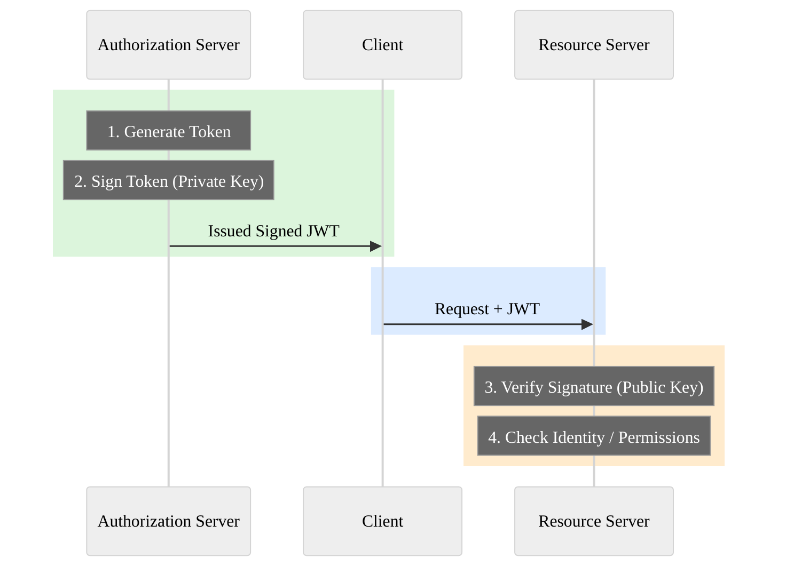
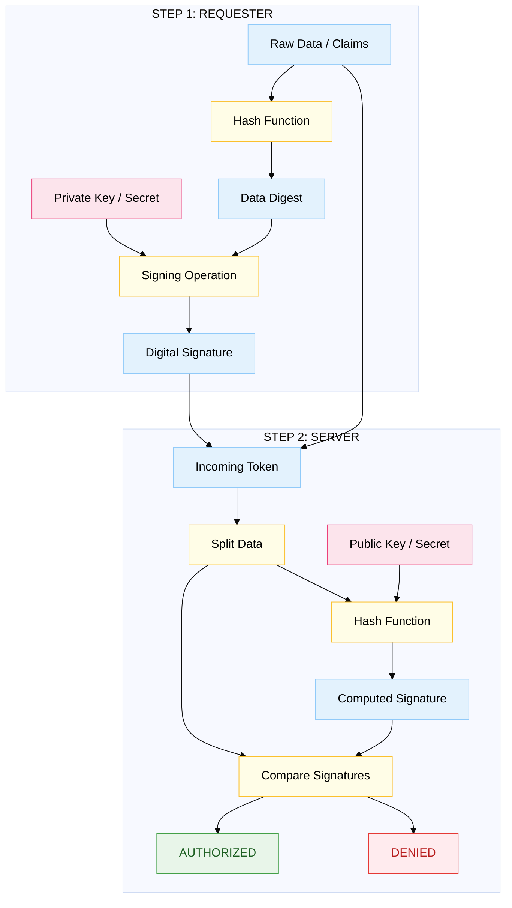
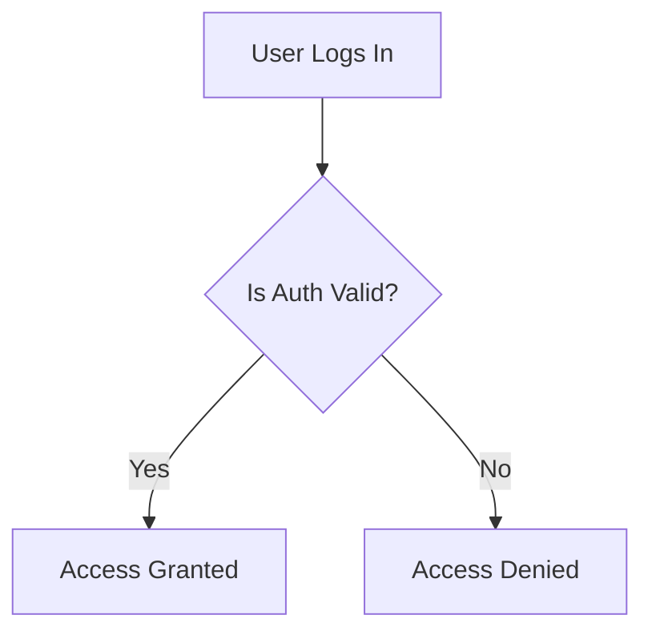
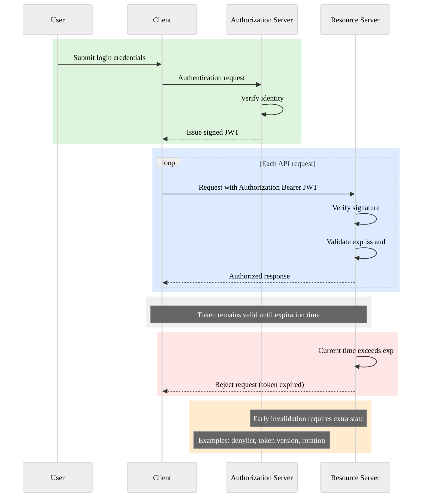
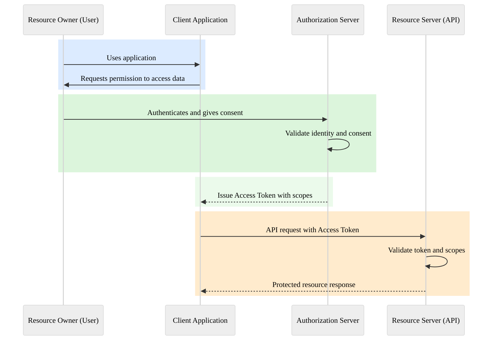
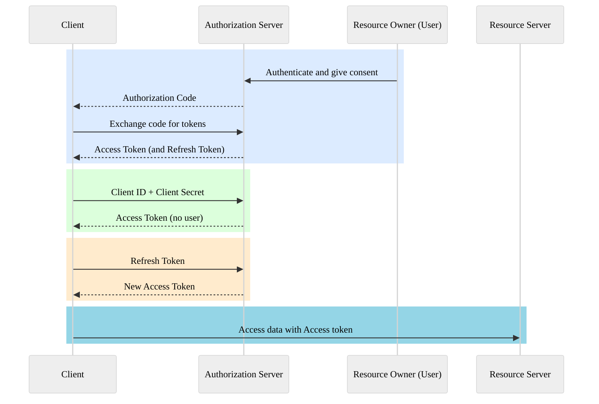
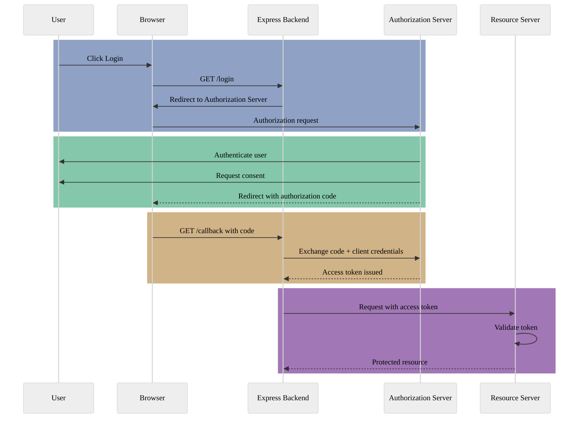
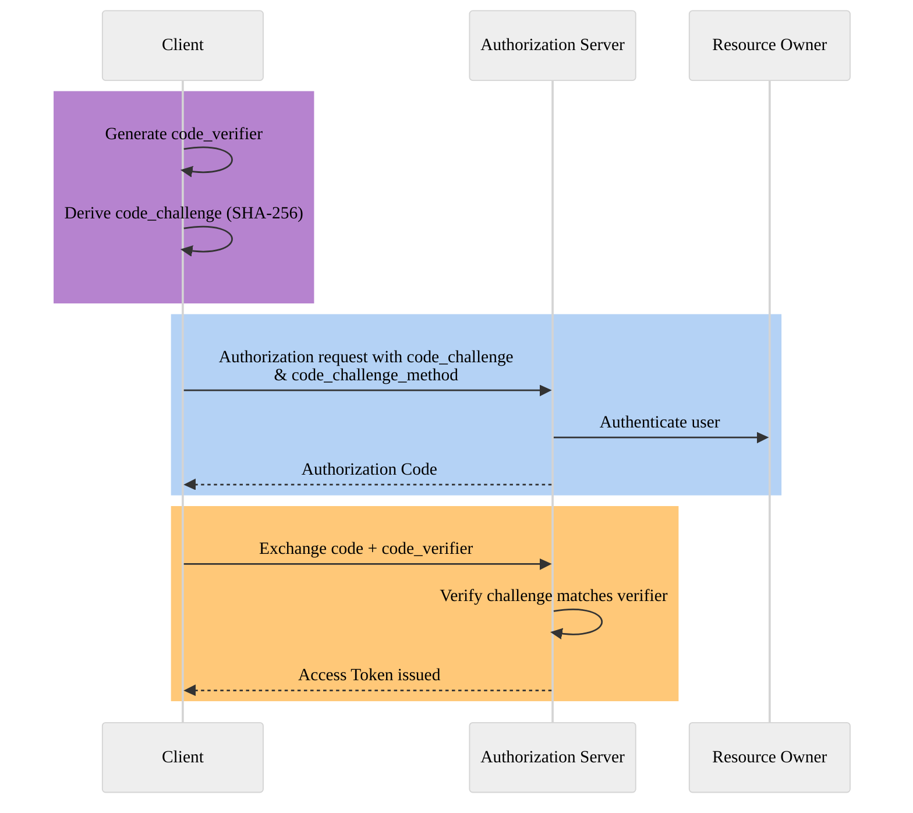

# Authentication and Authorization

# Table of Contents

## [Phase 0 – Cryptography Foundations](#phase-0-cryptography-foundations)

- **0.1 – Cryptography Terminology**
    - [Core Definitions (Plaintext, Ciphertext, Key)](#01--cryptography-terminology)
    - [Encryption vs. Decryption](#encryption)
    - [Hashing vs. Salting](#hash)
    - [Digital Signatures (Integrity & Authenticity)](#signature)
    - [Node.js Primitive Examples (Hashing, AES Encryption)](#nodejs-primitive-examples)
- **0.2 – Symmetric Cryptography**
    - [Shared Secrets & Algorithms (AES)](#02--symmetric-cryptography)
    - [Authentication Tags & GCM Mode](#authentication-tag-authtag--gcm)
    - [The Sender/Receiver Verification Logic](#complete-picture)
- **0.3 – Asymmetric Cryptography**
    - [Public and Private Key Pairs](#03--asymmetric-cryptography)
    - [Key Distribution & TLS (HTTPS) Usage](#why-its-used)
    - [JWT RS256 vs. OAuth Trusts](#questions--real-world-usage)
- **0.4 – Digital Signatures**
    - [The Signing and Verification Flow](#high-level-flow)
    - [Visual Logic Representation](#visual-representation)
- **0.5 – Hashing & Password Security**
    - [Verification Flows vs. Password Recovery](#hashing--password-terminologies)
    - [Salting vs. Peppering](#how-salt-protects-you)
    - [Slow Algorithms (bcrypt, argon2, scrypt)](#what-password-hashing-algorithms-do-differently)

## [Phase 1 – Authentication and Authorization Foundations](#phase-1-authentication--authorization-foundations)

- **1.1 – Terminologies**
    - [AuthN vs. AuthZ](#authentication-authn)
    - [Identity vs. Principal vs. Policy](#identity-who)
- **1.2 – Authorization in Express.js**
    - [The "Actor" Object Structure](#12-authorization-in-expressjs)
- **1.3 – Request Lifecycle**
    - [HTTP Semantics (401 vs. 403)](#13-request-lifecycle)

## [Phase 2 – JWT (Token-Based Security)](#phase-2-jwt-token-based-security)

- **2.1 – JWT Terminology**
    - [Claims (sub, iss, aud, exp)](#21-jwt-terminology)
- **2.2 – Overview & Self-Containment**
    - [The Self-Contained Design](#22-what-is-a-json-web-token)
- **2.3 – JWT Structure**
    - [Header, Payload (Claims Types), and Signature](#23-jwt-structure)
- **2.4 – Verification Flow**
    - [Step-by-step Validation](#24-jwt-verification-flow)
- **2.6 – HS256 vs. RS256**
    - [Symmetric (Shared) vs. Asymmetric (Key Pair) Signing](#26-jwt---hs256-vs-rs256)
- **2.9 – Token Lifecycle**
    - [Issuance, Usage, Expiration, and Invalidation](#29-jwt---token-lifecycle)
- **2.10 – Token Types**
    - [Access Tokens vs. ID Tokens vs. Refresh Tokens](#210-jwt---token-types)
- **2.11 – Secure Token Storage**
    - [XSS & CSRF Risks](#211-jwt---secure-token-storage)
    - [LocalStorage vs. HttpOnly Cookies](#storage-options-and-risks)

## [Phase 3 – OAuth 2.0 (Authorization Framework)](#phase-3-oauth-20-authorization-framework)

- **3.1 – Core Terminology**
    - [Roles: Resource Owner, Client, Auth Server, Resource Server](#31-oauth-20--core-terminology)
    - [Scopes & Least Privilege](#scope)
- **3.2 – Grant Types**
    - [Authorization Code Grant (The Gold Standard)](#the-main-oauth-20-grant-types)
    - [Client Credentials & Refresh Token Grants](#client-credentials-grant)
    - [Implicit Grant (Deprecated)](#implicit-grant-deprecated)
- **3.3 – Authorization Code Flow**
    - [Redirect-Based Security](#redirect-based-authorization)
    - [Back-Channel Communication](#authorization-code-exchange)
    - [Token Trust Boundaries](#token-trust-boundaries-critical-concept)
- **3.4 – Attack Scenarios**
    - [Interception, Leakage, and Replay Attacks](#34-oauth-20--attack-scenarios)

## [Glossary](#glossary)

- [Delegated Access](#a-delegated-access)
- [Cookies & Security Flags](#b-cookies)

---

# Phase 0 Cryptography Foundations

## 0.1 – Cryptography Terminology

### Cryptography

- Cryptography is the science and practice of securing information by transforming it from readable plaintext into unreadable ciphertext using mathematical algorithms and keys

### Plain Text

- Data in its original, readable form.
- _Example:_ `password123`

### Ciphertext

- Unreadable, transformed version of plain text after cryptographic operation.
- _Example:_ `983089703n83ebx2z211097as349kw122`

### Key

- A Secret value used to transform data.
- This is the actual power in cryptography, **No Security without a key**.

### Encryption

- Converting **plaintext -> ciphertext** using a key, so it can be reversed later.
- **Important property:** Reversible.
- Used when data must be read again later.

### Decryption

- Converting **ciphertext -> plaintext** using a key.
- Only someone with the correct key can decrypt.

### Hash

- A one-way transformation of data.
- **Key properties:**
    - Cannot be reversed.
    - Same input -> Same output.
    - Small change -> Complete different output.
- **Note:** Hashing is not encryption.

### Salt (Cryptography Terminology)

- Random data added to input before hashing.
- **Why it exists:** Prevents precomputed attacks (rainbow tables).
- **Note:** Salt is not secret -> it is stored with the hash.

### [Signature](#04-digital-signatures)

- Cryptographic proof that:
    - Data was created by a trusted party.
    - Data was not modified.
- A signature proves who sent it and that it hasn't been changed, but it does not hide the information from others.
- **Signature = integrity + authenticity, not secrecy.**
- **Integrity:**
    - It hasn't been tampered with.
    - It ensures that the data you received is exactly what was sent.
    - **How it works:** When a sender signs a document, a mathematical "fingerprint" (called a hash) is created based on the content.
    - **The Result:** If even a single comma or digit is changed in the document after it's signed, the "fingerprint" will no longer match.
- **Authenticity:**
    - It proves the identity of the person or system that created the signature.
    - **How it works:** It uses Asymmetric Cryptography. The sender uses their Private Key (which only they have) to create the signature.
    - **The Result:** Because the recipient uses the sender's public key to verify it, they can be 100% certain it was created by the owner of that specific key. This provides **Non-repudiation**.
- **Not Secrecy:**
    - This is the most common point of confusion. A digital signature is not encryption.
    - If you sign a <kbd>digital</kbd> letter but don't encrypt it, the letter is sent in "plain text".

---

### Core Problems Solved

- **Keep data secret:** Solved by encryption.
- **Store secrets safely:** Solved by Hashing.
- **Prove trust:** Solved by Signatures.

### Why These Are Used?

- **Why encryption?** Protect data in transit (HTTPS) and data at rest (DB, backups).
- **Why hashing?** Password storage and verifying integrity.
- **Why signatures?** JWT trusts, OAuth tokens, and API authentication.

### The Signature Logic

- `data + private key -> signature`
- `data + public key -> verification`
- Private key signs data; Public key verifies signature.
- Data cannot be altered without breaking the signature.

---

### Node.js Primitive Examples

#### Hashing

```javascript
import crypto from "crypto";
/**
 * crypto is a built in node.js module
 * Provides cryptographic primitives (hashing, encryption, random bytes)
 *
 * createHash('sha256'):
 *  - creates a hash function using sha256 algorithm (256 bits)
 *
 * update(password)
 *  - Feed input data into the hash function
 *  - You can call update() multiple times for streams
 *
 * digest('hex')
 *  - Finalize the hash and convert binary output -> hex string
 *
 * In production, we do not use raw SHA-256 for passwords (use bcrypt or argon)
 */

function hashPassword(password) {
    const hash = crypto.createHash("sha256").update(password).digest("hex");
    console.log(hash);
    return hash;
}

hashPassword("password123");
```

#### Encrypt & Decrypt

```javascript
import crypto from "crypto";

/**
 * crypto.randomBytes(32)
 *  - Generate a random symmetric key
 *  - 32 bytes = 256 bits
 *  - Used by AES-256
 *
 * crypto.randomBytes(16)
 *  - IV = Initializer vector
 *  - Adds randomness
 *  - Prevents identical plaintext from production identical ciphertext
 *  - IV is not secret, but must be unique
 *
 * crypto.createCipheriv('aes-256-cbc', key, iv);
 *  - Creates an AES cipher
 *  - aws-256-cbc
 *      - AES algorithm
 *      - 256-bits
 *      - CBC mode -> Cipher Blocking chain
 *          - CBC is used here for demo; GCM is preferred in real systems
 * crypto.update(text,'utf-8','hex') + cipher.final('hex');
 *  - update() -> encrypt data
 *  - utf-8 -> input encoding
 *  - hex -> output encoding
 *  - final() -> finishes encryption
 *
 * crypto.createDecipheriv('aes-256-cbc', key, iv);
 *  - Uses same algorithm
 *  - Uses same key
 *  - Uses same IV
 *
 * - This is why symmetric crypto is called symmetric
 */

const key = crypto.randomBytes(32);
const iv = crypto.randomBytes(16);

function encrypt(text) {
    const cipher = crypto.createCheriv("aes-256-cbc", key, iv);
    return cipher.update(text, "utf-8", "hex") + cipher.final("hex");
}

function decrypt(encrypted) {
    const decipher = crypto.createDecipheriv("aes-256-cbc", key, iv);
    return decipher.update(encrypted, "hex", "utf-8") + decipher.final("utf-8");
}

const secret = encrypt("hello");
console.log(decrypt(secret));
```

- **Block Cipher:** An Encryption algorithm that works on fixed-size blocks of data. Can encrypt only one block at a time.
- **Stream Cipher:** An Encryption algorithm that encrypts data bit-by-bit or byte-by-byte.
- **Block Cipher Mode:** A method that tells the cipher how to encrypt data longer than one block. (CBC one of them).
- **CBC (Cipher Block Chain):** A block cipher mode of operation. CBC chains blocks together so that,each block depends on the previous block
- **IV (Initialization vector):** A random value used only for first block of operation

---

## 0.2 – Symmetric Cryptography

- A Cryptography method where the **same key** is used for both Encryption and Decryption.
- **Symmetric Key / Shared secret:** Known to both sender and receiver. whoever has this key can encrypt and decrypt data. Both parties must already trust each other
- **Blocker Cipher:**
    - An algorithm that encrypts data in fixed-size blocks - Example: AES (16-byte block)
- **Stream Cipher:**
    - An algorithm that encrypts data byte-by-byte or bit-by-bit
    - Example: ChaCha20
- **Simple flow:**
    - Plaintext -> Encrypt(key) -> Ciphertext
    - Ciphertext -> Decrypt(key) -> Plaintext
- **Pros:** Fast, efficient, low CPU cost.
- **Cons:** The "Big Problem" — How do two parties securely share the same secret key? If the key is stolen, all data is compromised, Attackers can decrypt everything

### AES (Advanced Encryption Standard)

- It is Encryption algorithm used to convert plaintext to ciphertext using a key.
- A symmetric encryption algorithm used worldwide.
- Default choice for HTTPS, Disk encryption, DBs, and JWT (JWE).

### Authentication Tag (AuthTag) & GCM

- **AuthTag:** Proves data was not modified and the correct key was used.
- **Authenticated Encryption (AEAD):** Provides confidentiality + Integrity + Authenticity.
- **GCM (Galois/Counter Mode):** Preferred today because it provides encryption and authentication at the same time.
- **AES-GCM Outputs:**
    1. Ciphertext
    2. Auth Tag
- A short cryptographic value produced during encryption that proves:
    - That data was not modified
    - The correct key was used
- Authenticate Encryption
    - Encryption that provides:
        - confidentiality (secrecy)
        - Integrity (tamper detection)
        - Authenticity (correct key)
- In Node.js, getAuthTag() and setAuthTag() are methods used specifically with AEAD (Authenticated Encryption with Associated Data) ciphers, such aes-256-gcm or chacha20-ploy305
- With auth tag:
    - Any modification = decryption fails
    - Wrong key = decryption fails
    - Wrong IV = decryption fails
- This is why GCM is preferred today
    - GCM stands for Galois/Counter Mode. It is a "mode of operation" for symmetric key block ciphers(most commonly AES)
    - In simple terms, GCM is a "two-in-one" technology. It provides Encryption(secrecy) and Authentication(Integrity) at the same time.
- AES-GCM produces two outputs
    1. Ciphertext -> encrypted data
    2. Auth Tag -> integrity proof
    - Key + IV + plaintext -> ciphertext + tag
    - The auth tag is calculated using
        - Encrypted data
        - Key
        - IV
        - Optional associated data
    - During decryption
        - Recalculate authTag -> compare with provided authTag
        - If they match -> decrypt
        - If not -> throw error

---

### Complete Picture

1. `getAuthTag` (The Creation — **Sender Side**)
    - This happens at the end of the **Encryption** process.
    - **Action:** After the computer finishes turning your "hello" into encrypted hex, it generates the final mathematical fingerprint.
    - **The Result:** You call `getAuthTag()` to "pick up" this fingerprint (usually 16 bytes).
    - **Your Job:** You must send this tag along with the encrypted message to the recipient. Without it, they have no way to verify the data.

2. `setAuthTag` (The Target — **Receiver Side**)
    - This happens at the start of the **Decryption** process.
    - **Action:** The receiver takes the tag they received and stores it in the `decipher` object.
    - **The Status:** The computer just "holds onto it" and waits. It hasn't checked anything yet; it just knows what the "Target" fingerprint should look like.

3. `update` (The Calculation — **Receiver Side**) - **Action:** As the computer decrypts the ciphertext, it calculates its own "actual" fingerprint byte-by-byte from the data it is currently processing. - **The Status:** It is building a new fingerprint from scratch to see if it matches the one you provided in Step 2.

4. `final` (The Comparison — **Receiver Side**) -
    - **Action:** The computer puts the two fingerprints side-by-side:
        - **Tag A:** The one you "picked up" via **`getAuthTag`** and "stored" via **`setAuthTag`**.
        - **Tag B:** The one the computer just **calculated** itself during `update`.
    - **The Result:** - - **If they are identical:** Everything is fine. The data is authentic and hasn't been changed. - **If they are different:** It throws an error (`Unsupported state`) and prevents the data from being trusted.

### Summary Table

| Method       | Side     | Purpose                       | Analogy                                           |
| :----------- | :------- | :---------------------------- | :------------------------------------------------ |
| _getAuthTag_ | Sender   | **Create** the proof.         | Printing the "official weight" on a shipping box. |
| _setAuthTag_ | Receiver | **Store** the expected proof. | Telling the guard, "The box should weigh 10kg."   |
| _update_     | Receiver | **Calculate** the new proof.  | The guard putting the box on a scale.             |
| _final_      | Receiver | **Compare** the proofs.       | The guard checking if the scale matches the 10kg. |

This is why **Signature = Integrity + Authenticity**.

- **Integrity:** If someone changed the message, the `update` calculation would result in a different tag, and `final` would fail.
- **Authenticity:** Since the tag is created using your secret Key, only someone with that Key could have created a tag that matches.

**Code:** [symmetricCryptography.js](./code/phase-0/symmetricCryptography.js)

---

## 0.3 – Asymmetric Cryptography

- **Key Pair:** Mathematically linked; one cannot exist without the other.
- System using two different keys: **Public Key** and **Private Key**.
    - **Public Key:** Shared openly; used to encrypt data for the owner or verify signatures.
    - **Private Key:** Kept secret; used to decrypt data or create signatures.
- They are generated together and cannot exist independently

### Why It's Used

- **Key Distribution:** The process of sharing key securely. This solves the symmetric "shared secret" problem.
    - For data privacy
        - Public key -> encrypt
        - Private key -> decrypt

    - For Signature
        - Private key -> sign
        - Public key -> verify

- **Trust:** Foundation for JWT (RS256), OAuth 2.0, OIDC, and TLS (HTTPS).

### Mathematical Property

- Public & Private keys are mathematically related
- But:
    - Public key cannot derive private key
    - Even with unlimited public access
- This relies on:
    - Large prime factorization(RSA)
    - Elliptic curve math(ECC)

### Questions & Real World Usage

- **Why JWT Has RS256:** Auth server signs with Private Key; APIs verify with Public Key. APIs cannot forge tokens.
    - JWT: JSON WEB TOKEN
    - RS256: RSA + SHA-256 (asymmetric signing)
    - Issuer: Entity that create a token
    - Verifier: Entity that validates the token
- **Why OAuth Trusts Tokens:** Tokens are signed claims ("Digital Signatures").
    - OAuth tokens are not encrypted passwords
    - They are signed claims
    - OAuth Token Flow (simplified)

### Sequence Diagram (Asymmetric Crypto)



- **Why HTTPS is Possible:** Uses a TLS Handshake where the server sends a Public Key, the client encrypts a symmetric session key with it, and the server decrypts it with the Private Key.
    - The HTTP problem
        - How can i securely talk to a server i've never met before?
    - TLS handshake
        - Server sends public key(certificate)
        - Client verifies certificates authority(CA)
        - Client generates random symmetric key
        - Client encrypts it with server's public key
        - Server decrypts with private key
    - Now both share a symmetric session key.

- **Code** : [asymmetricCryptography.js](./code/phase-0/asymmetricCryptography.js)

### JWT vs OAuth

- **JWT:** A token format (Header.Payload.Signature). A container for claims.
- **OAuth 2.0:** An Authorization framework/protocol defining roles, flows, and how tokens are issued.

---

## 0.4 – Digital Signatures

- Bridge between cryptography and real-world trust(JWT, OAuth, HTTPS).
- **Integrity:** Data not altered by even 1 bit.
- **Authenticity:** Data created by the expected owner.
- **Non-repudiation:** Signer cannot deny signing it.

### High-Level Flow

1. **Signing:** `Data -> Hash -> Sign(hash, privateKey) -> Signature`
    - Signature = Encrypt(hash(data) , privateKey)
    - Data is hashed first
    - Hash is signed(now raw data)
    - Signature is small and fixed size
2. **Verification:** `Data -> Hash` vs `Signature + PublicKey -> Extracted Hash`.
    - Data -> Hash (Integrity)
    - Signature + PublicKey -> Verify (Authenticity)
3. If `Generated Hash === Extracted Hash`, the signature is valid.
    - Data has matches
    - Signature matches
    - Correct public key is used
        1. Re-hash the received data -> hash1
        2. Use public key to decrypt signature -> hash2
        3. Compare hash1 and hash2 -> hash1 === hash2

- If you need secrecy -> Encryption
- If you need trust -> use signatures

### Visual Representation



- You generate a hash from the received document.
- You use the public key to "open" the signature to see what the original hash was.
- You compare the two hashes.
- "The verifier does not generate a hash from the signature. Instead, the verifier extracts the original hash from the signature and compares it to a fresh hash they generate from the data".

---

## 0.5 – Hashing & Password Security

### Hashing & Password Terminologies

#### Password Hashing

The process of converting a password into a one-way cryptographic value for storage.

#### One-way Function

Easy to compute.
Computationally infeasible to reverse.

#### Salt (Password Hashing)

Random, unique data added to a password before hashing.

#### Pepper

A secret value added to all passwords in addition to salt.
Stored outside the database.

#### Rainbow Table

A precomputed list of common passwords and their hashes.

#### Brute-Force Attack

Systematically trying many passwords until one matches.

#### What Is Password Hashing

- We never store passwords; we store **proofs that a password was correct**.
- A password hash **cannot be decrypted**.

### Verification Flow

- User enters password.
- System computes:
    - <kbd>hash(password + salt)</kbd>
- Computed hash is compared with the stored hash.

### Why Password Hashing Is Used, Why Not Encryption?

- Encryption can be reversed.
- If the encryption key leaks, **all passwords leak**.

### Why Hashing Is Correct

- Hashing is one-way.
- Database breach ≠ password disclosure.
- Limits blast radius.
- If a system can decrypt passwords, it is already insecure.

### Why Normal Hashes Are Not Enough

- Algorithms such as:
    - SHA-256
    - SHA-512
    - MD5
- Are:
    - Too fast.
    - Designed for data integrity, not passwords.

- Fast hashing ⇒ easy brute-force attacks.

### What Password Hashing Algorithms Do Differently

- Password-safe algorithms:
    - Are intentionally slow.
    - Are adaptive.
    - Are memory-hard (in some cases).

- Examples:
    - bcrypt
    - argon2
    - scrypt

### How Salt Protects You

- Passwords are hashed as:
    - `hash(password + uniqueSalt)`
- Same password ⇒ different hash per user.
- Rainbow tables become useless.

**Salt Properties**

- Random.
- Stored with the hash.
- Not secret.

**Pepper**

- Passwords can be hashed as:
    - `hash(password + salt + pepper)`
- Pepper is a server secret.
- Stored in environment variables.
- Protects against database-only breaches.

### Passwords Are Verified, Not Recovered

- Passwords are never decrypted or retrieved.
- They are only verified by hash comparison.

### Password Hashing & Verification Flow


**Code**: [passwordHashing.js](./code/phase-0/passwordHashing.js)

# Phase 1 Authentication & Authorization Foundations

## 1.1 Authentication & Authorization Terminologies

### Authentication (AuthN)

- Authentication (AuthN) is a process by which a system verifies that an entity (user or system) is genuinely who it claims to be.
- It is usually done by validating credentials such as:
    - Passwords
    - Tokens
    - Cryptographic proofs
- In simple terms, **Authentication establishes identity, not permissions**.

### Authorization (AuthZ)

- Authorization (AuthZ) is a process by which a system determines whether an already authenticated entity is allowed to:
    - Perform a specific action
    - Access a specific resource
- Authorization is always evaluated **after authentication**.
- It enforces business rules and access control.

### Identity (Who)

- Identity is the verified representation of an entity inside the system after successful authentication.
- It is typically expressed as:
    - User ID
    - Service account ID
    - Client identifier
- It answers the question:
    - What exact entity is making this request?
- Identity is a set of attributes that uniquely define a person or entity.
- Identity is the **source of truth**.
- **Focus:** Authentication (AuthN)

### Principal (What)

- A Principal is the authenticated entity that is currently interacting with the system, such as:
    - A logged-in user
    - A backend service
    - An automated client
- The term _principal_ is commonly used in security models to abstract both human users and machines.
- It is a specific representation of an identity during a security session.
- **Focus:** Authorization (AuthZ)
- One identity can have multiple principals.

### Policy

- A Policy is a set of rules that determines whether a principal with certain attributes or permissions is allowed to perform a requested action.
- Policies are the mechanism through which authorization decisions are enforced.
- A policy is the **rule book** or the **contract**.

### Permission

- A Permission is a specific, well-defined action that a principal is allowed to perform, such as:
    - Reading data
    - Modifying a resource
    - Deleting an entity

### Analogy

- **Identity:** Me (the human)
- **Principal:** The specific account/session representing _me_ (`request.user`)
- **Role:** Admin (the “hat” the principal is wearing) (`principal.role`)
- **Policy:**
  “The Admin role is allowed to Read and Write, but NOT Delete.”
- **Permission:**
  Read, Write

### Identity → Principal → Permission Flow

- Identity (Login)
    - → Creates Principal (User Object)
    - → Contains Role (Admin)
    - → Grants Permissions (Read / Write / Delete)

## 1.2 Authorization in Express.js

```js
// 1. IDENTITY: The person who logged in (e.g., Sarah)

// 2. PRINCIPAL: This 'user' object is the Principal.
// It is the "Actor" representing Sarah in this request.
const principal = request.user;

// 3. ROLE: Role is a property OF the Principal.
console.log(principal.role); // "Admin"

// 4. PERMISSIONS: Granted BECAUSE of the Role.
if (principal.role === "Admin") {
    allowAccess(["read", "write", "delete"]);
}

// sample user object
{
    // 1. IDENTITY
    identity: {
        userId: "USR_9988",
        username: "sjenkins",
        mfaEnabled: true
    },

    // 2. PRINCIPAL (The Current Actor)
    principal: {
        sessionId: "session_abc123",
        authenticatedAt: "2023-10-27T10:00:00Z",
        ipAddress: "192.168.1.1",

        // 3. ROLES (The Groups)
        roles: ["ADMIN", "EDITOR"],

        // 4. POLICY (The Logic Source)
        // In complex systems, we often attach the "Policy ID" that
        // was used to calculate the permissions.
        appliedPolicy: "ENTERPRISE_ADMIN_POLICY_V2",

        // 5. PERMISSIONS (The Final List)
        // This is the "What" that the code actually checks.
        can: {
            user_read: true,
            user_write: true,
            user_delete: true,
            billing_access: false  // Even an Admin might not see Billing!
        }
    }
}
```

## 1.3 Request Lifecycle

- Authentication middleware validates identity
- Identity context is attached to request
- Authorization logic evaluates permissions
- Business logic executes only if allowed

### HTTP Semantics

- 401 Unauthorized means the system does not know who you are
- 403 Forbidden means the system knows who you are but refuses the action

## 1.4 Code Example

Refer to [AuthMiddleware.js](./code/phase-1/AuthMiddleware.js)

## 1.5 Sequence Diagram (AuthN Flow)



---

# Phase 2 JWT (Token-Based Security)

## JWT Overview

_A JSON Web Token is a Compact, URL-safe string that represents a set of claims between two parties. The information inside the JWT can be trusted because it was signed using cryptography. JWTs are commonly used to represent authenticated users and [*Delegated access*](#a-delegated-access) in web application and APIs_

## 2.1 JWT Terminology

### Token

A token is piece of data issued by a server and represented by a client as a proof of authentication and authorization. In JWT-based systems, the token itself carries the information to identify the user and validate trust

### Claim

A Claim is a piece of information asserted about a subject. In JWTs, claims are stored inside the payload as a name/value pairs. The name of the claim is always string and value can be any JSON value such as string, number, boolean, array or object.

When discussing JWTs, the word "claim" refers to the claim name (for example, sub, exp or role)

### Subject (sub)

The Subject claim identifies the entity that the token is about. In most applications, this is the unique identifier of the authenticated user.

### Issuer (iss)

The Issuer claim identifies the system that issues and signed the JWT. This is typically Authentication or Authorization server

### Audience (aud)

The audience claim specifies which service or API the token is intended for. This prevents a token issued for one server from being reused by another server.

### Expiration (exp)

The expiration claim defines the time after which the token is no longer valid. Even if the signature is valid, an expired token must be rejected.

### Signature

The signature is cryptographic value that ensure the token was issued by a trusted source and that its content have not been modified since issuance.

## 2.2 What is a JSON Web Token?

A JSON Web Token is a **_self-contained_** mechanism for securely transmitting information between parties. Is allows a server to trust the claim about a user without storing session state. The server validate the token by verifying the certificate and checking the claims, rather than querying a database or session store on every request

JWTs are widely used in modern authentication systems because they are lightweight, scalable, and well-suited for distributed architectures

**Self-Contained**:
A JWT is described as self-contained because it includes all the information required to understand and validate the token. This includes both the claim about the subject and the cryptographic signature that proves the token's integrity.

Because of this design, a server can authentication and authorize a request using only the token itself, without relying on server-side session storage.

## 2.3 JWT Structure

A JWT is composed of three parts, separated by dots(.)

_`header.payload.signature`_

Each part is Base64URL-encoded and has specific responsibility

### JWT Header

The header contains the metadata about the token, including the type of the token and cryptographic algorithm used to sign it.

```json
{
    "alg": "RS256",
    "typ": "JWT"
}
```

- The <kbd>alg</kbd> field indicates the signing algorithm, such as RS256(RSA with SHA-256)
- The <kbd>typ</kbd> field identifies the token types as a JWT.

> Note : The Server must not blindly trust the <kbd>alg</kbd> value from the token. Allowed algorithm must be enforced by the server configurations

### JWT Payload (Claims)

The payload contains the claims, which are statements about the subject of the token. or The Payload contains the information about the entity (typically user) and additional entity attributes. which are called claims.

```json
{
    "sub": "12345",
    "name": "Prashant",
    "admin": true,
    "iat": 17100000,
    "exp": 17103600
}
```

This payload assert the following:

- The subject of the token is the user with ID <kbd>12345</kbd>
- The user's name is Prashant
- The user has administrative privileges
- The token was issued at a specific time
- The token expires at a specific time

> _Important Rule About the Payload_
>
> The JWT payload is not encrypted, It is only Base64RL-encoded, which means anyone who has the token can decode and read the claims
>
> For this reason:
>
> - Sensitive data such as passwords or secrets must never be stored in a JWT payload
> - JWTs should only contain information that is safe to expose.

#### Types of JWT Claims

JWT Claims are generally categorized into three types

_1. Registered Claims_

Registered claims are predefined claim names which are defined by JWT specification. They are optional but have standard meaning when used.

_Examples include_:

- <kbd>iss</kbd> (issuer)
- <kbd>sub</kbd> (subject)
- <kbd>aud</kbd> (audience)
- <kbd>exp</kbd> (expiration)
- <kbd>iat</kbd> (issued at)

_2. Public claims_

Public claims are claims intended to shared across systems. These claims should be standardize or namespaced to avoid collisions.

_Examples include_:

- email
- profile

_3. Private claims_

Private claims are custom claims which are defined by your application. They are used to carry application specific information.

```json
{
    "role": "manager",
    "department": "sales"
}
```

### JWT Signature

The Signature is the most important part of the JWT because it established trust.

The Signature is created by signing the encoded header and payload using a cryptographic key.

```text
Signature = Sign(
    base64url(header) + "." + base64url(payload),
    privateKey
)
```

The Signature ensures:

1. The token was issued by a trusted issuer.
2. The token has not been modified

_If any part of the token changes, signature verification fails_

---

## 2.4 JWT Verification Flow

When a server receives a JWT, it performs the following steps:

1. Decode the header and payload.
2. Verify the signature using a trusted key. (Similar to Digital Signature verification)
3. validate registered claims such as exp, iss and aud.
4. Accept the token only if all validations succeed

_If any step fails, the token is rejected_

```javascript
import jwt from "jsonwebtoken";

const payload = jwt.verify(token, publicKey, {
    issuer: "https://auth.example.com",
    audience: "orders-api",
});
```

This Code:

- Verifies the token signature
- Ensures the token comes from the expected issuer(iss)
- Ensures the token is intended for the correct audience(aud)
- Returns the decoded claims if valid

## 2.5 What JWT Is and Is Not Responsible For

- JWT is responsible for:
    - Securely carrying claims
    - Proving token integrity
    - Enforcing expiration
- JWT is not responsible for
    - Authorization decisions
    - Logout handling
    - Token storage security
    - Preventing token that

## 2.6 JWT - HS256 vs RS256

_*Signing Algorithm* defines how the JWT signature is created and verified. It specifies_

- _The cryptographic method_
- _The type of key used_
- _How integrity and authenticity are enforced_

### HS256 vs RS256 – Terminology

#### HMAC (Hash-Based Message Authenticated Code)

- A cryptographic technique that combines a hash function and a secret key to produce a signature.

#### SHA-256 (Secure Hash Algorithm)

- A secure hash algorithm that produces a fixed 256-bit hash value.

#### RSA

- An asymmetric cryptographic algorithm that uses a public key and private key pair.

#### Signing key

- The secret or private key used to generate a JWT signature.

#### Verification Key

- The key used to verify that the JWT signature is valid.

### What are HS256 and RS256?

- HS256 and RS256 are JWT signing algorithms
- Their job is not encryption
- Their job is to prove that the token was issued by trusted authority and was not modified.

### Internal Working

---

#### _HS256(HMAC + SHA-256)_

HS256 uses one single secret key.

- The same key is used to sign the token
- The same key is used to verify the token

This is symmetric cryptography.

**_Flow_**

1. Server creates JWT header + payload
2. Server hashes them using SHA-256
3. Server signs the hash using a shared secret
4. Signature is appended to the JWT

**_During verification_**

- The API recalculates the signature using the same secret
- If signature matches, the token is trusted

```json
{
    "alg": "HS256",
    "typ": "JWT"
}
```

> **_critical Implication_**
>
> - Anyone who can verify the token can also sign new tokens, becaus the same secret is used
>
> This is extremely important.

#### _RS256(RSA + SHA+256)_

RS256 uses a Key pair:

- Private key -> used to sign the token
- Public key -> used to verify the token

This is asymmetric cryptography.

**_Flow_**

1. Authorization server sign the JWT using its private key
2. API receives the JWT
3. API verifies the signature using the public key
4. If verification succeeds, token it trusted

```json
{
    "alg": "RS256",
    "typ": "JWT"
}
```

> **_critical Implication_**
>
> - APIs cannot create tokens
> - APIs can only verify tokens
> - Token issuance authority is strictly controlled
>
> This separation is intentional and powerful

## 2.7 HS256 Problems in Real Systems

    - Secret must be shared across services
    - Secret leakage compromises entire system
    - Difficult key rotation
    - Risk of algorithm confusion attacks

## 2.8 RS257 Advantages

    - Private key never leaves auth server
    - Public key can safely distributed
    - Multiple APIs can verify token independently
    - Supports zero-trust and microservice architectures

## 2.9 JWT - Token Lifecycle

### Token Issuance

Token issuance is the process by which authorization server creates a JWT and gives it to a client after successfully verifying the user's identity.

- Issuance happens only once per authenticated event, not on every request.

- Token issuance exist to replace repeated credential exchange with a signal proof of authentication.

- Once issued, the token represents the authenticated identity for a limited time.

_When issuance occurs, the authorization server_:

1. Confirms the user's identity (for example, by verifying a password hash)
2. Constructs a payload containing identity and security claims.
3. Cryptographically signs the payload using a signing key
4. Returns the resulting JWT to the client

```json
{
    "sub": "user_42",
    "iss": "https://auth.example.com/",
    "aud": "orders-api",
    "iat": 1700000000,
    "exp": 1700003600
}
```

### Token Usage

Token Usage is the act of sending the issued JWT along with each API to prove identity and permissions.

The token it typically sent in the <kbd>Authorization</kbd> HTTP header.

_What happen internally during usage_
For every protected request, the API:

1. Extracts the token form the request
2. Verifies the token signature
3. Validates required claims
4. Builds an authentication context
5. Allows or rejects the request.

This process occurs for every request, not once per login

### Token Expiration

Token expiration defines the maximum lifetime of a JWT using the <kbd>exp</kbd> claim.

Once the expiration time is reached, the token must be rejected regardless of whether it was valid before.

_How expiration is enforced technically_

During validation, the API compares:

- The current serve time
- The <kbd>exp</kbd> value in the token.

If the current time is greater than than <kbd>exp</kbd>, the token is rejected immediately.

### Token Invalidation

Token invalidation means making a token unusable before its expiration time.

This is commonly expected during logout or account companies

_How systems handle invalidation conceptually_

In practice, system rely on strategies such as:

- Short-lived access tokens
- Server-side deny lists
- Token version checks
- Refresh token rotation

These mechanisms introduce controlled state, which we will cover in later phase.

### Sequence Diagram (Token Lifecycle)



## 2.10 JWT - Token Types

### JWT – Token Terminology

#### Token Type

A token type describes the purpose for which a token is issued and how it is expected to be used.

#### Access Token (term)

An Access token is a token used by a client to **access a protected API**.

#### ID Token (term)

An ID token is a token used to **prove that a user has authenticated and to carry user identity information**.

#### Refresh Token (term)

A refresh token is a token used to **obtain new access tokens without re-authenticating the user**.

_These names come directly from OAuth 2.0 and OpenID Connect, which AuthO implements_

### Access Token

An Access token represents authorization, not identity.

It tells an API: _"This request is allowed to access this resource with these permissions"_

**Why access token exist**

APIs should not care who is the user is, only check whether request is allowed to do.

Access tokens exists to carry permissions and scope in verifiable way.

This keeps APIs decoupled with authentication logic

**What access token contains**

An access token typically includes

- Who the token is for (sub)
- Who issued it(iss)
- When it expires(exp)
- What it can do (scopes or permissions)

The API validates the token and enforces authorization based on its contents.

> _Important boundary_
>
> Access tokens are not meant to be read by the frontend for user details
>
> There are meant to be:
>
> - sent to APIs
> - Validate by APIs
> - Enforced by APIs

### ID Token (OIDC)

An ID Token represents authentication, not authorization.

It tells the client application: _"This user has successfully logged in and here is their identity information."_

**Why ID token exist**

Frontend application need a trusted proof of login.

They also need basic user information without calling APIs unnecessarily.

ID tokens exist to fulfill this need securely and explicitly.

**What ID tokens contain**

An ID token typically includes:

- A stable user identifier(sub)
- The issuer(iss)
- The client it was issued for (aud)
- Authentication time
- Optional profile information

ID tokens are consumed by the client, not APIs

### Refresh Token

A refresh token is a longer-lived credential used to obtain new access tokens.

It is not sent to APIs

**Why refresh token exist**

Access tokens are short lived for security reasons.

Re-authenticating the user every few minutes would harm user experience.

Refresh token exist to:

- Preserve session continuity
- Avoid repeated logins
- Keep access tokens short-lived

_How refresh tokens are used_

1. Access token expires
2. Client send refresh token to authorization server
3. Authorization server issues a new access token

**APIs never see refresh tokens**

### Real-World Token Separation

AuthO enforces strict separation:

| Token Type    | Used By | Sent To     | Purpose            |
| ------------- | ------- | ----------- | ------------------ |
| Access Token  | Client  | API         | Authorization      |
| ID Token      | Client  | Client Only | Authentication     |
| Refresh Token | Client  | Auth server | Session continuity |

## 2.11 JWT - Secure Token Storage

### JWT – Secure Token Terminology

#### Token Storage

Token storage is the place where a client application **keeps authentication tokens between requests.**

#### Browser Storage

Browser storage is a mechanism provided by the browser to persist data, such as cookies and web storage.

#### XSS (Cross-site scripting)

XSS is an attack where an attacker injects malicious javascript code into a trusted website, causing browser to execute attacker-controlled code.

#### CSRF (Cross-site Request Forgery)

CSRF is an attack where a browser is tricked into sending authenticated requests to a server **without user's intent.**

#### HttpOnly Cookie

An HttpOnly Cookie is a cookie that **cannot be accessed by javascript**, even if XSS exists.

#### SameSite

SameSite is a cookie attribute that controls **whether cookies are sent with cross-site requests**.

### What Secure Token Storage Means

Secure token storage means choosing a storage mechanism that minimized the risk of token theft and misuse.

- A token is effectively a Key.
- Anyone who possesses it can act as a user until it expires

The goal of secure storage is to reduce the probability that attackers can access the key.

### _Why Token Storage is a Security problem_

The core problem

Browser are powerful but hostile environment.

They execute:

- First-party Javascript
- Third-party scripts
- User-installed extensions

If a token is stored where javascript can read it, **any successful XSS attack becomes an account takeover**.

### Storage Options and Risks

#### A. LocalStorage

LocalStorage stores key-value data in the browser and allows **full Javascript read/write access**.

Tokens stored here persist across page reloads.

_Why LocalStorage is dangerous_

If XSS occurs:

- Malicious Javascript code can read the token
- Token can be <abbr title='data exportation -- the data theft'>exfiltrated</abbr> to an attacker
- Attacker can <abbr title='pretends to be'>impersonate</abbr> the user

LocalStorage offer **Zero Protection** against XSS.

#### B. SessionStorage

SessionStorage is similar to LocalStorage but is scoped to a browser tab.

_*Why SessionStorage is still unsafer*_

SessionStorage is also fully accessible to Javascript.

XSS impact is the same as LocalStorage.

The Only difference is lifetime, not security.

#### C. Cookies (Without Security Flags)

[Cookies](#b-cookies) are automatically sent by the browser with HTTP requests to matching domain.

_*Why plain cookies are unsafe*_

without proper flags:

- Javascript can read cookies
- Cookies are sent in cross-site requests
- Both XSS and CSRF risks exist

Cookies are not secure by default

#### D. HttpOnly Cookies (Recommended)

How HttpOnly Cookies works

HttpOnly Cookies:

- Are sent automatically with requests
- Cannot read by Javascript
- Are invisible to XSS payloads

This removes the primary token theft vector.

_*Why HttpOnly cookies improve security*_

Even is XSS exists:

- Token cannot be stolen via Javascript
- Attackers cannot be easily exfiltrate it

This significantly reduces blast radius.

#### E. SameSite Attribute(CSRF Mitigation)

Why SameSite exists

When cookies are automatically sent, CSRF becomes possible.

Samesite controls **When cookies are includes in cross-site requests**.

SameSite modes

- **Strict** : Cookie sent only in same-site requests
- **Lax** : Cookie sent in top-level navigation's
- **None** : Cookie sent in all context(requires secure)

SameSite reduces CSRF risk without breaking modern auth flow.

### Real-World Secure Patterns

AuthO's recommended browser pattern:

- Store access tokens in memory
- Store session identifiers or refresh tokens in HttpOnly cookies
- Use Short-lived access tokens
- Rely on automatic cookie sending

# Phase 3 OAuth 2.0 (Authorization Framework)

## 3.1 OAuth 2.0 – Core Terminology

### Resource Owner

The Resource Owner is **the entity that owns the data being accessed**.

In most real-world applications, the Resource Owner is the **end user**, meaning a human being who owns personal data such as profile information, orders or messages.

OAuth 2.0 is designed primarily to protect Resource Owner's data, not the client application.

The Resource Owner is the only party that has the authority to **grant permission** for access to that data.

### Client

The Client is the application that **wants to access the Resource Owner's data**.

This Could be a web application, a mobile app, a backend application or even a command line tool.

The Client does not own the data and therefore cannot access by default.

Instead, the Client must request permission and prove that permission has been granted.

In OAuth, the client is identified by a **client ID**, and sometimes authenticated using a **client secret**.

### Authorization Server

The Authorization server is **the system responsible for authenticating Resource owner and issuing tokens**

It acts as a trusted authority that both the client and the Resource server rely on.

The Authorization Server verifies who the user is, ask for the consent when required, and issue tokens that represents that consent

In modern systems, platforms like AuthO commonly act as the Authorization Server.

### Resource Server

The Resource Server is **the API or backend service that hosts the protected data.**

It does not authenticate users directly and does not issue tokens.

Instead, it receives tokens from clients and validates them to decide whether access should be granted

The Resource Server trusts the Authorization Server to have performed authentication correctly.

### Scope

A Scope is **a way to limit what a client is allowed to do.**

Instead of granting full access, scopes allow access to be broken down into smaller, controlled permissions.

For example, a token may allow reading user data not modifying it.

Scopes are critical because they enforce **the principle of least privilege**, when means giving only the minimum access required.

### What OAuth 2.0 Is (Conceptually)

OAuth 2.0 is **not an authenticated protocol**.

OAuth 2.0 is **a delegated Authorization framework**.

It core purpose is to allow a Resource owner to **grant limited access to their data** to a Client **without sharing credentials** such as passwords

### Why OAuth 2.0 Exists

The Problem OAuth solves

Before OAuth, applications often asked users for their **username and password** for third party services.

This creates server risk because:

- Passwords were shared with untrusted apps
- Users could not limit access
- Password changes broke integration
- Breaches exposed full accounts

OAuth 2.0 exists to **eliminate credential sharing entirely**.

Instead of passwords, OAuth uses **time-limited tokens with limited permissions**.

### Technical Perspective

In a typical OAuth interaction:

- The **Resource Owner** owns the data.
- The **Client** request access
- The **Authorization Server** verifies identity and consent
- The **Resource Server** enforces access using tokens
- **Scopes** defines the boundaries of that access

This strict separation is what makes OAuth secure and scalable

### Sequence Diagram (OAuth Interaction)



## 3.2 OAuth 2.0 – Grant Types

### OAuth 2.0 – Grant Terminology

#### Grant Type

A Grant type defines **how a client application obtain a access token from authorization server**.

It describes:

- Who is involved
- How trust is established
- What credentials are exchanged
- What security assumptions are made

Grant types exist because **different clients have different risk levels and capabilities**

### What OAuth 2.0 Grant Types Are

OAuth 2.0 Grant types are _standardized authorization flows_.

Each grant type defines **specific sequence of steps that allows a client to obtain a access token without learning user's password**

OAuth does not allow clients to invent their own flow.

Only well-defined grant types are allowed. because authorization logic must be **predictable and auditable**

### The Main OAuth 2.0 Grant Types

**_Authorization Code Grant (Most Important)_**

_What is it_

The Authorization Code Grant is a flow where:

- The user authenticates with the Authorization server
- The client receives a **temporary authorization code**
- The client exchanges that code for tokens using a secure backend channel

The access token is never exposed directly to the browser

_Why it exists_

This grant exist to protect tokens from:

- Browser javascript
- URL leaks
- interception attacks

It is designed for **confidential clients**, such as backend servers.

AuthO strongly recommends this grant type for modern web applications

_High-level behavior_

- User logs in at Authorization server
- Client receives a short-lived code
- Backend exchanges code for token securely

**_Client Credentials Grant_**

_What is it_

The Client Credentials is used when:

- There is no user involved
- The Client is acting on its own behalf

In this grant, the client authenticates directly with the Authorization server using its own credentials

_Why it exists_

Machine-to-machine communication still needs authorization.

Examples include:

- Internal microservices
- Background jobs
- Scheduled workers

This grant exists to issue tokens without a Resource Owner.

> _Important limitation_
>
> This grant **must never be used for user login**, because there is no user identity involved.

**_Refresh Token Grant_**

_What is it_

The Refresh Token Grant allows a client to obtain a **new access token** using a refresh token.

The user is not involved in this flow.

_Why it exists_

Access tokens are intentionally short-lived for security reasons.

Refresh tokens exits to:

- Avoid frequent logins
- Maintain session continuity
- Reduce exposure of long-lived credentials

This grant is tightly controlled and carefully restricted.

**_Implicit Grant (deprecated)_**

_What it was_

The Implicit Grant was designed for browser-based applications that could not keeps secrets.

It returned access tokens directly in the browser

_Why it was deprecated_

This grant exposed token to:

- Browser history
- Javascript access
- URL Leakage

Modern security guidance, including AuthO's, **Strongly discourage its use**

It has been replaced by **Authorization code grant with PKCE (Proof key for Code Exchange)**

### Sequence Diagram (Grant Types)



## 3.3 OAuth 2.0 – Authorization Code Flow

> ### Example Scenario
>
> - **User** : A real human using a browser
> - **Client** : A web Application built with Express(example.com)
> - **Authorization Server** : AuthO
> - **Resource Owner** : Orders API (/orders)
>
> Goal : The user wants to login and then **access protected APIs** without sharing their password with the app

### Authorization Code Terminology

**_Authorization Code_**

An authorization code is a short-lived, one-time credential issued by the Authorization Server after the user successfully authenticates and gives consent.

This code does not grant access to APIs by itself.

Its only purpose is to be exchanged for tokens over a secure backend channel.

**_Redirect URI_**

A Redirect URI is **a pre-registered endpoint on the client application** where the Authorization Server is allowed to send the authorization code.

**_Back-Channel Communication_**

Back-Channel communication refers to **server-to-server communication** that is not exposed to the browser

In OAuth, token exchange always happen over a back-channel to protect secrets and tokens.

### Redirect-Based Authorization

Redirect-based authorization means the **client application never asks for user's username and password**

Instead, the client redirects the user's browser to Authorization server, where authentication happens

This is security boundary

_Why OAuth uses redirects_

Browsers are good at:

- Showing login pages
- Handling user interactions
- Following redirects

Browsers are not good at:

- Storing secrets
- Handling access tokens
- Making security decisions

Redirect allows:

- User authentication happens outside **the client**
- Credentials to be entered only at the **Authorization Server**

_What actually happens in our example_

1. User clicks "Login" on **example.com**
2. The Express app **redirects to browser** to AuthO
3. The browser leaves **example.com** completely

At this point:

- The client does **does not know the password**
- The browser is just following a redirect

```javascript
app.get("/login", (req, res) => {
    const authUrl = buildAuth0AuthorizeUrl({
        client_Id,
        redirect_uri,
        scope,
        response_type: "code",
    });

    res.redirect(authUrl);
});

// This route does not authenticate
// It only starts the authorization process
```

#### Authorization Code Exchange

The authorization code exchange is a **server to server operation** where the client exchange/trades a short lived code for tokens.

The browser is not involved here.

_Why the code exist at all_

The authorization code act as a **temporary proof of successful authentication and consent**

It exists to:

- Prevent tokens from appearing in URLs
- Prevent tokens from being exposed to Javascript
- Allow tokens issuance only after client authentication

This Code intentionally:

- Short-lived
- Single-use
- Useless without client authentication

_What happens technically_

1. Client backend sends the code to the Authorization Server
2. Client authenticates itself (client secret / PKCE)
3. Authorization server verifies.
    - Code validity
    - Client identity
    - Redirect URI
4. Tokens are issued to the backend.

#### Token Trust Boundaries (Critical Concept)

_What a trust boundary is_

A token trust boundary is a logical security perimeter where data (specifically authentication tokens like JWTs) **transitions from an untrusted state to a trusted state**. It represents the point where a system validates a token's signature, claims, and issuer before granting access, ensuring that unverified, external, or user-supplied data cannot be used to authorize action

| Boundary             | What is trusted       | what is not trusted |
| -------------------- | --------------------- | ------------------- |
| Browser              | User interaction      | Token storage       |
| Client Backend       | Secrets, tokens       | User credentials    |
| Authorization Server | Identity verification | client honesty      |
| Resource Server      | Token Validation      | User sessions       |

_Why boundaries matter_

If token cross into the browser:

- XSS can steal them
- Extension can exfiltrate them
- URLs can leak them

OAuth prevents this by ensuring:

- Browser -> only sees redirects and codes
- Backend -> only sees tokens
- API -> only see access tokens

Breaking a boundary breaks **OAuth security**

### Why Tokens Must Never Appear in the Browser

**Browser threat model (real world)**

Browsers are exposed to:

- Cross-Site Scripting (XSS)
- Malicious extensions
- History and referrer leakage
- Debug tools and logs

An access token in the browser is equivalent to **handing control to attacker**

OAuth's Authorization Code Flow exists **specifically to prevent this**

_Security guarantee provided_

If implemented correctly:

- Tokens never enter Javascript memory
- Tokens never appears in URLs
- Tokens never touch browser storage

This is **non-negotiable** for secure systems

## 3.4 OAuth 2.0 – Attack Scenarios

### Attack 1: Authorization Code Interception

_Scenario_

An Attacker intercepts the authorization code during redirect.

Why it fails

- The Code is useless without client authentication
- The Code is single-use and short-lived
- PKCE further binds the code to the original client

### Attack 2: Token Leakage via Browser

_Scenario_
Access token is returned directly to the browser

Impact

- XSS steals the token
- Attacker calls APIs as the user

Prevention

- Authorization Code Flow prevents tokens in the browser entirely

### Attack 3: Malicious Client Implementation

_Scenario_

An attacker tries to exchange a stole code from another client.

Why it fails

- Authorization server validates client identity
- Redirect URI mismatch
- Code is bound to a specific client

### Attack 4: API Token Replay

_Scenario_

Stolen access token is replayed against API.

Mitigations

- Short token lifetime
- Audience validation
- Scope enforcement

## 3.5 Sequence Diagram (OAuth 2.0 Auth Code flow)



## 3.6 PKCE (Proof Key for Code Exchange)

> PKCE is **not an optional enhancement**
>
> PKCE is a **mandatory security extension** to the Authorization Code Flow for modern OAuth clients.

### PKCE Terminologies

**_PKCE_**

PKCE stands for **Proof Key for Code exchange**

Is is a mechanism that cryptographically binds the authorization code to the client that initiated the login request.

**_Public Client_**

A Public client is an application that **cannot securely store a client secret**.

Example include:

- Browser-based application(SPA)
- Mobile applications
- Desktop applications

Public clients are assumed to be **fully observable by attackers**

**_Code Verifier_**

The Code verifier is a **<abr title="The complete lack of order">high-entropy</abr>, random string** generated by the client **before** the authorization request.

It kept **only on the client side** and is never exposed during redirects

**_Code Challenge_**

The Code Challenge is the **derived value** created from the code verifier, usually by hashing it.

The Authorization server stores the code challenge and later verifies it.

**_Code Challenge Method_**

This defines **how the code challenge is derived**.

The secure and recommended method is <kbd>S256</kbd>, which uses SHA-256 hashing.

### What PKCE Is

PKCE adds **cryptographic proof** for the Authorization Code Flow.

It ensures that:

- Receiving an authorization code is **not enough**
- Only the client that started the flow can finish it

In Simple terms:

PKCE answers the question:
"How do we know that the same client that requested the code is the one exchanging it?"

### Why PKCE Exists

The Original OAuth assumption

Early OAuth assumed:

- Clients were confidential
- Clients secrets could be protected

### The real-world attack PKCE prevents

**Authorization Code Interception Attack**

In this attack:

1. An Attacker intercepts the authorization code during redirect.
2. The attacker sends the stolen code to the Authorization Server.
3. Tokens are issued to the attacker

Without PKCE, **this attack succeeds** for public clients

### Why client secrets do not help here

Public clients:

- Run in environments the attacker controls
- Cannot hide secrets
- Cannot rely on client authentication

PKCE replaces secrets with **pre-request cryptographic proof**

### How PKCE works internally

**_Step 1: Client Generates Code verifier_**

Before redirecting the user, the client:

- Generated a long, random string
- Stores it locally (memory)

This value is never set directly during authorization

**_Step 2: Client Creates Code Challenge_**

The Client:

- Hashes the code verifier using SHA-256.
- Encodes the result

This becomes the code challenge

_*Formula: code_challenge = BASE64URL_ENCODE( SHA256 ( ASCII(code_verifier) ) )*_

**_Step 3: Authorization Request Includes Code Challenge_**

The Client redirects the browser with:

- <kbd> code_challenge </nbd>
- <kbd> code_challenge_method=SH256 </kbd>

The Authorization Server stores this value alongside **authorization code**

**_Step 4: Token Exchange Requires Code Verifier_**

when exchanging the authorization code:

- The client sends the original **code verifier**
- The Authorization Server hashes it again
- It compares the result with the stored code challenge

If they match, token is issued.

If they do not match, the request is rejected.

### Implementation

```javascript
//This is mapping only, not production code
//Generate PKCE Values

const codeVerifier = generateRandomString();
const codeChallenge = sha26Base64Url(codeVerifier);

// Note: The verifier stays on client side.


// Redirect with PKCE parameters

/auth/authorize?
    response_type=code
    &code_challenge=XYZ
    &code_challenge_method=s256


// Exchange code using verifier

POST /auth/token;
{
    code,
    code_verifier
}

```



## 3.7 Difference between Authorization code with and without PKCE

### Authorization Code Flow (Without PKCE)

This flow is designed for **confidential clients**, such as backend server applications, that can safely store a client secret.

The client redirects the user to the Authorization Server for authentication and consent.  
After successful login, the Authorization Server issues an **authorization code**.

During the **token exchange step**, the client sends:

- The authorization code
- Its **client credentials** (client ID and client secret)

The client secret is used to prove the **identity of the client application** to the Authorization Server.

This flow assumes that the client secret is **never exposed** and cannot be stolen.

---

### Authorization Code Flow with PKCE

This flow is designed for **public clients**, such as browser-based SPAs and mobile applications, which **cannot securely store a client secret**.

Before redirecting the user, the client generates a **code verifier** and derives a **code challenge** from it.

During the **authorization request**, the client sends:

- Client ID
- **Code challenge**

After the user authenticates, the Authorization Server issues an **authorization code**.

During the **token exchange step**, the client sends:

- The authorization code
- **Code verifier**

The Authorization Server validates that the code verifier matches the previously stored code challenge, proving that the same client instance completed the flow.

---

### Key Difference (Mental Model)

- **Client secret** proves _who the client is_
- **PKCE** proves _this is the same client instance_

---

### Side-by-Side Comparison

| Aspect                        | Authorization Code Flow | Authorization Code Flow + PKCE |
| ----------------------------- | ----------------------- | ------------------------------ |
| Client type                   | Confidential            | Public                         |
| Client secret used            | Yes                     | No                             |
| Authorization request         | client_id               | client_id + code_challenge     |
| Token exchange                | code + client_secret    | code + code_verifier           |
| Protection against code theft | Client secret           | PKCE proof                     |
| Safe for browser-based apps   | No                      | Yes                            |

---

### Important Note

Modern OAuth guidance recommends **using PKCE in all cases**, even for confidential clients, because it adds an additional security layer with no practical downside.

# Glossary

## A. Delegated Access

Delegated access is a security mechanism that allow an entity (the "delegate" or "proxy"), to perform an action or access a resource on behave of another (owner or delegator), without sharing owner primary login credentials

## B. Cookies

Cookies are small text files placed on a user's device by a website to remember information, such as login status, shopping cart items, or site preferences
