# Authentication and Authorization

---

# Table of Contents

## [Phase 0 – Cryptography Foundations](#phase-0-cryptography-foundations)

- [0.1 – Cryptography Terminology](#01--cryptography-terminology)
- [0.2 – Symmetric Cryptography](#02--symmetric-cryptography)
- [0.3 – Asymmetric Cryptography](#03--asymmetric-cryptography)
- [0.4 – Digital Signatures](#04--digital-signatures)
- [0.5 – Hashing & Password Security](#05--hashing--password-security)

## [Phase 1 – Authentication & Authorization Foundations](#phase-1-authentication--authorization-foundations)

- [1.1 – Authentication & Authorization Terminologies](#11-authentication--authorization-terminologies)
- [1.2 – Authorization in Express.js](#12-authorization-in-expressjs)
- [1.3 – Request Lifecycle & HTTP Semantics](#13-request-lifecycle)
- [1.4 – Code Example](#14-code-example)
- [1.5 – Sequence Diagram (AuthN Flow)](#15-sequence-diagram-authn-flow)

## [Phase 2 – JWT (Token-Based Security)](#phase-2-jwt-token-based-security)

- [2.1 – JWT Terminology](#21-jwt-terminology)
- [2.2 – Overview & Self-Containment](#22-what-is-a-json-web-token)
- [2.3 – JWT Structure (Header, Payload, Signature)](#23-jwt-structure)
- [2.4 – JWT Verification Flow](#24-jwt-verification-flow)
- [2.5 – JWT Responsibilities (What it is NOT)](#25-what-jwt-is-and-is-not-responsible-for)
- [2.6 – JWT - HS256 vs. RS256](#26-jwt---hs256-vs-rs256)
- [2.7 – HS256 Problems in Real Systems](#27-hs256-problems-in-real-systems)
- [2.8 – RS256 Advantages](#28-rs257-advantages)
- [2.9 – JWT - Token Lifecycle](#29-jwt---token-lifecycle)
- [2.10 – JWT - Token Types (Access, ID, Refresh)](#210-jwt---token-types)
- [2.11 – JWT - Secure Token Storage](#211-jwt---secure-token-storage)

## [Phase 3 – OAuth 2.0 (Authorization Framework)](#phase-3-oauth-20-authorization-framework)

- [3.1 – OAuth 2.0 – Core Terminology](#31-oauth-20--core-terminology)
- [3.2 – OAuth 2.0 – Grant Types](#32-oauth-20--grant-types)
- [3.3 – OAuth 2.0 – Authorization Code Flow](#33-oauth-20--authorization-code-flow)
- [3.4 – OAuth 2.0 – Attack Scenarios](#34-oauth-20--attack-scenarios)
- [3.5 – Sequence Diagram (OAuth 2.0 Auth Code flow)](#35-sequence-diagram-oauth-20-auth-code-flow)
- [3.6 – PKCE (Proof Key for Code Exchange)](#36-pkce-proof-key-for-code-exchange)
- [3.7 – PKCE vs. Standard Code Flow Comparison](#37-difference-between-authorization-code-with-and-without-pkce)

## [Phase 4 – OpenID Connect (OIDC)](#phase-4-openid-connect-oidc)

- [4.1 – Basics (The Identity Layer)](#41-basics)
- [4.2 – ID Token Validation Rules](#42-id-token-validation-rules)
- [4.3 – OIDC Login Flow vs. API Authorization](#43-oidc-login-flow--login-vs-api-authorization)

## [Phase 5 – Express.js Real-World Implementation](#phase-5-expressjs-real-world-implementation)

- [5.1 Express Authentication Architecture](#51-express-authentication-architecture)
- [5.2 JWT Authentication in Express](#52-jwt-authentication-in-express)
- [5.3 OAuth / OIDC Login in Express](#53-oauth--oidc-login-in-express)

## [PHASE 6 — Security Hardening](#phase-6-security-hardening)

- [6.1 Common Auth Vulnerabilities](#61-common-auth-vulnerabilities)
- [6.2 Authorization Models](#62-authorization-models)
- [6.3 Production Best Practices](#63-production-best-practices)

## [PHASE 7 — Platform and Network Security](#phase-7-platform-and-network-security)

- [7.1 TLS/HTTPS](#71-tlshttps)
- [7.2 CSRF (Cross-Site Request Forgery)](#72-csrf-cross-site-request-forgery)
- [7.3 CORS (Cross-Origin Resource Sharing)](#73-cors-cross-origin-resource-sharing)
- [7.4 Rate Limiting and Brute Force Protection](#74-rate-limiting-and-brute-force-protection)
- [7.5 Secrets and Key Management](#75-secrets-and-key-management)

## [PHASE 8 — Common Implementation](#phase-8-common-implementation)

- [8.1 Keycloak](#81-keycloak)

## [Glossary](#glossary)

- [A. Delegated Access](#a-delegated-access)
- [B. Cookies](#b-cookies)
- [C. Vague](#c-vague)

---

# Phase 0 Cryptography Foundations

## 0.1 – Cryptography Terminology

### Cryptography

- Cryptography is the science and practice of securing information by transforming it from readable plaintext into unreadable ciphertext using mathematical algorithms and keys

### Plain Text

- Data in its original, readable form.
- _Example:_ `password123`

### Ciphertext

- Unreadable, transformed version of plain text after cryptographic operation.
- _Example:_ `983089703n83ebx2z211097as349kw122`

### Key

- A Secret value used to transform data.
- This is the actual power in cryptography, **No Security without a key**.

### Encryption

- Converting **plaintext -> ciphertext** using a key, so it can be reversed later.
- **Important property:** Reversible.
- Used when data must be read again later.

### Decryption

- Converting **ciphertext -> plaintext** using a key.
- Only someone with the correct key can decrypt.

### Hash

- A one-way transformation of data.
- **Key properties:**
    - Cannot be reversed.
    - Same input -> Same output.
    - Small change -> Complete different output.
- **Note:** Hashing is not encryption.

### Salt (Cryptography Terminology)

- Random data added to input before hashing.
- **Why it exists:** Prevents precomputed attacks (rainbow tables).
- **Note:** Salt is not secret -> it is stored with the hash.

### [Signature](#04-digital-signatures)

- Cryptographic proof that:
    - Data was created by a trusted party.
    - Data was not modified.
- A signature proves who sent it and that it hasn't been changed, but it does not hide the information from others.
- **Signature = integrity + authenticity, not secrecy.**
- **Integrity:**
    - It hasn't been tampered with.
    - It ensures that the data you received is exactly what was sent.
    - **How it works:** When a sender signs a document, a mathematical "fingerprint" (called a hash) is created based on the content.
    - **The Result:** If even a single comma or digit is changed in the document after it's signed, the "fingerprint" will no longer match.
- **Authenticity:**
    - It proves the identity of the person or system that created the signature.
    - **How it works:** It uses Asymmetric Cryptography. The sender uses their Private Key (which only they have) to create the signature.
    - **The Result:** Because the recipient uses the sender's public key to verify it, they can be 100% certain it was created by the owner of that specific key. This provides **Non-repudiation**.
- **Not Secrecy:**
    - This is the most common point of confusion. A digital signature is not encryption.
    - If you sign a <kbd>digital</kbd> letter but don't encrypt it, the letter is sent in "plain text".

---

### Core Problems Solved

- **Keep data secret:** Solved by encryption.
- **Store secrets safely:** Solved by Hashing.
- **Prove trust:** Solved by Signatures.

### Why These Are Used?

- **Why encryption?** Protect data in transit (HTTPS) and data at rest (DB, backups).
- **Why hashing?** Password storage and verifying integrity.
- **Why signatures?** JWT trusts, OAuth tokens, and API authentication.

### The Signature Logic

- `data + private key -> signature`
- `data + public key -> verification`
- Private key signs data; Public key verifies signature.
- Data cannot be altered without breaking the signature.

---

### Node.js Primitive Examples

#### Hashing

```javascript
import crypto from "crypto";
/**
 * crypto is a built in node.js module
 * Provides cryptographic primitives (hashing, encryption, random bytes)
 *
 * createHash('sha256'):
 *  - creates a hash function using sha256 algorithm (256 bits)
 *
 * update(password)
 *  - Feed input data into the hash function
 *  - You can call update() multiple times for streams
 *
 * digest('hex')
 *  - Finalize the hash and convert binary output -> hex string
 *
 * In production, we do not use raw SHA-256 for passwords (use bcrypt or argon)
 */

function hashPassword(password) {
    const hash = crypto.createHash("sha256").update(password).digest("hex");
    console.log(hash);
    return hash;
}

hashPassword("password123");
```

#### Encrypt & Decrypt

```javascript
import crypto from "crypto";

/**
 * crypto.randomBytes(32)
 *  - Generate a random symmetric key
 *  - 32 bytes = 256 bits
 *  - Used by AES-256
 *
 * crypto.randomBytes(16)
 *  - IV = Initializer vector
 *  - Adds randomness
 *  - Prevents identical plaintext from production identical ciphertext
 *  - IV is not secret, but must be unique
 *
 * crypto.createCipheriv('aes-256-cbc', key, iv);
 *  - Creates an AES cipher
 *  - aes-256-cbc
 *      - AES algorithm
 *      - 256-bits
 *      - CBC mode -> Cipher Blocking chain
 *          - CBC is used here for demo; GCM is preferred in real systems
 * crypto.update(text,'utf-8','hex') + cipher.final('hex');
 *  - update() -> encrypt data
 *  - utf-8 -> input encoding
 *  - hex -> output encoding
 *  - final() -> finishes encryption
 *
 * crypto.createDecipheriv('aes-256-cbc', key, iv);
 *  - Uses same algorithm
 *  - Uses same key
 *  - Uses same IV
 *
 * - This is why symmetric crypto is called symmetric
 */

const key = crypto.randomBytes(32);
const iv = crypto.randomBytes(16);

function encrypt(text) {
    const cipher = crypto.createCipheriv("aes-256-cbc", key, iv);
    return cipher.update(text, "utf-8", "hex") + cipher.final("hex");
}

function decrypt(encrypted) {
    const decipher = crypto.createDecipheriv("aes-256-cbc", key, iv);
    return decipher.update(encrypted, "hex", "utf-8") + decipher.final("utf-8");
}

const secret = encrypt("hello");
console.log(decrypt(secret));
```

- **Block Cipher:** An Encryption algorithm that works on fixed-size blocks of data. Can encrypt only one block at a time.
- **Stream Cipher:** An Encryption algorithm that encrypts data bit-by-bit or byte-by-byte.
- **Block Cipher Mode:** A method that tells the cipher how to encrypt data longer than one block. (CBC one of them).
- **CBC (Cipher Block Chain):** A block cipher mode of operation. CBC chains blocks together so that,each block depends on the previous block
- **IV (Initialization vector):** A random value used only for first block of operation

---

## 0.2 – Symmetric Cryptography

- A Cryptography method where the **same key** is used for both Encryption and Decryption.
- **Symmetric Key / Shared secret:** Known to both sender and receiver. whoever has this key can encrypt and decrypt data. Both parties must already trust each other
- **Blocker Cipher:**
    - An algorithm that encrypts data in fixed-size blocks - Example: AES (16-byte block)
- **Stream Cipher:**
    - An algorithm that encrypts data byte-by-byte or bit-by-bit
    - Example: ChaCha20
- **Simple flow:**
    - Plaintext -> Encrypt(key) -> Ciphertext
    - Ciphertext -> Decrypt(key) -> Plaintext
- **Pros:** Fast, efficient, low CPU cost.
- **Cons:** The "Big Problem" — How do two parties securely share the same secret key? If the key is stolen, all data is compromised, Attackers can decrypt everything

### AES (Advanced Encryption Standard)

- It is Encryption algorithm used to convert plaintext to ciphertext using a key.
- A symmetric encryption algorithm used worldwide.
- Default choice for HTTPS, Disk encryption, DBs, and JWT (JWE).

### Authentication Tag (AuthTag) & GCM

- **AuthTag:** Proves data was not modified and the correct key was used.
- **Authenticated Encryption (AEAD):** Provides confidentiality + Integrity + Authenticity.
- **GCM (Galois/Counter Mode):** Preferred today because it provides encryption and authentication at the same time.
- **AES-GCM Outputs:**
    1. Ciphertext
    2. Auth Tag
- A short cryptographic value produced during encryption that proves:
    - That data was not modified
    - The correct key was used
- Authenticate Encryption
    - Encryption that provides:
        - confidentiality (secrecy)
        - Integrity (tamper detection)
        - Authenticity (correct key)
- In Node.js, getAuthTag() and setAuthTag() are methods used specifically with AEAD (Authenticated Encryption with Associated Data) ciphers, such aes-256-gcm or chacha20-ploy305
- With auth tag:
    - Any modification = decryption fails
    - Wrong key = decryption fails
    - Wrong IV = decryption fails
- This is why GCM is preferred today
    - GCM stands for Galois/Counter Mode. It is a "mode of operation" for symmetric key block ciphers(most commonly AES)
    - In simple terms, GCM is a "two-in-one" technology. It provides Encryption(secrecy) and Authentication(Integrity) at the same time.
- AES-GCM produces two outputs
    1. Ciphertext -> encrypted data
    2. Auth Tag -> integrity proof
    - Key + IV + plaintext -> ciphertext + tag
    - The auth tag is calculated using
        - Encrypted data
        - Key
        - IV
        - Optional associated data
    - During decryption
        - Recalculate authTag -> compare with provided authTag
        - If they match -> decrypt
        - If not -> throw error

---

### Complete Picture

1. `getAuthTag` (The Creation — **Sender Side**)
    - This happens at the end of the **Encryption** process.
    - **Action:** After the computer finishes turning your "hello" into encrypted hex, it generates the final mathematical fingerprint.
    - **The Result:** You call `getAuthTag()` to "pick up" this fingerprint (usually 16 bytes).
    - **Your Job:** You must send this tag along with the encrypted message to the recipient. Without it, they have no way to verify the data.

2. `setAuthTag` (The Target — **Receiver Side**)
    - This happens at the start of the **Decryption** process.
    - **Action:** The receiver takes the tag they received and stores it in the `decipher` object.
    - **The Status:** The computer just "holds onto it" and waits. It hasn't checked anything yet; it just knows what the "Target" fingerprint should look like.

3. `update` (The Calculation — **Receiver Side**) - **Action:** As the computer decrypts the ciphertext, it calculates its own "actual" fingerprint byte-by-byte from the data it is currently processing. - **The Status:** It is building a new fingerprint from scratch to see if it matches the one you provided in Step 2.

4. `final` (The Comparison — **Receiver Side**) -
    - **Action:** The computer puts the two fingerprints side-by-side:
        - **Tag A:** The one you "picked up" via **`getAuthTag`** and "stored" via **`setAuthTag`**.
        - **Tag B:** The one the computer just **calculated** itself during `update`.
    - **The Result:** - - **If they are identical:** Everything is fine. The data is authentic and hasn't been changed. - **If they are different:** It throws an error (`Unsupported state`) and prevents the data from being trusted.

### Summary Table

| Method       | Side     | Purpose                       | Analogy                                           |
| :----------- | :------- | :---------------------------- | :------------------------------------------------ |
| _getAuthTag_ | Sender   | **Create** the proof.         | Printing the "official weight" on a shipping box. |
| _setAuthTag_ | Receiver | **Store** the expected proof. | Telling the guard, "The box should weigh 10kg."   |
| _update_     | Receiver | **Calculate** the new proof.  | The guard putting the box on a scale.             |
| _final_      | Receiver | **Compare** the proofs.       | The guard checking if the scale matches the 10kg. |

This is why **Signature = Integrity + Authenticity**.

- **Integrity:** If someone changed the message, the `update` calculation would result in a different tag, and `final` would fail.
- **Authenticity:** Since the tag is created using your secret Key, only someone with that Key could have created a tag that matches.

**Code:** [symmetricCryptography.js](./Code/phase-0/symmetricCryptography.js)

---

## 0.3 – Asymmetric Cryptography

- **Key Pair:** Mathematically linked; one cannot exist without the other.
- System using two different keys: **Public Key** and **Private Key**.
    - **Public Key:** Shared openly; used to encrypt data for the owner or verify signatures.
    - **Private Key:** Kept secret; used to decrypt data or create signatures.
- They are generated together and cannot exist independently

### Why It's Used

- **Key Distribution:** The process of sharing key securely. This solves the symmetric "shared secret" problem.
    - For data privacy
        - Public key -> encrypt
        - Private key -> decrypt

    - For Signature
        - Private key -> sign
        - Public key -> verify

- **Trust:** Foundation for JWT (RS256), OAuth 2.0, OIDC, and TLS (HTTPS).

### Mathematical Property

- Public & Private keys are mathematically related
- But:
    - Public key cannot derive private key
    - Even with unlimited public access
- This relies on:
    - Large prime factorization(RSA)
    - Elliptic curve math(ECC)

### Questions & Real World Usage

- **Why JWT Has RS256:** Auth server signs with Private Key; APIs verify with Public Key. APIs cannot forge tokens.
    - JWT: JSON WEB TOKEN
    - RS256: RSA + SHA-256 (asymmetric signing)
    - Issuer: Entity that create a token
    - Verifier: Entity that validates the token
- **Why OAuth Trusts Tokens:** Tokens are signed claims ("Digital Signatures").
    - OAuth tokens are not encrypted passwords
    - They are signed claims
    - OAuth Token Flow (simplified)

### Sequence Diagram (Asymmetric Crypto)

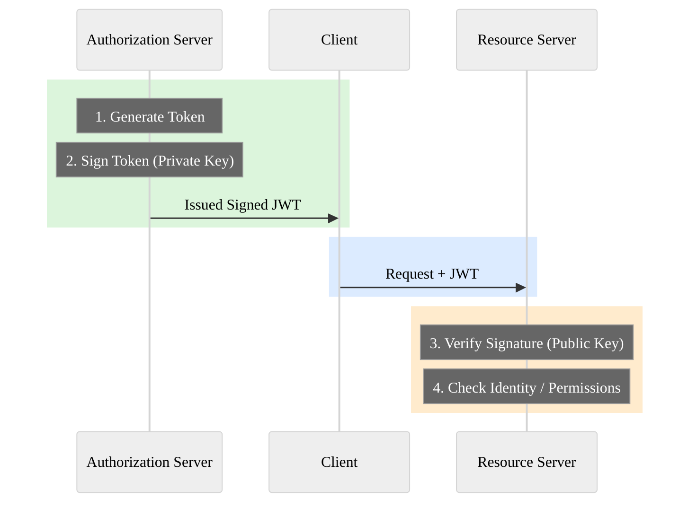
```mermaid
---
config:
  look: handDrawn
  theme: neutral
  themeVariables:
    fontFamily: "Verdana"
    fontSize: "16px"
    actorFontSize: "18px"
    messageFontSize: "14px"
    noteFontSize: "14px"
    actorFontWeight: "bold"
    actorTextColor: "#000"
    signalTextColor: "#000"
    labelTextColor: "#000"
---
sequenceDiagram
    participant AS as Authorization Server
    participant Client
    participant RS as Resource Server

    %% --- TOKEN CREATION (GREEN: TRUSTED AUTH SERVER) ---
    rect rgb(220, 245, 220)
        Note over AS: 1. Generate Token
        Note over AS: 2. Sign Token (Private Key)
        AS->>Client: Issued Signed JWT
    end

    %% --- TOKEN USAGE (BLUE: CLIENT TRANSPORT) ---
    rect rgb(220, 235, 255)
        Client->>RS: Request + JWT
    end

    %% --- TOKEN VERIFICATION (ORANGE: VALIDATION ZONE) ---
    rect rgb(255, 235, 205)
        Note over RS: 3. Verify Signature (Public Key)
        Note over RS: 4. Check Identity / Permissions
    end

```

- **Why HTTPS is Possible:** Uses a TLS Handshake where the server sends a Public Key, the client encrypts a symmetric session key with it, and the server decrypts it with the Private Key.
    - The HTTP problem
        - How can i securely talk to a server i've never met before?
    - TLS handshake
        - Server sends public key(certificate)
        - Client verifies certificates authority(CA)
        - Client generates random symmetric key
        - Client encrypts it with server's public key
        - Server decrypts with private key
    - Now both share a symmetric session key.

- **Code** : [asymmetricCryptography.js](./Code/phase-0/asymmetricCryptography.js)

### JWT vs OAuth

- **JWT:** A token format (Header.Payload.Signature). A container for claims.
- **OAuth 2.0:** An Authorization framework/protocol defining roles, flows, and how tokens are issued.

---

## 0.4 – Digital Signatures

- Bridge between cryptography and real-world trust(JWT, OAuth, HTTPS).
- **Integrity:** Data not altered by even 1 bit.
- **Authenticity:** Data created by the expected owner.
- **Non-repudiation:** Signer cannot deny signing it.

### High-Level Flow

1. **Signing:** `Data -> Hash -> Sign(hash, privateKey) -> Signature`
    - Signature = Encrypt(hash(data) , privateKey)
    - Data is hashed first
    - Hash is signed(now raw data)
    - Signature is small and fixed size
2. **Verification:** `Data -> Hash` vs `Signature + PublicKey -> Extracted Hash`.
    - Data -> Hash (Integrity)
    - Signature + PublicKey -> Verify (Authenticity)
3. If `Generated Hash === Extracted Hash`, the signature is valid.
    - Data has matches
    - Signature matches
    - Correct public key is used
        1. Re-hash the received data -> hash1
        2. Use public key to decrypt signature -> hash2
        3. Compare hash1 and hash2 -> hash1 === hash2

- If you need secrecy -> Encryption
- If you need trust -> use signatures

### Visual Representation

#### RSA Process (Asymmetric)

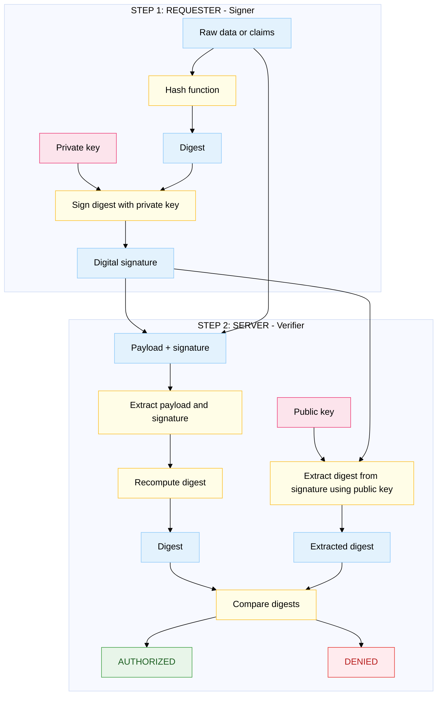
```mermaid
%%{ init: { "theme": "base" } }%%
graph TD
  classDef data fill:#e3f2fd,stroke:#90caf9,color:#000;
  classDef process fill:#fffde7,stroke:#fbc02d,color:#000;
  classDef key fill:#fce4ec,stroke:#ec407a,color:#000;
  classDef success fill:#e8f5e9,stroke:#43a047,color:#1b5e20;
  classDef failure fill:#ffebee,stroke:#e53935,color:#b71c1c;

  subgraph REQUESTER["STEP 1: REQUESTER - Signer"]
    direction TB
    Payload[Raw data or claims]:::data --> Hash1[Hash function]:::process
    Hash1 --> Digest1[Digest]:::data
    PrivateKey[Private key]:::key --> Sign[Sign digest with private key]:::process
    Digest1 --> Sign
    Sign --> Signature[Digital signature]:::data
  end

  Signature --> Outgoing[Payload + signature]:::data
  Payload --> Outgoing

  subgraph SERVER["STEP 2: SERVER - Verifier"]
    direction TB
    Outgoing --> Split[Extract payload and signature]:::process
    Split --> Recalc[Recompute digest]:::process
        Recalc --> Digest2[Digest]:::data
        PublicKey[Public key]:::key --> Extract[Extract digest from signature using public key]:::process
        Signature --> Extract
        Extract --> ExtractedDigest[Extracted digest]:::data
        Digest2 --> Compare[Compare digests]:::process
        ExtractedDigest --> Compare
        Compare --> OK[AUTHORIZED]:::success
        Compare --> ERR[DENIED]:::failure
  end
```

- The verifier recomputes a fresh hash from the received data, extracts the original hash from the signature using the public key, and compares the two hashes; if they match the signature is valid.

#### HMAC Process (Symmetric)

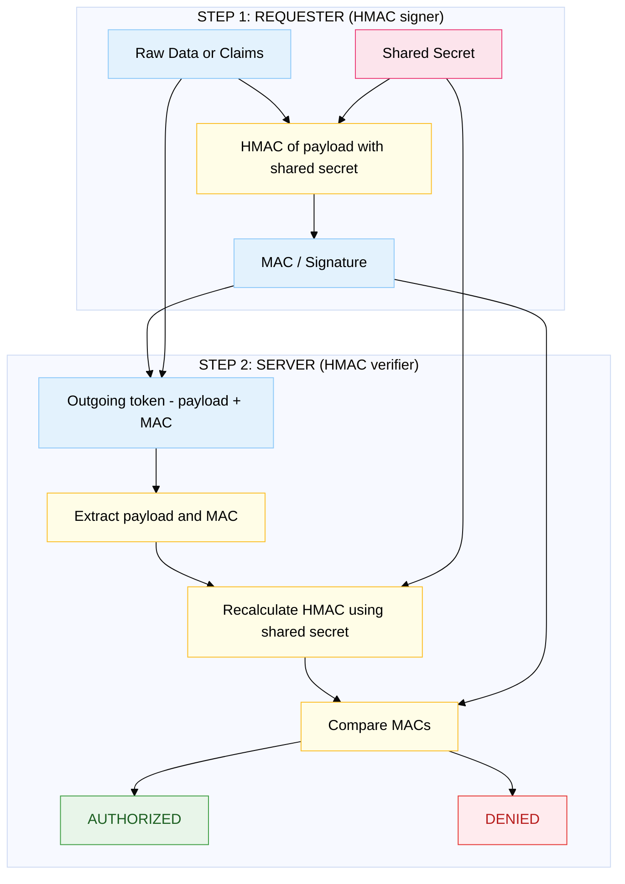
```mermaid
%%{ init: { "theme": "base" } }%%
graph TD
  classDef data fill:#e3f2fd,stroke:#90caf9,color:#000;
  classDef process fill:#fffde7,stroke:#fbc02d,color:#000;
  classDef key fill:#fce4ec,stroke:#ec407a,color:#000;
  classDef success fill:#e8f5e9,stroke:#43a047,color:#1b5e20;
  classDef failure fill:#ffebee,stroke:#e53935,color:#b71c1c;

  subgraph REQUESTER["STEP 1: REQUESTER (HMAC signer)"]
    direction TB
    Payload[Raw Data or Claims]:::data --> HmacCalc[HMAC of payload with shared secret]:::process
    SharedSecret[Shared Secret]:::key --> HmacCalc
    HmacCalc --> Signature[MAC / Signature]:::data
  end

  Signature --> Outgoing[Outgoing token - payload + MAC]:::data
  Payload --> Outgoing

  subgraph SERVER["STEP 2: SERVER (HMAC verifier)"]
    direction TB
    Outgoing --> Split[Extract payload and MAC]:::process
    Split --> HmacVerifyCalc[Recalculate HMAC using shared secret]:::process
    SharedSecret --> HmacVerifyCalc
    HmacVerifyCalc --> Compare[Compare MACs]:::process
    Signature --> Compare
    Compare --> OK[AUTHORIZED]:::success
    Compare --> ERR[DENIED]:::failure
  end

```

- MAC : Message Authenticated Code
- HMAC : Hash-Based Message Authenticated Code
- MAC is recreated again in receiver end and compare both sender MAC and receiver MAC
- If both match, data is valid

---

## 0.5 – Hashing & Password Security

### Hashing & Password Terminologies

#### Password Hashing

The process of converting a password into a one-way cryptographic value for storage.

#### One-way Function

Easy to compute.
Computationally infeasible to reverse.

#### Salt (Password Hashing)

Random, unique data added to a password before hashing.

#### Pepper

A secret value added to all passwords in addition to salt.
Stored outside the database.

#### Rainbow Table

A precomputed list of common passwords and their hashes.

#### Brute-Force Attack

Systematically trying many passwords until one matches.

#### What Is Password Hashing

- We never store passwords; we store **proofs that a password was correct**.
- A password hash **cannot be decrypted**.

### Verification Flow

- User enters password.
- System computes:
    - <kbd>hash(password + salt)</kbd>
- Computed hash is compared with the stored hash.

### Why Password Hashing Is Used, Why Not Encryption?

- Encryption can be reversed.
- If the encryption key leaks, **all passwords leak**.

### Why Hashing Is Correct

- Hashing is one-way.
- Database breach ≠ password disclosure.
- Limits blast radius.
- If a system can decrypt passwords, it is already insecure.

### Why Normal Hashes Are Not Enough

- Algorithms such as:
    - SHA-256
    - SHA-512
    - MD5
- Are:
    - Too fast.
    - Designed for data integrity, not passwords.

- Fast hashing ⇒ easy brute-force attacks.

### What Password Hashing Algorithms Do Differently

- Password-safe algorithms:
    - Are intentionally slow.
    - Are adaptive.
    - Are memory-hard (in some cases).

- Examples:
    - bcrypt
    - argon2
    - scrypt

### How Salt Protects You

- Passwords are hashed as:
    - `hash(password + uniqueSalt)`
- Same password ⇒ different hash per user.
- Rainbow tables become useless.

**Salt Properties**

- Random.
- Stored with the hash.
- Not secret.

**Pepper**

- Passwords can be hashed as:
    - `hash(password + salt + pepper)`
- Pepper is a server secret.
- Stored in environment variables.
- Protects against database-only breaches.

### Passwords Are Verified, Not Recovered

- Passwords are never decrypted or retrieved.
- They are only verified by hash comparison.

### Password Hashing & Verification Flow

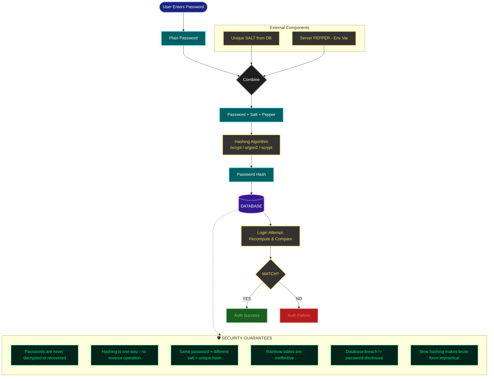
```mermaid
graph TD
    %% Global Styles for Dark Theme
    classDef default fill:#1e1e1e,stroke:#888,color:#fff,stroke-width:2px;
    classDef start fill:#1a237e,stroke:#5c6bc0,color:#fff;
    classDef process fill:#333,stroke:#ffd54f,color:#ffd54f;
    classDef storage fill:#311b92,stroke:#ba68c8,color:#fff;
    classDef success fill:#1b5e20,stroke:#81c784,color:#81c784;
    classDef failure fill:#b71c1c,stroke:#e57373,color:#e57373;
    classDef highlight fill:#006064,stroke:#4dd0e1,color:#fff;
    classDef cert fill:#00241b,stroke:#00e676,color:#00e676,stroke-dasharray: 5 5;

    %% 1. The Main Flow
    User([User Enters Password]):::start --> Plain[Plain Password]:::highlight

    subgraph Secrets ["External Components"]
        Salt[Unique SALT from DB]:::process
        Pepper[Server PEPPER - Env Var]:::process
    end

    Plain --> Combine{Combine}
    Salt --> Combine
    Pepper --> Combine

    Combine --> Data[Password + Salt + Pepper]:::highlight
    Data --> HashAlgo[Hashing Algorithm<br/>bcrypt / argon2 / scrypt]:::process

    HashAlgo --> PHash[Password Hash]:::highlight
    PHash --> DB[(DATABASE)]:::storage

    DB --> Login[Login Attempt:<br/>Recompute & Compare]:::process

    Login --> Match{MATCH?}:::process
    Match -- YES --> Success[Auth Success]:::success
    Match -- NO --> Failure[Auth Failure]:::failure

    %% 2. ADDED HERE: The Security Guarantees Box (Option 2)
    %% We connect it to the DB with a dotted line so it sits at the bottom
    DB -.-> Guarantees

    subgraph Guarantees ["🛡️ SECURITY GUARANTEES"]
        direction TB
        G1[Passwords are never decrypted or recovered]:::cert
        G2[Hashing is one-way - no reverse operation]:::cert
        G3[Same password + different salt = unique hash]:::cert
        G4[Rainbow tables are ineffective]:::cert
        G5[Database breach != password disclosure]:::cert
        G6[Slow hashing makes brute-force impractical]:::cert
    end

    %% This invisible link keeps the Guarantees box centered at the bottom
    Success ~~~ Guarantees
    Failure ~~~ Guarantees
```

**Code**: [passwordHashing.js](./Code/phase-0/passwordHashing.js)

# Phase 1 Authentication & Authorization Foundations

## 1.1 Authentication & Authorization Terminologies

### Authentication (AuthN)

- Authentication (AuthN) is a process by which a system verifies that an entity (user or system) is genuinely who it claims to be.
- It is usually done by validating credentials such as:
    - Passwords
    - Tokens
    - Cryptographic proofs
- In simple terms, **Authentication establishes identity, not permissions**.

### Authorization (AuthZ)

- Authorization (AuthZ) is a process by which a system determines whether an already authenticated entity is allowed to:
    - Perform a specific action
    - Access a specific resource
- Authorization is always evaluated **after authentication**.
- It enforces business rules and access control.

### Identity (Who)

- Identity is the verified representation of an entity inside the system after successful authentication.
- It is typically expressed as:
    - User ID
    - Service account ID
    - Client identifier
- It answers the question:
    - What exact entity is making this request?
- Identity is a set of attributes that uniquely define a person or entity.
- Identity is the **source of truth**.
- **Focus:** Authentication (AuthN)

### Principal (What)

- A Principal is the authenticated entity that is currently interacting with the system, such as:
    - A logged-in user
    - A backend service
    - An automated client
- The term _principal_ is commonly used in security models to abstract both human users and machines.
- It is a specific representation of an identity during a security session.
- **Focus:** Authorization (AuthZ)
- One identity can have multiple principals.

### Policy

- A Policy is a set of rules that determines whether a principal with certain attributes or permissions is allowed to perform a requested action.
- Policies are the mechanism through which authorization decisions are enforced.
- A policy is the **rule book** or the **contract**.

### Permission

- A Permission is a specific, well-defined action that a principal is allowed to perform, such as:
    - Reading data
    - Modifying a resource
    - Deleting an entity

### Analogy

- **Identity:** Me (the human)
- **Principal:** The specific account/session representing _me_ (`request.user`)
- **Role:** Admin (the “hat” the principal is wearing) (`principal.role`)
- **Policy:**
  “The Admin role is allowed to Read and Write, but NOT Delete.”
- **Permission:**
  Read, Write

### Identity → Principal → Permission Flow

- Identity (Login)
    - → Creates Principal (User Object)
    - → Contains Role (Admin)
    - → Grants Permissions (Read / Write / Delete)

## 1.2 Authorization in Express.js

```js
// 1. IDENTITY: The person who logged in (e.g., Sarah)

// 2. PRINCIPAL: This 'user' object is the Principal.
// It is the "Actor" representing Sarah in this request.
const principal = request.user;

// 3. ROLE: Role is a property OF the Principal.
console.log(principal.role); // "Admin"

// 4. PERMISSIONS: Granted BECAUSE of the Role.
if (principal.role === "Admin") {
    allowAccess(["read", "write", "delete"]);
}

// sample user object
{
    // 1. IDENTITY
    identity: {
        userId: "USR_9988",
        username: "prashant",
        mfaEnabled: true
    },

    // 2. PRINCIPAL (The Current Actor)
    principal: {
        sessionId: "session_abc123",
        authenticatedAt: "2023-10-27T10:00:00Z",
        ipAddress: "192.168.1.1",

        // 3. ROLES (The Groups)
        roles: ["ADMIN", "EDITOR"],

        // 4. POLICY (The Logic Source)
        // In complex systems, we often attach the "Policy ID" that
        // was used to calculate the permissions.
        appliedPolicy: "ENTERPRISE_ADMIN_POLICY_V2",

        // 5. PERMISSIONS (The Final List)
        // This is the "What" that the code actually checks.
        can: {
            user_read: true,
            user_write: true,
            user_delete: true,
            billing_access: false  // Even an Admin might not see Billing!
        }
    }
}
```

## 1.3 Request Lifecycle

- Authentication middleware validates identity
- Identity context is attached to request
- Authorization logic evaluates permissions
- Business logic executes only if allowed

### HTTP Semantics

- 401 Unauthorized means the system does not know who you are
- 403 Forbidden means the system knows who you are but refuses the action

## 1.4 Code Example

Refer to [AuthMiddleware.js](./Code/phase-1/AuthMiddleware.js)

## 1.5 Sequence Diagram (AuthN Flow)

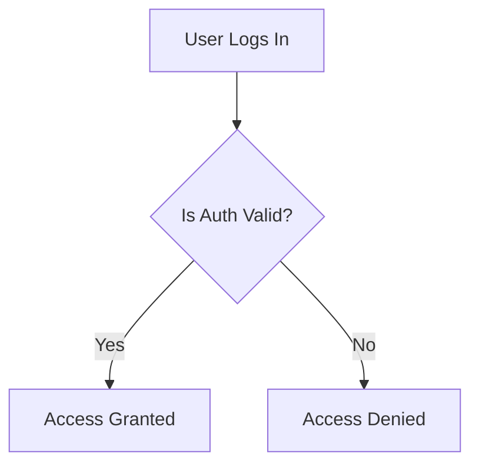
```mermaid
graph TD
    A[User Logs In] --> B{Is Auth Valid?}
    B -- Yes --> C[Access Granted]
    B -- No --> D[Access Denied]
```

---

# Phase 2 JWT (Token-Based Security)

## JWT Overview

_A JSON Web Token is a Compact, URL-safe string that represents a set of claims between two parties. The information inside the JWT can be trusted because it was signed using cryptography. JWTs are commonly used to represent authenticated users and [*Delegated access*](#a-delegated-access) in web application and APIs_

## 2.1 JWT Terminology

### Token

A token is piece of data issued by a server and represented by a client as a proof of authentication and authorization. In JWT-based systems, the token itself carries the information to identify the user and validate trust

### Claim

A Claim is a piece of information asserted about a subject. In JWTs, claims are stored inside the payload as a name/value pairs. The name of the claim is always string and value can be any JSON value such as string, number, boolean, array or object.

When discussing JWTs, the word "claim" refers to the claim name (for example, sub, exp or role)

### Subject (sub)

The Subject claim identifies the entity that the token is about. In most applications, this is the unique identifier of the authenticated user.

### Issuer (iss)

The Issuer claim identifies the system that issues and signed the JWT. This is typically Authentication or Authorization server

### Audience (aud)

The audience claim specifies which service or API the token is intended for. This prevents a token issued for one server from being reused by another server.

### Expiration (exp)

The expiration claim defines the time after which the token is no longer valid. Even if the signature is valid, an expired token must be rejected.

### Signature

The signature is cryptographic value that ensure the token was issued by a trusted source and that its content have not been modified since issuance.

## 2.2 What is a JSON Web Token?

A JSON Web Token is a **_self-contained_** mechanism for securely transmitting information between parties. Is allows a server to trust the claim about a user without storing session state. The server validate the token by verifying the certificate and checking the claims, rather than querying a database or session store on every request

JWTs are widely used in modern authentication systems because they are lightweight, scalable, and well-suited for distributed architectures

**Self-Contained**:
A JWT is described as self-contained because it includes all the information required to understand and validate the token. This includes both the claim about the subject and the cryptographic signature that proves the token's integrity.

Because of this design, a server can authentication and authorize a request using only the token itself, without relying on server-side session storage.

## 2.3 JWT Structure

A JWT is composed of three parts, separated by dots(.)

_`header.payload.signature`_

Each part is Base64URL-encoded and has specific responsibility

### JWT Header

The header contains the metadata about the token, including the type of the token and cryptographic algorithm used to sign it.

```json
{
    "alg": "RS256",
    "typ": "JWT"
}
```

- The <kbd>alg</kbd> field indicates the signing algorithm, such as RS256(RSA with SHA-256)
- The <kbd>typ</kbd> field identifies the token types as a JWT.

> Note : The Server must not blindly trust the <kbd>alg</kbd> value from the token. Allowed algorithm must be enforced by the server configurations

### JWT Payload (Claims)

The payload contains the claims, which are statements about the subject of the token. or The Payload contains the information about the entity (typically user) and additional entity attributes. which are called claims.

```json
{
    "sub": "12345",
    "name": "Prashant",
    "admin": true,
    "iat": 17100000,
    "exp": 17103600
}
```

This payload assert the following:

- The subject of the token is the user with ID <kbd>12345</kbd>
- The user's name is Prashant
- The user has administrative privileges
- The token was issued at a specific time
- The token expires at a specific time

> _Important Rule About the Payload_
>
> The JWT payload is not encrypted, It is only Base64URL-encoded, which means anyone who has the token can decode and read the claims
>
> For this reason:
>
> - Sensitive data such as passwords or secrets must never be stored in a JWT payload
> - JWTs should only contain information that is safe to expose.

#### Types of JWT Claims

JWT Claims are generally categorized into three types

_1. Registered Claims_

Registered claims are predefined claim names which are defined by JWT specification. They are optional but have standard meaning when used.

_Examples include_:

- <kbd>iss</kbd> (issuer)
- <kbd>sub</kbd> (subject)
- <kbd>aud</kbd> (audience)
- <kbd>exp</kbd> (expiration)
- <kbd>iat</kbd> (issued at)

_2. Public claims_

Public claims are claims intended to shared across systems. These claims should be standardize or namespaced to avoid collisions.

_Examples include_:

- email
- profile

_3. Private claims_

Private claims are custom claims which are defined by your application. They are used to carry application specific information.

```json
{
    "role": "manager",
    "department": "sales"
}
```

### JWT Signature

The Signature is the most important part of the JWT because it established trust.

The Signature is created by signing the encoded header and payload using a cryptographic key.

```text
Signature = Sign(
    base64url(header) + "." + base64url(payload),
    privateKey
)
```

The Signature ensures:

1. The token was issued by a trusted issuer.
2. The token has not been modified

_If any part of the token changes, signature verification fails_

---

## 2.4 JWT Verification Flow

When a server receives a JWT, it performs the following steps:

1. Decode the header and payload.
2. Verify the signature using a trusted key. (Similar to Digital Signature verification)
3. validate registered claims such as exp, iss and aud.
4. Accept the token only if all validations succeed

_If any step fails, the token is rejected_

```javascript
import jwt from "jsonwebtoken";

const payload = jwt.verify(token, publicKey, {
    issuer: "https://auth.example.com",
    audience: "orders-api",
});
```

This Code:

- Verifies the token signature
- Ensures the token comes from the expected issuer(iss)
- Ensures the token is intended for the correct audience(aud)
- Returns the decoded claims if valid

## 2.5 What JWT Is and Is Not Responsible For

- JWT is responsible for:
    - Securely carrying claims
    - Proving token integrity
    - Enforcing expiration
- JWT is not responsible for
    - Authorization decisions
    - Logout handling
    - Token storage security
    - Preventing token that

## 2.6 JWT - HS256 vs RS256

_*Signing Algorithm* defines how the JWT signature is created and verified. It specifies_

- _The cryptographic method_
- _The type of key used_
- _How integrity and authenticity are enforced_

### HS256 vs RS256 – Terminology

#### HMAC (Hash-Based Message Authenticated Code)

- A cryptographic technique that combines a hash function and a secret key to produce a signature.

#### SHA-256 (Secure Hash Algorithm)

- A secure hash algorithm that produces a fixed 256-bit hash value.

#### RSA

- An asymmetric cryptographic algorithm that uses a public key and private key pair.

#### Signing key

- The secret or private key used to generate a JWT signature.

#### Verification Key

- The key used to verify that the JWT signature is valid.

### What are HS256 and RS256?

- HS256 and RS256 are JWT signing algorithms
- Their job is not encryption
- Their job is to prove that the token was issued by trusted authority and was not modified.

### Internal Working

---

#### _HS256(HMAC + SHA-256)_

HS256 uses one single secret key.

- The same key is used to sign the token
- The same key is used to verify the token

This is symmetric cryptography.

**_Flow_**

1. Server creates JWT header + payload
2. Server hashes them using SHA-256
3. Server signs the hash using a shared secret
4. Signature is appended to the JWT

**_During verification_**

- The API recalculates the signature using the same secret
- If signature matches, the token is trusted

```json
{
    "alg": "HS256",
    "typ": "JWT"
}
```

> **_critical Implication_**
>
> - Anyone who can verify the token can also sign new tokens, because the same secret is used
>
> This is extremely important.

#### _RS256(RSA + SHA+256)_

RS256 uses a Key pair:

- Private key -> used to sign the token
- Public key -> used to verify the token

This is asymmetric cryptography.

**_Flow_**

1. Authorization server sign the JWT using its private key
2. API receives the JWT
3. API verifies the signature using the public key
4. If verification succeeds, token it trusted

```json
{
    "alg": "RS256",
    "typ": "JWT"
}
```

> **_critical Implication_**
>
> - APIs cannot create tokens
> - APIs can only verify tokens
> - Token issuance authority is strictly controlled
>
> This separation is intentional and powerful

## 2.7 HS256 Problems in Real Systems

    - Secret must be shared across services
    - Secret leakage compromises entire system
    - Difficult key rotation
    - Risk of algorithm confusion attacks

## 2.8 RS257 Advantages

    - Private key never leaves auth server
    - Public key can safely distributed
    - Multiple APIs can verify token independently
    - Supports zero-trust and microservice architectures

## 2.9 JWT - Token Lifecycle

### Token Issuance

Token issuance is the process by which authorization server creates a JWT and gives it to a client after successfully verifying the user's identity.

- Issuance happens only once per authenticated event, not on every request.

- Token issuance exist to replace repeated credential exchange with a signal proof of authentication.

- Once issued, the token represents the authenticated identity for a limited time.

_When issuance occurs, the authorization server_:

1. Confirms the user's identity (for example, by verifying a password hash)
2. Constructs a payload containing identity and security claims.
3. Cryptographically signs the payload using a signing key
4. Returns the resulting JWT to the client

```json
{
    "sub": "user_42",
    "iss": "https://auth.example.com/",
    "aud": "orders-api",
    "iat": 1700000000,
    "exp": 1700003600
}
```

### Token Usage

Token Usage is the act of sending the issued JWT along with each API to prove identity and permissions.

The token it typically sent in the <kbd>Authorization</kbd> HTTP header.

_What happen internally during usage_
For every protected request, the API:

1. Extracts the token form the request
2. Verifies the token signature
3. Validates required claims
4. Builds an authentication context
5. Allows or rejects the request.

This process occurs for every request, not once per login

### Token Expiration

Token expiration defines the maximum lifetime of a JWT using the <kbd>exp</kbd> claim.

Once the expiration time is reached, the token must be rejected regardless of whether it was valid before.

_How expiration is enforced technically_

During validation, the API compares:

- The current serve time
- The <kbd>exp</kbd> value in the token.

If the current time is greater than than <kbd>exp</kbd>, the token is rejected immediately.

### Token Invalidation

Token invalidation means making a token unusable before its expiration time.

This is commonly expected during logout or account companies

_How systems handle invalidation conceptually_

In practice, system rely on strategies such as:

- Short-lived access tokens
- Server-side deny lists
- Token version checks
- Refresh token rotation

These mechanisms introduce controlled state, which we will cover in later phase.

### Sequence Diagram (Token Lifecycle)

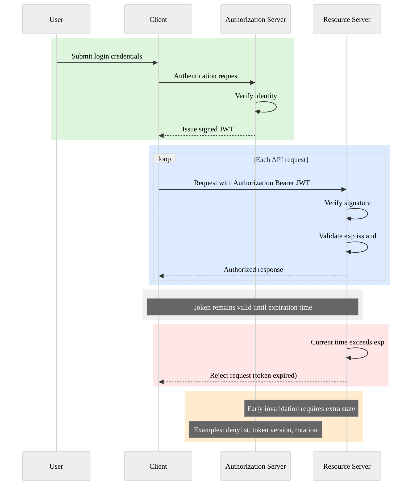
```mermaid
---
config:
  look: handDrawn
  theme: neutral
  themeVariables:
    fontFamily: "Verdana"
    fontSize: "16px"
    actorFontSize: "18px"
    messageFontSize: "14px"
    noteFontSize: "14px"
    actorFontWeight: "bold"
    actorTextColor: "#000"
    signalTextColor: "#000"
    labelTextColor: "#000"
---

sequenceDiagram
    participant User
    participant Client
    participant AuthServer as Authorization Server
    participant API as Resource Server

    %% --- AUTHENTICATION & TOKEN ISSUANCE (GREEN) ---
    rect rgb(220, 245, 220)
        User->>Client: Submit login credentials
        Client->>AuthServer: Authentication request
        AuthServer->>AuthServer: Verify identity
        AuthServer-->>Client: Issue signed JWT
    end

    %% --- TOKEN USAGE (BLUE) ---
    rect rgb(220, 235, 255)
        loop Each API request
            Client->>API: Request with Authorization Bearer JWT
            API->>API: Verify signature
            API->>API: Validate exp iss aud
            API-->>Client: Authorized response
        end
    end

    %% --- TOKEN LIFETIME (GRAY) ---
    rect rgb(240, 240, 240)
        Note over Client,API: Token remains valid until expiration time
    end

    %% --- TOKEN EXPIRATION (RED) ---
    rect rgb(255, 230, 230)
        API->>API: Current time exceeds exp
        API-->>Client: Reject request (token expired)
    end

    %% --- EARLY INVALIDATION (ORANGE) ---
    rect rgb(255, 235, 205)
        Note over AuthServer,API: Early invalidation requires extra state
        Note over AuthServer: Examples: denylist, token version, rotation
    end

```

## 2.10 JWT - Token Types

### JWT – Token Terminology

#### Token Type

A token type describes the purpose for which a token is issued and how it is expected to be used.

#### Access Token (term)

An Access token is a token used by a client to **access a protected API**.

#### ID Token (term)

An ID token is a token used to **prove that a user has authenticated and to carry user identity information**.

#### Refresh Token (term)

A refresh token is a token used to **obtain new access tokens without re-authenticating the user**.

_These names come directly from OAuth 2.0 and OpenID Connect, which AuthO implements_

### Access Token

An Access token represents authorization, not identity.

It tells an API: _"This request is allowed to access this resource with these permissions"_

**Why access token exist**

APIs should not care who is the user is, only check whether request is allowed to do.

Access tokens exists to carry permissions and scope in verifiable way.

This keeps APIs decoupled with authentication logic

**What access token contains**

An access token typically includes

- Who the token is for (sub)
- Who issued it(iss)
- When it expires(exp)
- What it can do (scopes or permissions)

The API validates the token and enforces authorization based on its contents.

> _Important boundary_
>
> Access tokens are not meant to be read by the frontend for user details
>
> There are meant to be:
>
> - sent to APIs
> - Validate by APIs
> - Enforced by APIs

### ID Token (OIDC)

An ID Token represents authentication, not authorization.

It tells the client application: _"This user has successfully logged in and here is their identity information."_

**Why ID token exist**

Frontend application need a trusted proof of login.

They also need basic user information without calling APIs unnecessarily.

ID tokens exist to fulfill this need securely and explicitly.

**What ID tokens contain**

An ID token typically includes:

- A stable user identifier(sub)
- The issuer(iss)
- The client it was issued for (aud)
- Authentication time
- Optional profile information

ID tokens are consumed by the client, not APIs

### Refresh Token

A refresh token is a longer-lived credential used to obtain new access tokens.

It is not sent to APIs

**Why refresh token exist**

Access tokens are short lived for security reasons.

Re-authenticating the user every few minutes would harm user experience.

Refresh token exist to:

- Preserve session continuity
- Avoid repeated logins
- Keep access tokens short-lived

_How refresh tokens are used_

1. Access token expires
2. Client send refresh token to authorization server
3. Authorization server issues a new access token

**APIs never see refresh tokens**

### Real-World Token Separation

AuthO enforces strict separation:

| Token Type    | Used By | Sent To     | Purpose            |
| ------------- | ------- | ----------- | ------------------ |
| Access Token  | Client  | API         | Authorization      |
| ID Token      | Client  | Client Only | Authentication     |
| Refresh Token | Client  | Auth server | Session continuity |

## 2.11 JWT - Secure Token Storage

### JWT – Secure Token Terminology

#### Token Storage

Token storage is the place where a client application **keeps authentication tokens between requests.**

#### Browser Storage

Browser storage is a mechanism provided by the browser to persist data, such as cookies and web storage.

#### XSS (Cross-site scripting)

XSS is an attack where an attacker injects malicious javascript code into a trusted website, causing browser to execute attacker-controlled code.

#### CSRF (Cross-site Request Forgery)

CSRF is an attack where a browser is tricked into sending authenticated requests to a server **without user's intent.**

#### HttpOnly Cookie

An HttpOnly Cookie is a cookie that **cannot be accessed by javascript**, even if XSS exists.

#### SameSite

SameSite is a cookie attribute that controls **whether cookies are sent with cross-site requests**.

### What Secure Token Storage Means

Secure token storage means choosing a storage mechanism that minimized the risk of token theft and misuse.

- A token is effectively a Key.
- Anyone who possesses it can act as a user until it expires

The goal of secure storage is to reduce the probability that attackers can access the key.

### _Why Token Storage is a Security problem_

The core problem

Browser are powerful but hostile environment.

They execute:

- First-party Javascript
- Third-party scripts
- User-installed extensions

If a token is stored where javascript can read it, **any successful XSS attack becomes an account takeover**.

### Storage Options and Risks

#### A. LocalStorage

LocalStorage stores key-value data in the browser and allows **full Javascript read/write access**.

Tokens stored here persist across page reloads.

_Why LocalStorage is dangerous_

If XSS occurs:

- Malicious Javascript code can read the token
- Token can be <abbr title='data exportation -- the data theft'>exfiltrated</abbr> to an attacker
- Attacker can <abbr title='pretends to be'>impersonate</abbr> the user

LocalStorage offer **Zero Protection** against XSS.

#### B. SessionStorage

SessionStorage is similar to LocalStorage but is scoped to a browser tab.

_*Why SessionStorage is still unsafer*_

SessionStorage is also fully accessible to Javascript.

XSS impact is the same as LocalStorage.

The Only difference is lifetime, not security.

#### C. Cookies (Without Security Flags)

[Cookies](#b-cookies) are automatically sent by the browser with HTTP requests to matching domain.

_*Why plain cookies are unsafe*_

without proper flags:

- Javascript can read cookies
- Cookies are sent in cross-site requests
- Both XSS and CSRF risks exist

Cookies are not secure by default

#### D. HttpOnly Cookies (Recommended)

How HttpOnly Cookies works

HttpOnly Cookies:

- Are sent automatically with requests
- Cannot read by Javascript
- Are invisible to XSS payloads

This removes the primary token theft vector.

_*Why HttpOnly cookies improve security*_

Even is XSS exists:

- Token cannot be stolen via Javascript
- Attackers cannot be easily exfiltrate it

This significantly reduces blast radius.

#### E. SameSite Attribute(CSRF Mitigation)

Why SameSite exists

When cookies are automatically sent, CSRF becomes possible.

Samesite controls **When cookies are includes in cross-site requests**.

SameSite modes

- **Strict** : Cookie sent only in same-site requests
- **Lax** : Cookie sent in top-level navigation's
- **None** : Cookie sent in all context(requires secure)

SameSite reduces CSRF risk without breaking modern auth flow.

### Real-World Secure Patterns

AuthO's recommended browser pattern:

- Store access tokens in memory
- Store session identifiers or refresh tokens in HttpOnly cookies
- Use Short-lived access tokens
- Rely on automatic cookie sending

# Phase 3 OAuth 2.0 (Authorization Framework)

## 3.1 OAuth 2.0 – Core Terminology

### Resource Owner

The Resource Owner is **the entity that owns the data being accessed**.

In most real-world applications, the Resource Owner is the **end user**, meaning a human being who owns personal data such as profile information, orders or messages.

OAuth 2.0 is designed primarily to protect Resource Owner's data, not the client application.

The Resource Owner is the only party that has the authority to **grant permission** for access to that data.

### Client

The Client is the application that **wants to access the Resource Owner's data**.

This Could be a web application, a mobile app, a backend application or even a command line tool.

The Client does not own the data and therefore cannot access by default.

Instead, the Client must request permission and prove that permission has been granted.

In OAuth, the client is identified by a **client ID**, and sometimes authenticated using a **client secret**.

### Authorization Server

The Authorization server is **the system responsible for authenticating Resource owner and issuing tokens**

It acts as a trusted authority that both the client and the Resource server rely on.

The Authorization Server verifies who the user is, ask for the consent when required, and issue tokens that represents that consent

In modern systems, platforms like AuthO commonly act as the Authorization Server.

### Resource Server

The Resource Server is **the API or backend service that hosts the protected data.**

It does not authenticate users directly and does not issue tokens.

Instead, it receives tokens from clients and validates them to decide whether access should be granted

The Resource Server trusts the Authorization Server to have performed authentication correctly.

### Scope

A Scope is **a way to limit what a client is allowed to do.**

Instead of granting full access, scopes allow access to be broken down into smaller, controlled permissions.

For example, a token may allow reading user data not modifying it.

Scopes are critical because they enforce **the principle of least privilege**, when means giving only the minimum access required.

### What OAuth 2.0 Is (Conceptually)

OAuth 2.0 is **not an authenticated protocol**.

OAuth 2.0 is **a delegated Authorization framework**.

It core purpose is to allow a Resource owner to **grant limited access to their data** to a Client **without sharing credentials** such as passwords

### Why OAuth 2.0 Exists

The Problem OAuth solves

Before OAuth, applications often asked users for their **username and password** for third party services.

This creates server risk because:

- Passwords were shared with untrusted apps
- Users could not limit access
- Password changes broke integration
- Breaches exposed full accounts

OAuth 2.0 exists to **eliminate credential sharing entirely**.

Instead of passwords, OAuth uses **time-limited tokens with limited permissions**.

### Technical Perspective

In a typical OAuth interaction:

- The **Resource Owner** owns the data.
- The **Client** request access
- The **Authorization Server** verifies identity and consent
- The **Resource Server** enforces access using tokens
- **Scopes** defines the boundaries of that access

This strict separation is what makes OAuth secure and scalable

### Sequence Diagram (OAuth Interaction)

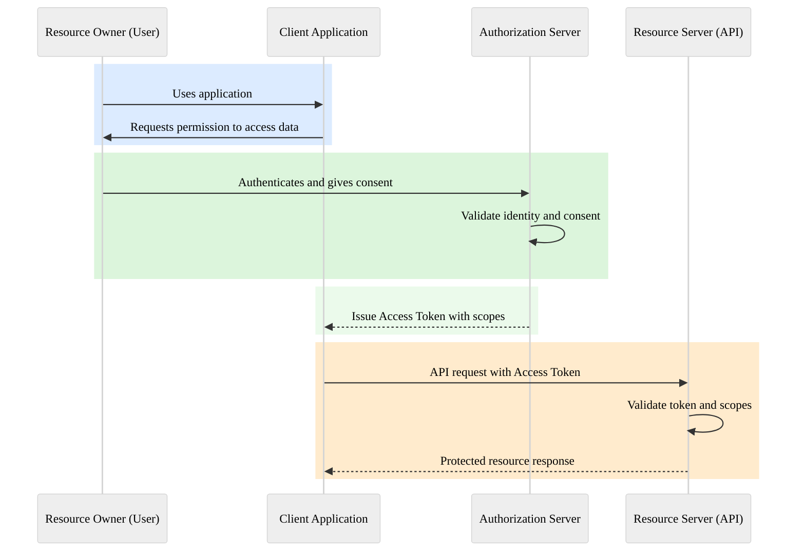
```mermaid
---
config:
  look: handDrawn
  theme: neutral
  themeVariables:
    fontFamily: "Verdana"
    fontSize: "16px"
    actorFontSize: "18px"
    messageFontSize: "14px"
    noteFontSize: "14px"
    actorFontWeight: "bold"
    actorTextColor: "#000"
    signalTextColor: "#000"
    labelTextColor: "#000"
---
sequenceDiagram
    participant RO as Resource Owner (User)
    participant Client as Client Application
    participant AS as Authorization Server
    participant RS as Resource Server (API)

    %% --- CLIENT INTERACTION (BLUE) ---
    rect rgb(220, 235, 255)
        RO->>Client: Uses application
        Client->>RO: Requests permission to access data
    end

    %% --- AUTHENTICATION & CONSENT (GREEN) ---
    rect rgb(220, 245, 220)
        RO->>AS: Authenticates and gives consent
        AS->>AS: Validate identity and consent
    end

    %% --- TOKEN ISSUANCE (LIGHT GREEN) ---
    rect rgb(235, 250, 235)
        AS-->>Client: Issue Access Token with scopes
    end

    %% --- RESOURCE ACCESS (ORANGE) ---
    rect rgb(255, 235, 205)
        Client->>RS: API request with Access Token
        RS->>RS: Validate token and scopes
        RS-->>Client: Protected resource response
    end

```

## 3.2 OAuth 2.0 – Grant Types

### OAuth 2.0 – Grant Terminology

#### Grant Type

A Grant type defines **how a client application obtain a access token from authorization server**.

It describes:

- Who is involved
- How trust is established
- What credentials are exchanged
- What security assumptions are made

Grant types exist because **different clients have different risk levels and capabilities**

### What OAuth 2.0 Grant Types Are

OAuth 2.0 Grant types are _standardized authorization flows_.

Each grant type defines **specific sequence of steps that allows a client to obtain a access token without learning user's password**

OAuth does not allow clients to invent their own flow.

Only well-defined grant types are allowed. because authorization logic must be **predictable and auditable**

### The Main OAuth 2.0 Grant Types

**_Authorization Code Grant (Most Important)_**

_What is it_

The Authorization Code Grant is a flow where:

- The user authenticates with the Authorization server
- The client receives a **temporary authorization code**
- The client exchanges that code for tokens using a secure backend channel

The access token is never exposed directly to the browser

_Why it exists_

This grant exist to protect tokens from:

- Browser javascript
- URL leaks
- interception attacks

It is designed for **confidential clients**, such as backend servers.

AuthO strongly recommends this grant type for modern web applications

_High-level behavior_

- User logs in at Authorization server
- Client receives a short-lived code
- Backend exchanges code for token securely

**_Client Credentials Grant_**

_What is it_

The Client Credentials is used when:

- There is no user involved
- The Client is acting on its own behalf

In this grant, the client authenticates directly with the Authorization server using its own credentials

_Why it exists_

Machine-to-machine communication still needs authorization.

Examples include:

- Internal microservices
- Background jobs
- Scheduled workers

This grant exists to issue tokens without a Resource Owner.

> _Important limitation_
>
> This grant **must never be used for user login**, because there is no user identity involved.

**_Refresh Token Grant_**

_What is it_

The Refresh Token Grant allows a client to obtain a **new access token** using a refresh token.

The user is not involved in this flow.

_Why it exists_

Access tokens are intentionally short-lived for security reasons.

Refresh tokens exits to:

- Avoid frequent logins
- Maintain session continuity
- Reduce exposure of long-lived credentials

This grant is tightly controlled and carefully restricted.

**_Implicit Grant (deprecated)_**

_What it was_

The Implicit Grant was designed for browser-based applications that could not keeps secrets.

It returned access tokens directly in the browser

_Why it was deprecated_

This grant exposed token to:

- Browser history
- Javascript access
- URL Leakage

Modern security guidance, including AuthO's, **Strongly discourage its use**

It has been replaced by **Authorization code grant with PKCE (Proof key for Code Exchange)**

### Sequence Diagram (Grant Types)

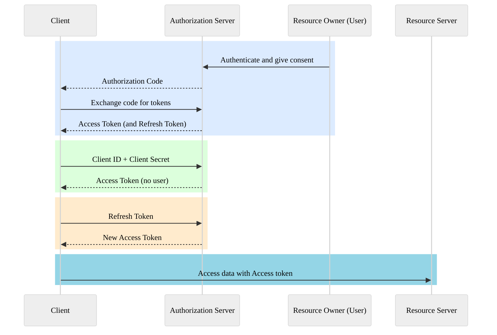
```mermaid
---
config:
  look: handDrawn
  theme: neutral
  themeVariables:
    fontFamily: "Verdana"
    fontSize: "16px"
    actorFontSize: "18px"
    messageFontSize: "14px"
    noteFontSize: "14px"
    actorFontWeight: "bold"
    actorTextColor: "#000"
    signalTextColor: "#000"
    labelTextColor: "#000"
---
sequenceDiagram
    participant Client
    participant AS as Authorization Server
    participant RO as Resource Owner (User)
    participant RS as Resource Server

    rect rgb(220,235,255)
        RO->>AS: Authenticate and give consent
        AS-->>Client: Authorization Code
        Client->>AS: Exchange code for tokens
        AS-->>Client: Access Token (and Refresh Token)
    end

    rect rgb(220,255,220)
        Client->>AS: Client ID + Client Secret
        AS-->>Client: Access Token (no user)
    end

    rect rgb(255,235,205)
        Client->>AS: Refresh Token
        AS-->>Client: New Access Token
    end

    rect rgb(148, 213, 230)
        Client->>RS : Access data with Access token
    end

```

## 3.3 OAuth 2.0 – Authorization Code Flow

> ### Example Scenario
>
> ---
>
> - **User** : A real human using a browser
> - **Client** : A web Application built with Express(example.com)
> - **Authorization Server** : AuthO
> - **Resource Owner** : Orders API (/orders)
>
> Goal : The user wants to login and then **access **protected** APIs** without sharing their password with the app

### Authorization Code Terminology

**_Authorization Code_**

An authorization code is a short-lived, one-time credential issued by the Authorization Server after the user successfully authenticates and gives consent.

This code does not grant access to APIs by itself.

Its only purpose is to be exchanged for tokens over a secure backend channel.

**_Redirect URI_**

A Redirect URI is **a pre-registered endpoint on the client application** where the Authorization Server is allowed to send the authorization code.

**_Back-Channel Communication_**

Back-Channel communication refers to **server-to-server communication** that is not exposed to the browser

In OAuth, token exchange always happen over a back-channel to protect secrets and tokens.

### Redirect-Based Authorization

Redirect-based authorization means the **client application never asks for user's username and password**

Instead, the client redirects the user's browser to Authorization server, where authentication happens

This is security boundary

_Why OAuth uses redirects_

Browsers are good at:

- Showing login pages
- Handling user interactions
- Following redirects

Browsers are not good at:

- Storing secrets
- Handling access tokens
- Making security decisions

Redirect allows:

- User authentication happens outside **the client**
- Credentials to be entered only at the **Authorization Server**

_What actually happens in our example_

1. User clicks "Login" on **example.com**
2. The Express app **redirects to browser** to AuthO
3. The browser leaves **example.com** completely

At this point:

- The client does **does not know the password**
- The browser is just following a redirect

```javascript
app.get("/login", (req, res) => {
    const authUrl = buildAuth0AuthorizeUrl({
        client_Id,
        redirect_uri,
        scope,
        response_type: "code",
    });

    res.redirect(authUrl);
});

// This route does not authenticate
// It only starts the authorization process
```

#### Authorization Code Exchange

The authorization code exchange is a **server to server operation** where the client exchange/trades a short lived code for tokens.

The browser is not involved here.

_Why the code exist at all_

The authorization code act as a **temporary proof of successful authentication and consent**

It exists to:

- Prevent tokens from appearing in URLs
- Prevent tokens from being exposed to Javascript
- Allow tokens issuance only after client authentication

This Code intentionally:

- Short-lived
- Single-use
- Useless without client authentication

_What happens technically_

1. Client backend sends the code to the Authorization Server
2. Client authenticates itself (client secret / PKCE)
3. Authorization server verifies.
    - Code validity
    - Client identity
    - Redirect URI
4. Tokens are issued to the backend.

#### Token Trust Boundaries (Critical Concept)

_What a trust boundary is_

A token trust boundary is a logical security perimeter where data (specifically authentication tokens like JWTs) **transitions from an untrusted state to a trusted state**. It represents the point where a system validates a token's signature, claims, and issuer before granting access, ensuring that unverified, external, or user-supplied data cannot be used to authorize action

| Boundary             | What is trusted       | what is not trusted |
| -------------------- | --------------------- | ------------------- |
| Browser              | User interaction      | Token storage       |
| Client Backend       | Secrets, tokens       | User credentials    |
| Authorization Server | Identity verification | client honesty      |
| Resource Server      | Token Validation      | User sessions       |

_Why boundaries matter_

If token cross into the browser:

- XSS can steal them
- Extension can exfiltrate them
- URLs can leak them

OAuth prevents this by ensuring:

- Browser -> only sees redirects and codes
- Backend -> only sees tokens
- API -> only see access tokens

Breaking a boundary breaks **OAuth security**

### Why Tokens Must Never Appear in the Browser

**Browser threat model (real world)**

Browsers are exposed to:

- Cross-Site Scripting (XSS)
- Malicious extensions
- History and Referrer leakage
- Debug tools and logs

An access token in the browser is equivalent to **handing control to attacker**

OAuth's Authorization Code Flow exists **specifically to prevent this**

_Security guarantee provided_

If implemented correctly:

- Tokens never enter Javascript memory
- Tokens never appears in URLs
- Tokens never touch browser storage

This is **non-negotiable** for secure systems

## 3.4 OAuth 2.0 – Attack Scenarios

### Attack 1: Authorization Code Interception

_Scenario_

An Attacker intercepts the authorization code during redirect.

Why it fails

- The Code is useless without client authentication
- The Code is single-use and short-lived
- PKCE further binds the code to the original client

### Attack 2: Token Leakage via Browser

_Scenario_
Access token is returned directly to the browser

Impact

- XSS steals the token
- Attacker calls APIs as the user

Prevention

- Authorization Code Flow prevents tokens in the browser entirely

### Attack 3: Malicious Client Implementation

_Scenario_

An attacker tries to exchange a stole code from another client.

Why it fails

- Authorization server validates client identity
- Redirect URI mismatch
- Code is bound to a specific client

### Attack 4: API Token Replay

_Scenario_

Stolen access token is replayed against API.

Mitigations

- Short token lifetime
- Audience validation
- Scope enforcement

## 3.5 Sequence Diagram (OAuth 2.0 Auth Code flow)

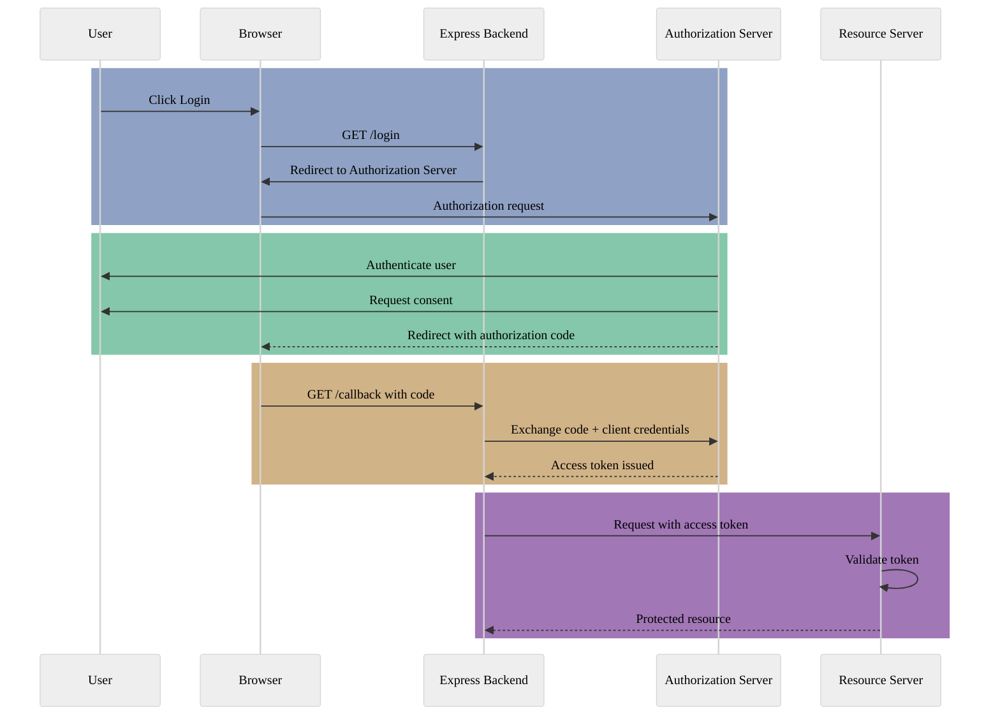
```mermaid
---
config:
  look: handDrawn
  theme: neutral
  themeVariables:
    fontFamily: "Verdana"
    fontSize: "16px"
    actorFontSize: "18px"
    messageFontSize: "14px"
    noteFontSize: "14px"
    actorFontWeight: "bold"
    actorTextColor: "#000"
    signalTextColor: "#000"
    labelTextColor: "#000"
---
sequenceDiagram
    participant User
    participant Browser
    participant Client as Express Backend
    participant AS as Authorization Server
    participant API as Resource Server

    %% Redirect-based authorization
    rect rgb(143, 161, 196)
        User->>Browser: Click Login
        Browser->>Client: GET /login
        Client->>Browser: Redirect to Authorization Server
        Browser->>AS: Authorization request
    end

    %% User authentication & consent
    rect rgb(132, 199, 170)
        AS->>User: Authenticate user
        AS->>User: Request consent
        AS-->>Browser: Redirect with authorization code
    end

    %% Back-channel token exchange
    rect rgb(209, 179, 136)
        Browser->>Client: GET /callback with code
        Client->>AS: Exchange code + client credentials
        AS-->>Client: Access token issued
    end

    %% API access using token
    rect rgb(161, 119, 182)
        Client->>API: Request with access token
        API->>API: Validate token
        API-->>Client: Protected resource
    end


```

## 3.6 PKCE (Proof Key for Code Exchange)

> PKCE is **not an optional enhancement**
>
> PKCE is a **mandatory security extension** to the Authorization Code Flow for modern OAuth clients.

### PKCE Terminologies

**_PKCE_**

PKCE stands for **Proof Key for Code exchange**

It is a mechanism that cryptographically binds the authorization code to the client that initiated the login request.

**_Public Client_**

A Public client is an application that **cannot securely store a client secret**.

Example include:

- Browser-based application(SPA)
- Mobile applications
- Desktop applications

Public clients are assumed to be **fully observable by attackers**

**_Code Verifier_**

The Code verifier is a **<abr title="The complete lack of order">high-entropy</abr>, random string** generated by the client **before** the authorization request.

It kept **only on the client side** and is never exposed during redirects

**_Code Challenge_**

The Code Challenge is the **derived value** created from the code verifier, usually by hashing it.

The Authorization server stores the code challenge and later verifies it.

**_Code Challenge Method_**

This defines **how the code challenge is derived**.

The secure and recommended method is <kbd>S256</kbd>, which uses SHA-256 hashing.

### What PKCE Is

PKCE adds **cryptographic proof** for the Authorization Code Flow.

It ensures that:

- Receiving an authorization code is **not enough**
- Only the client that started the flow can finish it

In Simple terms:

PKCE answers the question:
"How do we know that the same client that requested the code is the one exchanging it?"

### Why PKCE Exists

The Original OAuth assumption

Early OAuth assumed:

- Clients were confidential
- Clients secrets could be protected

### The real-world attack PKCE prevents

**Authorization Code Interception Attack**

In this attack:

1. An Attacker intercepts the authorization code during redirect.
2. The attacker sends the stolen code to the Authorization Server.
3. Tokens are issued to the attacker

Without PKCE, **this attack succeeds** for public clients

### Why client secrets do not help here

Public clients:

- Run in environments the attacker controls
- Cannot hide secrets
- Cannot rely on client authentication

PKCE replaces secrets with **pre-request cryptographic proof**

### How PKCE works internally

**_Step 1: Client Generates Code verifier_**

Before redirecting the user, the client:

- Generated a long, random string
- Stores it locally (memory)

This value is never set directly during authorization

**_Step 2: Client Creates Code Challenge_**

The Client:

- Hashes the code verifier using SHA-256.
- Encodes the result

This becomes the code challenge

_*Formula: code_challenge = BASE64URL_ENCODE( SHA256 ( ASCII(code_verifier) ) )*_

**_Step 3: Authorization Request Includes Code Challenge_**

The Client redirects the browser with:

- <kbd> code_challenge </nbd>
- <kbd> code_challenge_method=SH256 </kbd>

The Authorization Server stores this value alongside **authorization code**

**_Step 4: Token Exchange Requires Code Verifier_**

when exchanging the authorization code:

- The client sends the original **code verifier**
- The Authorization Server hashes it again
- It compares the result with the stored code challenge

If they match, token is issued.

If they do not match, the request is rejected.

### Implementation

```javascript
//This is mapping only, not production code
//Generate PKCE Values

const codeVerifier = generateRandomString();
const codeChallenge = sha26Base64Url(codeVerifier);

// Note: The verifier stays on client side.


// Redirect with PKCE parameters

/auth/authorize?
    response_type=code
    &code_challenge=XYZ
    &code_challenge_method=s256


// Exchange code using verifier

POST /auth/token;
{
    code,
    code_verifier
}

```

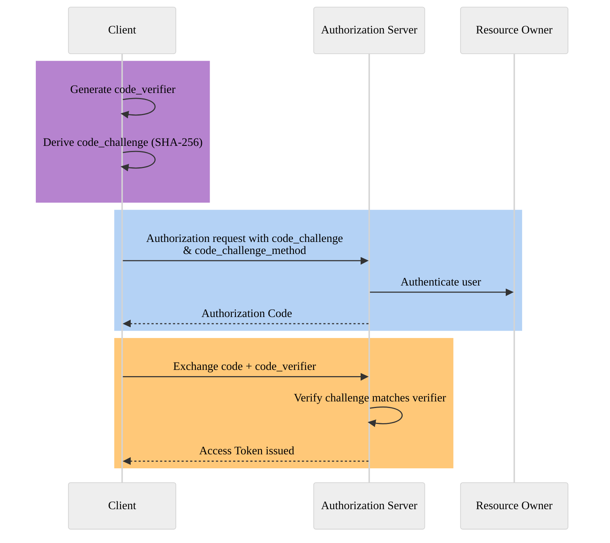
```mermaid
---
config:
  look: handDrawn
  theme: neutral
  themeVariables:
    fontFamily: "Verdana"
    fontSize: "16px"
    actorFontSize: "18px"
    messageFontSize: "14px"
    noteFontSize: "14px"
    actorFontWeight: "bold"
    actorTextColor: "#000"
    signalTextColor: "#000"
    labelTextColor: "#000"
---
sequenceDiagram
    participant Client
    participant AS as Authorization Server
    participant RO as Resource Owner

    %% ===== PKCE Preparation =====
    rect rgb(182, 131, 207)
        Client->>Client: Generate code_verifier
        Client->>Client: Derive code_challenge (SHA-256)
    end

    %% ===== Authorization Request =====
    rect rgb(180, 210, 245)
        Client->>AS: Authorization request with code_challenge <br/>& code_challenge_method
        AS->>RO: Authenticate user
        AS-->>Client: Authorization Code
    end

    %% ===== Token Exchange (PKCE Validation) =====
    rect rgb(255, 200, 120)
        Client->>AS: Exchange code + code_verifier
        AS->>AS: Verify challenge matches verifier
        AS-->>Client: Access Token issued
    end

```

## 3.7 Difference between Authorization code with and without PKCE

### Authorization Code Flow (Without PKCE)

This flow is designed for **confidential clients**, such as backend server applications, that can safely store a client secret.

The client redirects the user to the Authorization Server for authentication and consent.  
After successful login, the Authorization Server issues an **authorization code**.

During the **token exchange step**, the client sends:

- The authorization code
- Its **client credentials** (client ID and client secret)

The client secret is used to prove the **identity of the client application** to the Authorization Server.

This flow assumes that the client secret is **never exposed** and cannot be stolen.

---

### Authorization Code Flow with PKCE

This flow is designed for **public clients**, such as browser-based SPAs and mobile applications, which **cannot securely store a client secret**.

Before redirecting the user, the client generates a **code verifier** and derives a **code challenge** from it.

During the **authorization request**, the client sends:

- Client ID
- **Code challenge**

After the user authenticates, the Authorization Server issues an **authorization code**.

During the **token exchange step**, the client sends:

- The authorization code
- **Code verifier**

The Authorization Server validates that the code verifier matches the previously stored code challenge, proving that the same client instance completed the flow.

---

### Key Difference (Mental Model)

- **Client secret** proves _who the client is_\*\*\*\*
- **PKCE** proves _this is the same client instance_

---

### Side-by-Side Comparison

| Aspect                        | Authorization Code Flow | Authorization Code Flow + PKCE |
| ----------------------------- | ----------------------- | ------------------------------ |
| Client type                   | Confidential            | Public                         |
| Client secret used            | Yes                     | No                             |
| Authorization request         | client_id               | client_id + code_challenge     |
| Token exchange                | code + client_secret    | code + code_verifier           |
| Protection against code theft | Client secret           | PKCE proof                     |
| Safe for browser-based apps   | No                      | Yes                            |

---

### Important Note

Modern OAuth guidance recommends **using PKCE in all cases**, even for confidential clients, because it adds an additional security layer with no practical downside.

# PHASE 4 OpenID Connect (OIDC)

## 4.1 Basics

### What OpenID Connect Actually is

_**OpenId Connect**, Commonly called **OIDC**, is a standard protocol for user authentication._

OAuth 2.0 by itself **does not define authentication**.

OAuth only defines how a client can get permission to access a resource.

Because many applications need login functionality, developers started using OAuth **incorrectly** as a login mechanism. This led to confusion and security problems.

OpenID connect was created to solve this exact problem.

OIDC is an **identity layer built on top of OAuth 2.0**.

It user OAuth flow, but it adds **clear rules, tokens, and validation steps** that answer one specific question"

> _Who is the user that logged in_

---

### Why OAuth Alone is Not Enough

OAuth Answers question like :

- Can this application read user data ?
- Is this token allowed to access this api ?

OAuth does not answer:

- Who is the user ?
- When did the user authenticate ?
- Was multi-factor authentication used ?
- Is this login fresh or reused ?

Before OIDC existed, each identity provider returned user information in **custom, non-standard formats**.

Clients has to guess how to treat tokens as identity proof, which was unsafe.

OIDC exists to make authentication **explicit, standardize, and verifiable**.

---

### Authentication vs Authorization

Authentication is the process of proving **who a user is**.

Authorization is the process of **deciding what user is allowed to do**.

OIDC is responsible for **authentication**.
OAuth is responsible for **authorization**.

This separation is intentional and critical for security.

When systems mix these responsibilities, they create vulnerabilities such as:

- Treating access token as identity proof.
- Allowing APIs to trust user identity without validation.

OIDC prevents these mistakes by clearly separating tokens and responsibilities.

---

### What an ID Token is

The **ID Token** is the central concept in OpenID Connect.

An ID Token is a **Cryptographically signed token** issued by Authorization Server after a **user successfully authenticates**.

Its purpose is **not** to access APIs
Its purpose is to **prove authentication to the client application**.

You can think of the ID Token as a **Singed Authentication receipt**.

It tells the client:

- A real user authenticated
- The authentication happened at a trust provider.
- The identity information has not been tampered with

---

### What information an ID Token Contains

An ID Token contains claims, which are statements about a user and the authentication event.

Some of most important claims are:

- <kbd>iss</kbd> (Issuer): This tells the client **who issued the token**. The Client use this to ensure the token came from the expected identity provider.
- <kbd>sub</kbd> (Subject): This is a **stable, unique identifier** for the user. It is not email and should not change over time.
- <kbd>aud</kbd> (Audience): This indicates **which client the token is meant for**. If this does not match the client's IP, the token must be rejected.
- <kbd>exp</kbd> (Expiration): This defines **how long the token is valid**. Expiration limit the damage if the token is stolen.
- <kbd>iat</kbd> (Issued at): This indicated **when the authentication happened**.

Together, these allows the client to **verify the authenticity and freshness** of the login.

---

### The UserInfo Endpoint

Sometimes the ID Token does not contain all user profile data.

For this reason, OIDC defines a **UserInfo endpoint**.

The UserInfo endpoint:

- Is protected by an **Access Token**.
- Returns standardized user profile information.
- Allows profile retrieval without bloating ID Token.

This keeps authentication lightweight and flexible.

The **UserInfo endpoint** is an OAuth-protected API endpoint exposed by the **Authorization server**.

It is used after **authentication** to fetch **additional user profile information**.

```json
{
    "sub": "248289761001",
    "name": "Prashant Chevula",
    "given_name": "Prashant",
    "family_name": "Chevula",
    "preferred_username": "prashant.chevula",
    "email": "prashant@example.com",
    "email_verified": true,
    "picture": "https://example.com/profile/prashant.jpg",
    "locale": "en-IN",
    "updated_at": "2026-01-15T10:20:30Z"
}
```

```http
GET /userInfo
Authorization: Bearer ACCESS_TOKEN
```

_**ID Tokens must never be sent to the UserInfo endpoint**_

---

### How OIDC User OAuth Flows

OIDC does **not invent new flows**.

It reuses OAuth flows, most commonly:

- Authorization Code Flow
- Authorization Code Flow with PKCE

The Key difference is the **scope**.

When a Client includes the <kbd>openid</kbd> scope"

- OAuth authorization becomes **OIDC authentication**.
- The Authorization Server knows to issue an **ID Token**

So the presence of <kbd>openid</kbd> is what activates OIDC

---

### End-to-End Flow

In a typical OIDC login:

1. The Client redirects the user to the Authorization Server with <kbd>openid</kbd> scope.
2. The user authenticates and gives consent
3. The Authorization Server issues an authorization code.
4. The Client exchanges the code for tokens
5. The Client receives:
    - An ID Token (for login)
    - An Access Token (For APIs)
6. The client validate the IP Token and established a user session.

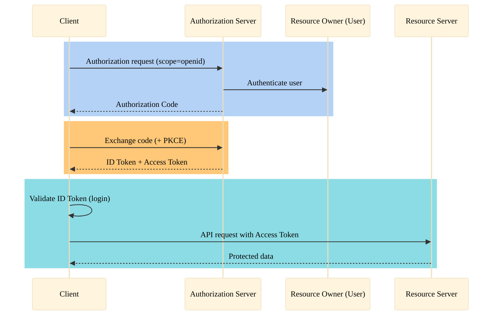
```mermaid
---
config:
  look: handDrawn
  theme: base
  themeVariables:
    fontFamily: "Verdana"
    fontSize: "16px"
    actorFontSize: "18px"
    messageFontSize: "14px"
    noteFontSize: "14px"
    actorFontWeight: "bold"
    actorTextColor: "#000"
    signalTextColor: "#000"
    labelTextColor: "#000"
---

sequenceDiagram
    participant Client
    participant AS as Authorization Server
    participant RO as Resource Owner (User)
    participant RS as Resource Server

    rect rgb(180, 210, 245)
        Client->>AS: Authorization request (scope=openid)
        AS->>RO: Authenticate user
        AS-->>Client: Authorization Code
    end

    rect rgb(255, 200, 120)
        Client->>AS: Exchange code (+ PKCE)
        AS-->>Client: ID Token + Access Token
    end

    rect rgb(140, 220, 230)
        Client->>Client: Validate ID Token (login)
        Client->>RS: API request with Access Token
        RS-->>Client: Protected data
    end

```

## 4.2 ID Token Validation Rules

### Why ID Token validation is critical

An **ID Token is not trusted just because it exists**.

It is only a **string received over the network**.

Anyone can copy it, replay it, or try to forge it.

If a Client accepts an ID Token **without validating it**, the attacker can:

- Log in as another user
- Bypass authentication
- Hijack sessions

So the real question is:

"How does the client know this IP Token is real, fresh, and meant for it?"

That is what ID Token validation answers.

---

### Who Must validate the ID Token

ID Token validation is the client's responsibility, not the APIs

Reason:

- The ID token proves **authentication**
- Authentication is consumed by the **client application**
- APIs only care about **authorization**, not login.

---

### What an ID Token Really is

An ID token is

- A **JWT**
- Cryptographically signed
- Issued by the **OIDC** provider
- Intended for **one specific client**

So Validation has two layers:

1. **JWT Cryptographic validation**
2. **OIDC semantic validation**

---

### Mandatory ID Token Validation Rules

1. _**Signature validation**_

_What is checked_

The client verifies that:

- The ID Token was signed by the **expected Authorization Server**
- The signature matched the header and payload
- The correct public key was used.

_Why this exists_

Without signatures validation:

- Anyone can modify claims like <kbd>sub</kbd>
- Anyone can forge an ID Token
- Authentication becomes meaningless

_Signature validation proves:_

"This token was issued by the real identity provided and not altered"

2. _**Issuer validation (iss)**_

_What is checked_

The Client verifies that the <kbd>iss</kbd> claim:

- Exactly match the expected issuer URL

```arduino
    https://accounts.example-idp.com
```

_Why this exists_

Multiple identity providers can exist.

Without issuer validation:

- Token from a different provider could be accepted
- Attacker could inject a token from their own idp

_Issuer validation answers:_

"Who vouches for this authentication?"

3. _**Audience Validation (aud)**_

_What is checked_

The Client verifies that:

- The <kbd>aud</kbd> claim contains its **own client ID**

_Why this exists_

ID Tokens are **client-specific**

Without audience validation:

- A Token issued for App-A could be used to login into App-B
- Cross-application login attacks become possible

_Audience validation answers:_

"Was this token meant for me?"

4. _**Expiration Check (exp)**_

_What is checked_

The Client ensures that:

- current time is before the <kbd>exp</kbd> timestamp.

_Why this exists_

Authentication must be **time-bounded**

Without expiration:

- A stolen token works forever
- Replay attacks become trivial

_Expiration limits:_

- Token reuse
- Damage window of compromise

5. _**Issued At Check (iat)**_

_What is checked_

The client verifies:

- The token was issued recently
- The token is not absurdly old or from the future

_Why this exists_

This helps detect:

- Clock skew issues
- Replayed or cached tokens
- Misissued tokens

This adds **freshness guarantees**.

6. _**Nonce Validation (nonce) - critical for browsers**_

_What is a nonce_

A nonce is a **random value generated by the client at login start and stored locally**.

The Authorization Server includes this same value inside the ID Token.

_What is checked_

The Client verifies:

- The nonce in the ID Token matched the one it generated

_Why this exists_

This prevents **replay attacks**.

_without nonce validation:_

- An attacker can replay a valid ID Token
- The client cannot distinguish old logins from new ones

_Nonce answers:_

"Is this token the result of this login request?"

---

### Validation Order (why order matter)

Correct validation order is:

1. Signature
2. Issuer
3. Audience
4. Expiration
5. Issued-At
6. Nonce

Why:

- Signature first -> otherwise claims cannot be trusted
- Nonce last -> only meaningful after authenticity is confirmed

---

### Express Pseudo-Code -- ID Token Validation

This is not production code, just concept

```js
function validateToken(idToken) {
    const decoded = verifyJwtSignature(idToken);

    if (decoded.iss !== EXPECTED_ISSUER) {
        throw new Error("Invalid issuer");
    }

    if (decoded.aud.includes(CLIENT_ID)) {
        throw new Error("Invalid audience");
    }

    if (decoded.exp < Date.now()) {
        throw new Error("Token expired");
    }

    if (decoded.nonce !== storedNonce) {
        throw new Error("Nonce mismatch");
    }

    return decoded; // Authentication trusted
}
```

Only **after this function succeeds** should the user be considered logged in.

---

### Sequence Diagram - ID Token validation flow

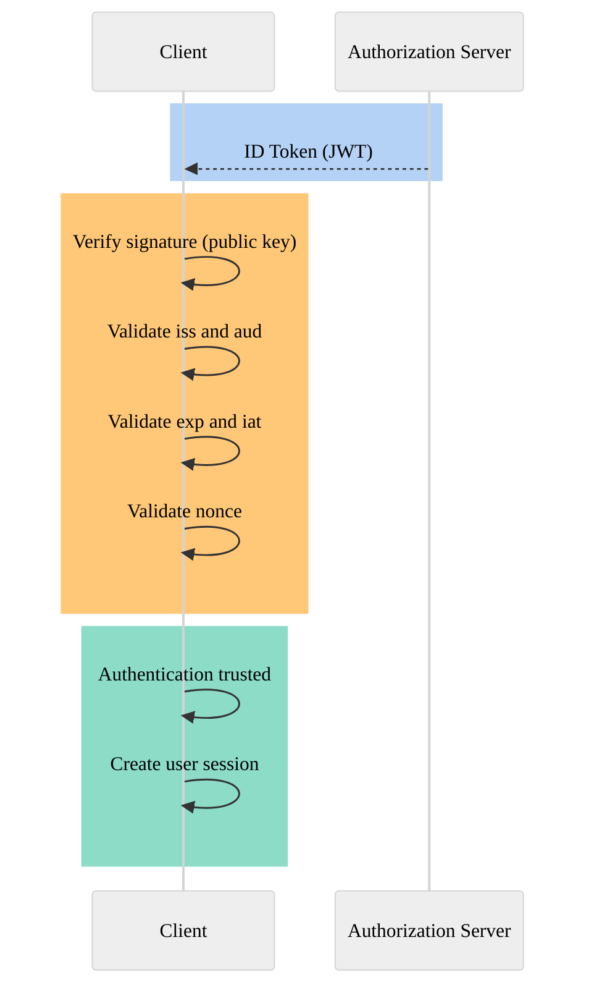
```mermaid

---
config:
  look: handDrawn
  theme: neutral
  themeVariables:
    fontFamily: "Verdana"
    fontSize: "16px"
    actorFontSize: "18px"
    messageFontSize: "14px"
    noteFontSize: "14px"
    actorFontWeight: "bold"
    actorTextColor: "#000"
    signalTextColor: "#000"
    labelTextColor: "#000"
---

sequenceDiagram
    participant Client
    participant AS as Authorization Server

    rect rgb(180, 210, 245)
        AS-->>Client: ID Token (JWT)
    end

    rect rgb(255, 200, 120)
        Client->>Client: Verify signature (public key)
        Client->>Client: Validate iss and aud
        Client->>Client: Validate exp and iat
        Client->>Client: Validate nonce
    end

    rect rgb(140, 220, 200)
        Client->>Client: Authentication trusted
        Client->>Client: Create user session
    end

```

## 4.3 OIDC Login Flow & Login vs API Authorization

### Understanding the core problem this topic solves

In many application, developers treat "login" as a [vague](#c-vague) concept.

Sometimes it means the user can see the UI

Sometimes it means APIS allow requests

Sometimes it means both.

OpenID Connect exists specifically to **remove this ambiguity**.

OIDC forces us to answer two separate questions very clearly.

1. Who is the user who just authenticated ?
2. What is this request allowed to do on the backend ?

OIDC answers the first question only.

OAuth answers the second question only.

---

### What "Login" Means in OIDC

In OIDC, login means **verifying the user's identity and establishing a trusted authentication state inside the client application**

Login is **not** :

- Calling APIs
- Checking permissions
- Enforcing roles

Login **end** when:

- The Client has received an **ID Token**.
- The Client has **fully validated** that ID Token
- The Client know the user's stable identity(sub)

At that point, authentication is complete.

Nothing beyond this point is considered "login".

---

### What API Authorization means

API authorization is the act of allowing or denying access to the backend resources.

It is performed by:

- Resource Server (APIs)
- Using **Access Tokens**
- Based on scopes, permissions, or policies

APIs **do not**:

- know about browser sessions
- Care about **UI login** state
- Validate ID Tokens

This separation exists because APIs are designed to be **stateless, scalable, and independent of UI concerns**.

---

### Walking through a Real OIDC Login glow (E2E)

#### Step 1: The Client Initiates Login (OIDC is Activated here)

The login process begins when the client application decides it needs to authenticate a user.

At this moment, the user is **not logged in,** no token exist, and no trust has been established.

The Client redirects the user's browser to the Authorization Server with an OAuth authorization request.

What turns this into OIDC is the presence of the <kbd>openid</kbd> scope.

This scope tells the Authorization Server:

    "This is not just authorization. I am asking you to authenticate the user."

Conceptually, the Express backend's role here is minimal. It constructs a redirect and sends the browser away.

```js
app.get("/login", (req, res) => {
    const authUrl = buildAuthorizeUrl({
        response_type: "code",
        scope: "openid profile email",
        code_challenge,
        code_challenge_method: "s256",
    });

    res.redirect(authUrl);
});
```

At this point:

- The client has not authenticated anyone
- No token exist
- The browser is simply following a redirect.

#### Step 2: The User Authenticates at the Authorization Server

The Authorization Server now takes full control.

It authenticates the user using whatever methods it supports:

- Passwords
- MFA
- Biometrics
- SSO

The Client is **completely excluded** from this step.

This is critical.
This client must **never** see user credentials.

Once authentication succeeds, the Authorization Server prepares the result of that authentication.

#### Step 3: An Authorization Code is Issued.

After successful authentication (and consent if required), the Authorization Server redirects the browser back to the client

What is returned is **not a token**, and it does **not identify the user**.

It is short-lived authorization code.

This code is only a **temporary handle** that allows the client to ask the Authorization Server for tokens securely.

```http
GET /callback?code=XYZ
```

If the client stops here, the user is **not logged in yet**

#### Step 4: The Client Exchanges the Code for Tokens

Now the client performs a **back-channel request** to the Authorization Server. (Client-Initiated Backchannel Authentication (CIBA))

This request is server-to-server and invisible to the browser.

In response, the Authorization Server issues **two different tokens,** each with a distinct purpose.

- An **ID Token,** which represents authentication
- An **Access Token,** which represents authorization

```js
const tokenResponse = await exchangeCode({
    code,
    code_verifier,
});

const { id_token, access_token } = tokenResponse;
```

This moment is where many systems go wrong.

The client must now split responsibilities

_The Login Lane: What the Client Does with the ID Token_

The ID token is used **only by the client**.

The Client validates the ID token using all rules from topic 4.2:

- Signature
- Issuer
- Audience
- Expiration
- Nonce

If validation fails, login fails.

If validation succeeds, the client extract the <kbd>sub</kbd> claim and establishes a local session.

```js
const user = validateToken(id_token);

req.session.userId = user.sub;
```

At this exact moment:

- The user is logged in
- Authentication is complete
- No API authorization has occurred

**Login ends here**.

_The API Lane: What Happens with the Access Token_

The Access Token has nothing to do with login state.

It is stored securely and attached to API requests when needed.

```http
Authorization: Bearer Access_Token
```

The API Validates:

- The token signature
- The audience
- The Scopes or permissions

The API does not:

- Know who is logged in the UI
- Validates the Tokens
- Care about sessions

---

### Sequence Diagram

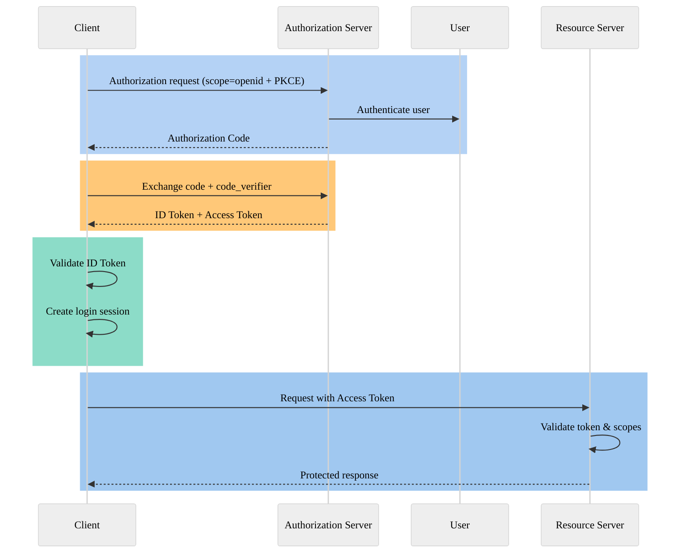
```mermaid
---
config:
  look: handDrawn
  theme: neutral
  themeVariables:
    fontFamily: "Verdana"
    fontSize: "16px"
    actorFontSize: "18px"
    messageFontSize: "14px"
    noteFontSize: "14px"
    actorFontWeight: "bold"
    actorTextColor: "#000"
    signalTextColor: "#000"
    labelTextColor: "#000"
---

sequenceDiagram
    participant Client
    participant AS as Authorization Server
    participant User
    participant API as Resource Server

    rect rgb(180, 210, 245)
        Client->>AS: Authorization request (scope=openid + PKCE)
        AS->>User: Authenticate user
        AS-->>Client: Authorization Code
    end

    rect rgb(255, 200, 120)
        Client->>AS: Exchange code + code_verifier
        AS-->>Client: ID Token + Access Token
    end

    rect rgb(140, 220, 200)
        Client->>Client: Validate ID Token
        Client->>Client: Create login session
    end

    rect rgb(160, 200, 240)
        Client->>API: Request with Access Token
        API->>API: Validate token & scopes
        API-->>Client: Protected response
    end

```

# Phase 5 Express.js Real world Implementation

## 5.1 Express Authentication Architecture

_What this topic is (and is not)_

This topic is about **architecture,** not login yet.

Here we define:

- How requests flow through Express
- Where authentication logic lives
- Where authorization logic lives
- How identity is attached to a request
- Where OAuth/OIDC will later plug in
- Where a BFF logically sits

_**Express Request LifeCycle**_

Every incoming request flows through Express like this:

1. Request enters the app
2. Global middleware runs
3. Authentication middlewares runs
4. Authorization middleware runs
5. Route handler executes
6. Error middleware handles failures

Our job is to place **authentication and authorization at the correct points**

_Step 1 - Minimal Express App_

```js
//app.js
import express from "express";

const app = express();

//Prase JSON bodies
app.use(express.json());

//health check(public)
app.get("/health",(req, res) => {
    res.json({status : "ok"})
});

export default app;'

```

_Step 2 - Introducing the Auth Context Concept_

In secure backends, authentication does not immediately allow access.

Instead, authentication **adds identity information** to the request.

This is called an **auth context**.

The auth context answers:

- Is this request authenticated ?
- Who is the user ?
- What identity is associated with this request ?

In Express, this is usually attached to:

    req.user

But nothing sets <kbd>req.user</kbd> by default - we must design it.

_Step 3 - Authentication Middleware_

Now we create a middleware whose only job is:

    "If credentials are present and valid, attach identity to the request."

Not:

- Not authorization
- Not permissions
- Not business logic

```js
//middleware/authenticate.js

export function authenticate(req, res, next) {
    //For now, we assume no authentication
    //Later this will verify JWT / session / OIDC

    req.user = null; //explicit, predictable state
    next();
}
```

We are defining a **Contract** :

- Every request will have <kbd>req.user</kbd>
- Routes can rely on this contract
- Authentication logic can evolve without touching routes

_Step 4 - Wiring Authentication Middleware Globally_

Now we wire it into the app.

```js
//app.js

import express from "express";
import { authenticate } from "./middleware/authenticate.js";

const app = express();

app.use(express.json());

app.use(authenticate);

app.get("/health", (req, res) => {
    res.json({
        status: "OK",
        authenticatedUser: req.user,
    });
});

export default app;
```

Now:

- Every request goes through authentication.
- No route needs to care how authentication works
- Identity propagation is centralized

This is **industry-standard practice**

_Step 5 - Authorization Middleware_

Authentication answers

    who the user is

Authorization

    Is this user allowed to do this?

These must be separate.

```js
//middleware/requireAuth.js
export function requireAuth(req, res, next) {
    if (!req.user) {
        return res.status(401).json({
            error: "Authentication required",
        });
    }

    next();
}
```

This middleware does not authenticate

It only check the result of the authentication.

_Step 5 - Protected Routes_

Now we apply authorization only where needed.

```js
//app.js

import { requireAuth } from "./middleware/requireAuth.js";

app.get("/profile", requireAuth, (req, res) => {
    res.json({
        message: " This is a protected route",
        user: req.user,
    });
});
```

This is powerful because:

- Public routes stay public
- Protected routes are explicit
- Security logic is reusable

---

## 5.2 JWT Authentication in Express

This topic is intentionally **OIDC-agnostic**.

Here, JWTs are used to **access tokens issued by our own backend,** not by an external IdP.

_Step 1 - Install Required npm packages_

These are **Industry-standard** and intentionally minimal

```bash
npm install jsonwebtoken bcrypt
```

_Step 2 - A Minimal User Store_

In Production, this would be a database.

For clarity, we'll use an in-memory store

```js
//data/users.js

import bcrypt from "bcrypt";

const users = [
    {
        id: "u1",
        email: "user1@example.com",
        passwordHash: bcrypt.hashSync("password123", 10),
        role: "user",
    },
];

export function findUserByEmail(email) {
    return users.find((u) => u.email === email);
}
```

_Step 3 - JWT Utility function_

We now define how tokens are issued and verified.

```js
//utility/jwt.js

import jwt from "jsonwebtoken";

const JWT_SECRET = "super-secret-key";
const JWT_EXPIRY = "5m";

export function issueAccessToken(user) {
    return jwt.sign(
        {
            sub: user.id,
            email: user.email,
            role: user.role,
        },
        JWT_SECRET,
        {
            expiresIn: JWT_EXPIRY,
        },
    );
}

export function verifyAccessToken(token) {
    return jwt.verify(token, JWT_SECRET);
}
```

Notice something important:

- We are issuing **access tokens**
- The Payload contains **identity + authorization hits**
- The token is **time-limited**

_Step 4 - Login Endpoint_

Now we implement a real login endpoint

```js
//routes/auth.js

import express from "express";
import bcrypt from "bcrypt";
import { findUserByEmail } from "../data/users.js";
import { issueAccessToken } from "../utils/jwt.js";

const router = express.Router();

router.post("/login", async (req, res) => {
    const { email, password } = req.body;

    const user = findUserByEmail(email);

    if (!user) {
        return res.status(401).json({ error: "Invalid Credentials" });
    }

    const isValid = await bcrypt.compare(password, user.passwordHash);
    if (!isValid) {
        return res.status(401).json({ error: "Invalid Credentials" });
    }

    const accessToken = issueAccessToken(user);

    res.json({ accessToken });
});

export default router;
```

What just happened?

- Credentials were verified
- A JWT was issued
- No Session was created
- Authentication is now **stateless**

This is **classic JWT-bases authentication**

_Step 4 - JWT Verification inside <kbd>authenticate()</kbd> Middleware_

```js
//middleware/authenticate.js

import { verifyAccessToken } from "../utility/jwt.js";

export function authenticate(req, res, next) {
    const authHeader = req.headers.authorization;

    if (!authHeader || !authHeader.startsWith("Bearer ")) {
        req.user = null;
        next();
    }

    const token = authHeader.split(" ")[1];

    try {
        const decoded = verifyAccessToken(token);

        req.user = {
            id: decoded.sub,
            email: decoded.email,
            role: decoded.role,
        };
    } catch (err) {
        req.user = null;
    }

    next();
}
```

This is the **heart of JWT authentication**

Key points:

- Token extraction is centralized
- Verification happens once per request
- Identity is attached to <kbd>req.user</kbd>
- Routes remain clean and unaware of JWTs

_Step 6 - Protected Route_

Now let's use the existing authorization middleware

```js
//routes/profile.js

import express from express;
import { requireAuth } from "./middleware/requireAuth.js";

const router = express.Router();

router.get("/profile", requireAuth, (req, res) => {
    res.json({
        message: " This is a protected route",
        user: req.user,
    });
});

export default router;
```

At runtime:

1. Request enters Express
2. <kbd>authenticate()</kbd>
3. JWT is verified
4. <kbd>req.user</kbd> is populated
5. <kbd>requireAuth()</kbd> enforces access
6. Routes execute

_Complete flow_

<details>
    <summary>"click to expand"</summary>

- Login is responsible for **verifying credentials and issuing a token**
- Authentication middleware is responsible for **verifying tokens and attaching identity**

- Authorization middleware is responsible for **allowing or denying access**

- Routes remain clean and unaware of token mechanics

### 1️⃣ `/login` flow

Your understanding here is correct.

When `/login` is called, the backend:

- Extracts `email` and `password` from the request body
- Fetches the stored user record using the email
- Compares the provided password with the stored `passwordHash`
- Issues a JWT **only if verification succeeds**

One important refinement:

> `/login` is the **only place** where passwords are handled.
> After this point, passwords never appear again.

This is correct security behavior.

---

### 2️⃣ JWT issuance (`issueAccessToken`)

Your description is also correct.

The JWT utility:

- Signs a token using a secret (or private key)
- Embeds identity information (`sub`, role, etc.)
- Sets an expiration
- Returns a string token

One mental note to lock in:

> The token itself **is not authentication**.
> Authentication happens only when the token is **verified later**.

---

### 3️⃣ Token verification flow (authenticate middleware)

This is where your understanding is strong.

For every request:

- The middleware checks `req.headers.authorization`
- Verifies that it uses the `Bearer` scheme
- Extracts the token
- Verifies the token’s signature and validity
- Attaches the decoded identity to `req.user`

This is exactly how **real Express backends work**.

Important clarification:

> The token is not “decoded” for trust.
> It is **verified**, and decoding happens as a consequence of verification.

This distinction matters in interviews and real code.

---

### 4️⃣ `/profile` route + `requireAuth`

Your flow here is also correct.

The `/profile` route:

- Does not know anything about JWTs
- Does not parse headers
- Does not verify tokens

It simply trusts the contract:

> “If `req.user` exists, authentication succeeded.”

`requireAuth` enforces that contract.

This is **clean architecture** and **industry best practice**.

---

### One small but important structural refinement

I’ll rewrite your model in a **slightly more precise way**, keeping your intent intact.

### 🔹 Request flow (runtime view)

1. Request enters Express
2. `authenticate` middleware runs
    - Looks for `Authorization` header
    - Verifies JWT if present
    - Sets `req.user` or `null`

3. Route-level middleware (`requireAuth`) runs
    - Allows or blocks access

4. Route handler executes

---

### 🔹 Responsibility separation (design view)

- `/login`
  Responsible for **credential verification and token issuance**

- `authenticate`
  Responsible for **token verification and identity propagation**

- `requireAuth`
  Responsible for **enforcing authentication**

- Routes (`/profile`)
  Responsible for **business logic only**

This separation is exactly what you want.

- app
    - /login
        - extract email and password
        - extract email with passwordHash from db
        - verify password
        - issue token
    - Verify token
        - req.headers.authorization
        - check bearer token
        - decode token
        - add user context
    - /profile route
        - add requireAuth middleware
        - If user present process next
        - else error

- jwt
    - issueAccessToken
        - sign token with secret key
        - return token
    - verifyAccessToken
        - verify token

- authenticate
    - check authHeaders
    - extract token
    - verify token
    - add user context

- requireAuth
    - check user context
    - if present fine
    - else error

</details>

## 5.3 OAuth / OIDC Login in Express

### Terminologies

_**OAuth 2.0**_

OAuth 2.0 is an **authorization** framework that allow one system to obtain limited access to another system on behalf of a user, without sharing the user's password. It defines role, flows amd rules, but is does not define how login identity works.

_**OpenID Connect (OIDC)**_

OIDC is an **identity layer built on top of OAuth 2.0**. It adds standardized identity concept such as _ID Token_ and _UserInfo_, making OAuth suitable for login.

_**Authorization Code Flow**_

This is an OAuth 2.0 flow where the browser receive a **temporary authorization code**, not tokens. The backend system later exchanges this code for tokens using a secure back-channel.

_**PKCE (Proof Key for Code Exchange)**_

PKCE is a security extension that binds the authorization request to the token exchange using a cryptographic challenge, preventing authorization code interception attacks.

_**BFF (Backend For Frontend)**_

A BFF is a backend dedicated to a specific frontend. In authentication, it means the **browser never handles tokens;** the backend manages login state securely.

_**Authorization Server(Auth Server/IdP)**_

The system responsible for authentication users and issuing tokens. Examples include AuthO, Google, and Microsoft Entra ID.

_**Client**_

The application requesting authentication. In our case, the **Express BFF** is the OAuth client.

_**Front-channel**_

This refers to the communication path that involves the **User Agent(Browser)**. When you server redirects the user to Google, or when Google redirects the user back to your <kbd>/callback</kbd>,that is Front-channel. It is inherently "insecure" because the user can see and modify the data in the URL.

_**Back-channel**_

This is direct **Server-to-Server** communication. Your Express server talks directly to Google's token endpoint via a secure HTTPS request. The browser is never involved here. This is where sensitive items like <kbd>client_secret</kbd> and <kbd>access_tokens</kbd> are handled.

_**User Agent**_

The Software act in behalf of the user, typically a web browser like Chrome or Firefox.

_**Token Endpoint**_

A Specific URL provided by the Identity Provider(IdP) used specially for exchanging codes for tokens via the back-channel

_**Discovery Document**_

A JSON file hosted by the Identity Provider (IdP) at a standardized path: <kbd>/.well-know/openid-configuration</kbd>. It acts as a "map" for your application.

_**JWKS (JSON Web Key Set)**_

A set of public keys hosted by th IdP. Your backend uses these keys to verify that an ID Token was actually signed by the IdP and hasn't been tampered with.

_**Nonce**_

A "Number used Once". A random string generated by your BFF and sent to the IdP. The IdP puts it inside the ID token. When the token returns, your BFF checks if it's the same string. This prevents "Replay attacks".

_**IdP (Identity Provider)**_

The external service that maintains user identities and provides tokens (e.g., Google).

_**Tenant**_

A private instance or "silo" within an IdP. In Microsoft Entra ID (formerly Azure AD), your company has its own "Tenant ID." In Auth0, you have a "Domain."

_**Multi-tenancy**_

An architecture where one application can accept logins from _any_ organization's account (e.g., "Login with any Microsoft Work Account").

_**Prompt**_

A parameter sent during login to force a specific behavior (e.g., `prompt=consent` forces the user to see the permission screen again).

_**GSI (Google Identity Services)**_

Google’s proprietary wrapper around OIDC, which often adds features like "One Tap" login.

---

### Concept: The "Two-Handshake" Protocol

Think of OIDC as a two-stage handshake.

1. **Stage 1 (Front-channel)**: You send the user to the IdP to prove who they are. The IdP gives the user a "claim check" (the Authorization Code) and sends them back to you.
2. **Stage 2 (Back-channel)**: Your server takes that "claim check" and goes to IdP's back door. You server says, "I am legitimate application (here is my <kbd>client_secret</kbd>), and i have this claim check. Please give me the real tokens."

---

### Authorization Code Flow + PKCE (BFF Architecture)

_<h3>Concept</h3>_

The Authorization Code Flow with PKCE is designed so that **tokens are never exposed to the browser**.

The browser only performs redirect. All sensitive operations - Code exchange, token validation and session creation - happen on the backend.

In a **BFF architecture**, this flow enables secure login while completely avoiding token storage in the browser. The backend converts OAuth/OIDC tokens into a **server-side session.**

_<h3>Why this flow exists</h3>_

Early OAuth flows returned tokens directly to the browser. This caused serious security issues.

- Token Could be stolen via XSS
- Token leaked through browser history or logs
- Mobile and SPA clients were vulnerable to interception attacks

The Authorization Code Flow solves this by introducing a **two-step process**.

1. Browser gets a short-lived **authorization code**
2. Backend exchanges the code for tokens securely

PKCE exists because attackers learned to **steal authorization codes** during redirects

PKCE cryptographically binds the code to the original request so stolen code become useless.

_<h3>Internal Working</h3>_

**High level mechanics**

1. The browser is redirected to the Authorization Server <kbd>/authorize</kbd> endpoint.
2. A **code challenge** (derived from a random secret) is sent.
3. The user authenticates at the Authorization Server.
4. The Authorization Server redirects back with an **authorization code**.
5. The backend sends:
    1. the authorization code
    2. the original **code verifier**
6. The Authorization Server validates the PKCE binding
7. Tokens are issued **only to the backend**
8. The backend creates a session for the browser.

_<h3>The Back-Channel Exchange</h3>_

When the browser hits your <kbd>/callback?code=XYZ</kbd> route, your Express server performs the following.

1. **Extraction**: It pulls the <kbd>code</kbd> from the URL query parameters.
2. **Verification**: It retrieves the <kbd>code_verifier</kbd>(from PKCE) that was saved in the user's session.
3. **The Request**: It makes a <kbd>POST</kbd> request to the IdP's **Token Endpoint**. This request includes"
    - <kbd>grant_type</kbd>: "authorization_code"
    - <kbd>code</kbd>: The code from the browser
    - <kbd>client_id</kbd> & <kbd>client_secret</kbd>: Your app's credentials
    - <kbd>code_verifier</kbd>: The PKCE secret
4. **The Response**: If everything matches, the IdP returns a JSON object containing the <kbd>id_token</kbd> and the <kbd>access_token</kbd> (permission to call APIs)

_<h3>Real, Runnable Express Code (openid-client, BFF style)</h3>_

We use <kbd>openid-client</kbd> because it is **spec-accurate** and used in production BFF systems

<h4>Why <kbd>openid-client</kbd> exists</h4>

It implements OAuth 2.0 and OIDC **exactly as defined by the specs**, including discovery, PKCE, token validation and JWK handling. Companies choose it when correctness and security matter more than abstraction.

```bash
npm install express express-session openid-client
```

- **Code** : [authCodeFlow.js](../Implementation/AuthorizationCodeFlow/authFlow.js)

_<h3>Authorization Code Flow</h3>_

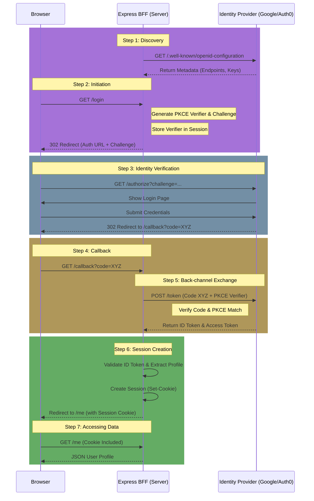
```mermaid
sequenceDiagram
    participant Browser
    participant BFF as Express BFF (Server)
    participant IdP as Identity Provider (Google/Auth0)

    %% PHASE 1: PREPARATION & INITIATION
    rect rgb(165, 114, 216)
    Note over BFF: Step 1: Discovery
    BFF->>IdP: GET /.well-known/openid-configuration
    IdP-->>BFF: Return Metadata (Endpoints, Keys)

    Note over Browser, BFF: Step 2: Initiation
    Browser->>BFF: GET /login
    Note right of BFF: Generate PKCE Verifier & Challenge
    Note right of BFF: Store Verifier in Session
    BFF-->>Browser: 302 Redirect (Auth URL + Challenge)
    end

    %% PHASE 2: USER INTERACTION
    rect rgb(115, 143, 165)
    Note over Browser, IdP: Step 3: Identity Verification
    Browser->>IdP: GET /authorize?challenge=...
    IdP->>Browser: Show Login Page
    Browser->>IdP: Submit Credentials
    IdP-->>Browser: 302 Redirect to /callback?code=XYZ
    end

    %% PHASE 3: CALLBACK & TOKEN EXCHANGE
    rect rgb(175, 151, 90)
    Note over Browser, BFF: Step 4: Callback
    Browser->>BFF: GET /callback?code=XYZ

    Note over BFF, IdP: Step 5: Back-channel Exchange
    BFF->>IdP: POST /token (Code XYZ + PKCE Verifier)
    Note left of IdP: Verify Code & PKCE Match
    IdP-->>BFF: Return ID Token & Access Token
    end

    %% PHASE 4: SESSION & PROFILE
    rect rgb(100, 172, 100)
    Note over BFF: Step 6: Session Creation
    BFF->>BFF: Validate ID Token & Extract Profile
    BFF->>BFF: Create Session (Set-Cookie)
    BFF-->>Browser: Redirect to /me (with Session Cookie)

    Note over Browser, BFF: Step 7: Accessing Data
    Browser->>BFF: GET /me (Cookie Included)
    BFF-->>Browser: JSON User Profile
    end
```

---

### openid-client (npm library)

_<h3>Concept: Trust but Verify</h3>_

In a BFF architecture, the BFF is the "Validator." It doesn't trust the tokens coming back from the browser; It treats them as "untrusted input" until they pass series of cryptographic and logical tests.

**Discovery** allows the BFF to configure itself automatically. Instead of you manually typing in Google's login URL, logout URL, and public keys, the BFF fetches the Discovery Document, reads the instructions, and stays updated even if the IdP changes its keys (Key Rotation)

_<h3>Internal Working: The Discovery & Validation Logic</h3>_

1. **Bootstrap**: You provide the <kbd>openid-client</kbd> with the base URL of the IdP.
2. **Fetch Metadata**: The library fetches the Discovery Document. It learns where the <kbd>/authorize</kbd>, <kbd>/token</kbd>, and <kbd>/jwks</kbd> endpoints are.
3. **Fetch Public keys**: It fetches the **JWKS**. These are the public halves of the IdP' private signing keys.
4. **Token Receipt**: When the ID Token(a JWT) arrives at the <kbd>/callback</kbd> endpoint, the library:
    - **Cryptographic Check**: Uses the JWKS to verify the RS256 signature
    - **Integrity Check**: Ensures the <kbd>iss</kbd> matches the discovery URL
    - **Ownership Check**: Ensures the <kbd>aud</kbd>(Audience) matches your <kbd>CLIENT_ID</kbd>
    - **Timeliness Check**: Ensures the current time is between the <kbd>iat</kbd>(Issued At) and <kbd>exp</kbd> (Expiration) times.
    - **Replay Check**: Verifies the <kbd>nonce</kbd> matches the one stored in your session.

### Sequence Diagram: Discovery & Validation Sequence

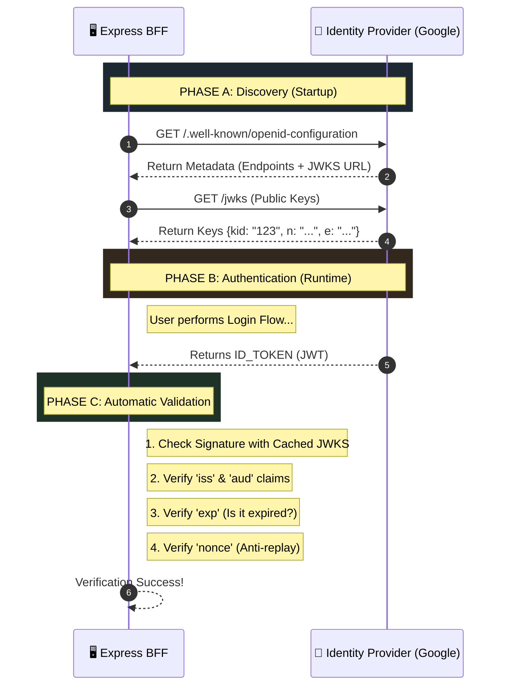
```mermaid

sequenceDiagram
    autonumber

    participant BFF as 🖥️ Express BFF
    participant IdP as 🔑 Identity Provider (Google)

    rect rgb(30, 40, 50)
    Note over BFF, IdP: PHASE A: Discovery (Startup)
    end
    BFF->>IdP: GET /.well-known/openid-configuration
    IdP-->>BFF: Return Metadata (Endpoints + JWKS URL)
    BFF->>IdP: GET /jwks (Public Keys)
    IdP-->>BFF: Return Keys {kid: "123", n: "...", e: "..."}

    rect rgb(50, 40, 30)
    Note over BFF, IdP: PHASE B: Authentication (Runtime)
    end
    Note right of BFF: User performs Login Flow...
    IdP-->>BFF: Returns ID_TOKEN (JWT)

    rect rgb(30, 50, 40)
    Note over BFF: PHASE C: Automatic Validation
    end
    Note right of BFF: 1. Check Signature with Cached JWKS
    Note right of BFF: 2. Verify 'iss' & 'aud' claims
    Note right of BFF: 3. Verify 'exp' (Is it expired?)
    Note right of BFF: 4. Verify 'nonce' (Anti-replay)

    BFF-->>BFF: Verification Success!
```

---

### Provider Nuances

While Google, Auth0, and Microsoft all claim to follow the OpenID Connect standard, they each have "flavors" or nuances in how they handle sessions, logout, and specific configuration parameters. This is **Topic 5.3.6: Provider Nuances (Google vs. Auth0 vs. Microsoft Entra ID).**

_<h4>Concept: The "Standard" vs. "Implementation"</h4>_

If OIDC is the "Language," then Google, Auth0, and Microsoft speak different "Dialects."

For example, the OIDC specification says there _should_ be a standard way to log out. **Auth0** follows this strictly. **Microsoft** follows it but requires a "Tenant ID." **Google**, however, does not provide a standard OIDC `end_session_endpoint`. To log a user out of Google, you often have to use a completely different, non-standard URL.

_<h4>Why it exists: Market Positioning</h4>_

Each provider builds its OIDC implementation to suit its primary customer base:

- **Google:** Focuses on consumer ease-of-use and "One Tap" friction-less login.
- **Auth0:** Focuses on developers and strict protocol compliance to allow for easy integration.
- **Microsoft Entra ID:** Focuses on enterprise security, deep permission sets (scopes), and organizational hierarchies.

_<h4>Internal Working: Key Nuances</h4>_

#### A. Google Nuances

- **Discovery URL:** `https://accounts.google.com/.well-known/openid-configuration`
- **Logout:** Google does not provide a standard OIDC logout endpoint in their discovery document. Developers must manually redirect users to `https://accounts.google.com/Logout`.
- **Access Tokens:** Google's access tokens are often "Opaque" strings, not JWTs. You cannot decode them; you must send them back to Google's `/userInfo` endpoint to get data.

#### B. Auth0 Nuances

- **Discovery URL:** `https://{YOUR_DOMAIN}.auth0.com/.well-known/openid-configuration`
- **Compliance:** Auth0 is the most "standard" of the three. It supports the `end_session_endpoint` perfectly.
- **Audience Requirement:** Auth0 strictly requires an `audience` parameter if you want a JWT access token for your own API.

#### C. Microsoft Entra ID Nuances

- **Discovery URL:** `https://login.microsoftonline.com/{tenant}/v2.0/.well-known/openid-configuration`
- **The Tenant Problem:** You must decide if your app is **Single-tenant** (only your company) or **Multi-tenant** (any company). For multi-tenant, you replace `{tenant}` with the word `common`.
- **V1 vs V2:** Microsoft has two versions of their API. The V2.0 endpoint is the only one that is truly OIDC compliant.

Implementation: Configuration Comparison

When using `openid-client`, your configuration object changes slightly depending on the provider.

```javascript
//  GOOGLE CONFIG
const googleConfig = {
    issuer: "https://accounts.google.com",
    // Google doesn't need 'audience' for basic profile info
    params: { scope: "openid profile email" },
};

//  AUTH0 CONFIG
const auth0Config = {
    issuer: "https://dev-xxxx.auth0.com",
    params: {
        scope: "openid profile email",
        // Auth0 REQUIRES audience to give you a usable Access Token JWT
        audience: "https://my-api.com",
    },
};

//  MICROSOFT ENTRA ID CONFIG
const msConfig = {
    // 'common' allows any Microsoft Work/School account
    issuer: "https://login.microsoftonline.com/common/v2.0",
    params: {
        scope: "openid profile email User.Read",
        // Microsoft often requires specific response_mode
        response_mode: "query",
    },
};
```

_<h4>Flow: Logout Comparison (High Contrast)</h4>_

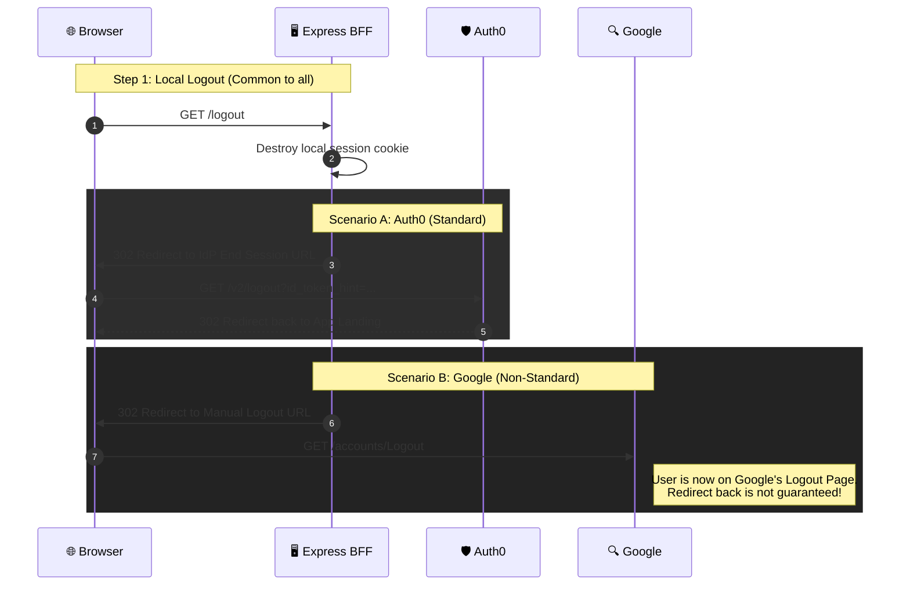
```mermaid
sequenceDiagram
    autonumber
    participant User as 🌐 Browser
    participant BFF as 🖥️ Express BFF
    participant Auth0 as 🛡️ Auth0
    participant Google as 🔍 Google

    Note over User, BFF: Step 1: Local Logout (Common to all)
    User->>BFF: GET /logout
    BFF->>BFF: Destroy local session cookie

    rect rgb(45, 45, 45)
    Note over BFF, Auth0: Scenario A: Auth0 (Standard)
    BFF->>User: 302 Redirect to IdP End Session URL
    User->>Auth0: GET /v2/logout?id_token_hint=...
    Auth0-->>User: 302 Redirect back to App Landing
    end

    rect rgb(35, 35, 35)
    Note over BFF, Google: Scenario B: Google (Non-Standard)
    BFF->>User: 302 Redirect to Manual Logout URL
    User->>Google: GET /accounts/Logout
    Note right of Google: User is now on Google's Logout Page.<br/>Redirect back is not guaranteed!
    end
```

_<h4>Real-world Implications</h4>_

1.  **Vendor Lock-in:** If you hardcode your logout logic for Google, switching to Microsoft Entra ID later will require a significant rewrite of your session management code.
2.  **Enterprise Readiness:** If you build an app for businesses (B2B), you **must** use Microsoft Entra ID or Auth0. Google is rarely used for primary enterprise identity compared to Microsoft.
3.  **User Experience:** Google's lack of a standard "Post-Logout Redirect" means your users might get "stuck" on a Google page after logging out of your app. This is why many developers use a "hidden iframe" or a client-side cleanup for Google logout.

_<h4>Where this fits in Architecture? </h4>_

These nuances live in your **Configuration/Environment Layer**. A well-architected BFF should have a "Provider Strategy" or a configuration file that abstracts these differences away, so the rest of your Express routes don't care whether the user came from Google or Microsoft.

---

# Phase 6 Security Hardening

## 6.1 Common Auth Vulnerabilities

### Terminologies (JWT Misconfigurations)

_**Header Manipulation**_

An attack where a user modifies the first part of a JWT (the JSON header) to change how the server process the rest of the token.

_**Signature Stripping**_

An attack where the <kbd>alg</kbd>(algorithm) header is changed to <kbd>none</kbd> , telling the server that the token no longer requires a cryptographic signature to be valid.

_**Algorithm Confusion (key confusion)**_

A sophisticated attack where an attacker changes the algorithm from **RS256** (asymmetric) to **HS256** (symmetric), forcing server to use its own public key to verify a signature, as if it were a Private secret

_**Trusting the Client**_

A fundamental security anti-pattern where a server relies on data provider by the user (like the <kbd>alg</kbd> header) to decide how to perform security checks

### Concept: The "Self-Describing" Trap

JWTs are designed to be "self-describing". "The header tells the server:" "Hey, I am JWT, and I used Algorithm X to sign data"

The Vulnerability exists because many early JWT libraries (and poorly configured moderns ones) would read the header and dynamically choose the verification logic basic on what user sent. If the user sends a token and says, "I used no algorithm," a vulnerable server will skip the signature check entirely. If the user, "I used HS256," the server might try to verify it using a symmetric method, even if it was originally designed for asymmetric RS256.

### Why if exists: Flexibility vs Security

The JWT specification (RFC 7519) included the <kbd>none</kbd> algorithm to support use cases where a signature is already handled by a lower layer(like a security tunnel). However, in web applications, this flexibility became a [liability](#d-liability)

Algorithm Confusion attacks exists because of a mathematical "quirk":

- In **RS256**, the server uses a **Public key** to verify.
- In **HS256**, the server uses a **Shared Secret** to verify.

If an attacker changes the header to <kbd>HS246</kbd> and the library is not told to only accept <kbd>RS256</kbd>, the library will take whatever key is provided in the configuration (often the public key) and treat is as the "Shared secret". Since the Public key is public, the attacker can use it to sign their own malicious tokens.

### Internal Working: Algorithm Confusion Attack

1. **Preparation**: The attacker obtain the server's **Public key** (which is usually public or easily accessible)
2. **Modification**: The attacker creates a fake JWT with a payload like `{ "user" : "admin" }`
3. **Header Swap**: The attacker changes the header to `{ "alg" : "HS256", "typ" : "JWT" }`
4. **Signing**: The attacker signs the JWT using the **Server's Public Key** as the HMAC secret.
5. **Submission**: The server receives the token. It sees `alg: HS256`. It looks for its "Secret". If the developer passed the same key object used for RS256, the library uses the public key string as the HMAC secret.
6. **Validation**: The Signature matches! The attacker is now logged in as "Admin".

### Implementation: Vulnerable vs Secure code

Using the popular `jsonwebtoken` library in Node.js, here is how senior developer prevents these attacks.

**The Vulnerable way (Implicit Trust)**

```js
//DANGEROUS:  The library decides which algorithm to use based on the token header

const decoded = jwt.verify(token, publicKey);
```

**The Secure way (Explicit Enforcement)**

```js
// SECURE: We explicitly lock the algorithm.
// If the user sends 'none' or 'HS256', the library throws an error.
const decoded = jwt.verify(token, publicKey, {
    algorithms: ["RS256"],
});
```

### The Algorithm Confusion Attack flow

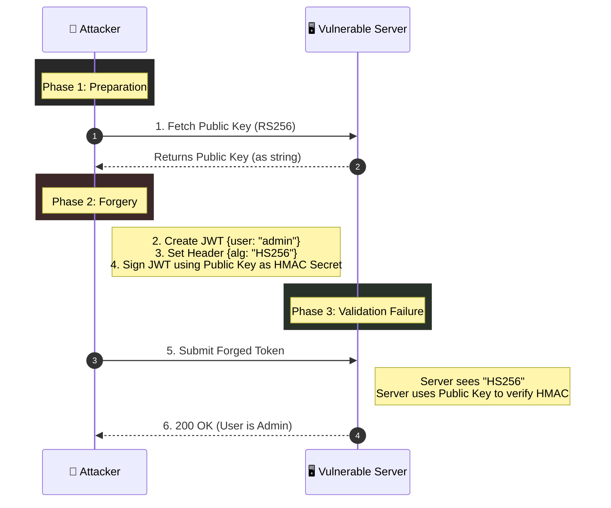
```mermaid
sequenceDiagram
    autonumber
    participant Attacker as 👺 Attacker
    participant Server as 🖥️ Vulnerable Server

    rect rgb(40, 40, 40)
    Note over Attacker: Phase 1: Preparation
    end
    Attacker->>Server: 1. Fetch Public Key (RS256)
    Server-->>Attacker: Returns Public Key (as string)

    rect rgb(60, 40, 40)
    Note over Attacker: Phase 2: Forgery
    end
    Note right of Attacker: 2. Create JWT {user: "admin"}<br/>3. Set Header {alg: "HS256"}<br/>4. Sign JWT using Public Key as HMAC Secret

    rect rgb(40, 50, 40)
    Note over Server: Phase 3: Validation Failure
    end
    Attacker->>Server: 5. Submit Forged Token
    Note right of Server: Server sees "HS256"<br/>Server uses Public Key to verify HMAC
    Server-->>Attacker: 6. 200 OK (User is Admin)
```

### Important Architecture Note

This security hardening belongs in your **Authentication Middleware Layer**. It is the "Guard" at the entrance of your system. A Senior Architect ensures that the validation logic is **Restrictive (Allow-list)** rather than** Permissive (Block-list)**. You don't block <kbd>none</kbd>; you only allow <kbd>RS256</kbd>.
##check

---

### Token Leakage

Even a cryptographically perfect JWT is useless if it is accidentally revealed to an unauthorized party. Token leakage occurs when sensitive credential escape the "Trusted Zone" and enters logs, browser history, or third-party headers.

### Terminologies (Token Leakage)

_**Referrer Header**_

An HTTP header that tells a website where a user comes from. If a token is in the URL, the next website the user clicks on will receive that token in the `Referrer` header.

_**Side-channel Leakage**_

When a token is exposed to a unintended medium, such a server logs, error message, or browser console outputs.

_**Log sanitization**_

The process of automatically scrubbing sensitive patterns (like `Bearer eyJ....`) from application logs before it write to a disk or sent to a logging service(like ELK or Splunk).

_**Browser History/Cache**_

The Localstorage of URLs visited by a user. If tokens are passed as query parameters (`?token=eyJ....`) they are permanently stored in the browser's history file.

### Concept "Information Spillage"

In a secure architecture, tokens are treated as "Biological Hazards." They should only exist in specific, shielded containers(like `Authorization` header or `HttpOnly` cookies). **Token Leakage** happens when these "hazards"
spill into the public or semi-public areas of your infrastructure.

The most common leak is the **URL Leak**. If you send a token as a query parameter, it is no longer private. It is now visible to:

1. The user's browser history.
2. The server's access logs (Nginx/Apache)
3. Any third-party analytics scripts running on the page

### Why it exists: Developer Convenience vs Default Behavior

Leakage usually occurs because of "Default Behaviors."

- **Logging** : Frameworks like Morgan or Winston often logs the entire object by default.
- **Browsers** : Browsers automatically sends the `Referrer` header to help websites tract traffic sources.
- **Error Handling** : When a backend fails, developers often return the "Original Request" in the error body to help with debugging, inadvertently sending token back to the client in a plain JSON response.

### Internal Working: The Leakage Paths

1. **The Referrer Leak**: User is on `myapp.com/callback?token=XYZ`. User clicks a link oto `partner-site.com`. The browser sends a request to `partner-site.com` with the header `Referrer: myapp.com/callback?token=XYZ`. The Partner now owns the token.

2. **The Infrastructure Leak**: An Nginx load balancer logs every request line. It writes `GET /api/v1/user?auth=eyJ..` to `/var/log/nginx/access.log`. A DevOps engineer with log access now has the tokens.

3. **The Exception Leak** : Your code crashes, the `catch(err)` block sends `res.json({ error :  err , context :  req.headers })`. The token is now in the response body

### Implementation: Prevention and Sanitization

As a Senior Engineer, you prevent leakage at the **Middleware** and **Global config** level.

**A. Secure Headers (Preventing Referrer Leaks)**

We use `helmet` to tell the browser: "Never send the full URL in the Referrer header".

```js
import helmet from "helmet";

//set the Referrer-Policy to 'no-Referrer' or 'strict-origin-when-cross-origin'

app.use(helmet.referrerPolicy({ policy: "no-referrer" }));
```

**B. Log Sanitization (Preventing Infrastructure Leaks)**

We configure our logger (e.g Winston) to scrub the `Authorization` header before it hits the disk.

```js
import winston from "winston";

const sanitize = winston.format((info) => {
    //Regex to find and replace Bearer tokens

    if (info.message) {
        info.message = info.message.replace(
            /Bearer\s+[A-Za-z0-9-_=]+\.[A-Za-z0-9-_=]+\.?[A-Za-z0-9-_.+/=]*/g,
            "Bearer [REDACTED]",
        );

        return info;
    }
});

const logger = winston.createLogger({
    format: winston.format.combine(sanitize(), winston.format.json()),
    transports: [new winston.transports.Console()],
});
```

### Visual Representation: Token Leakage Scenarios

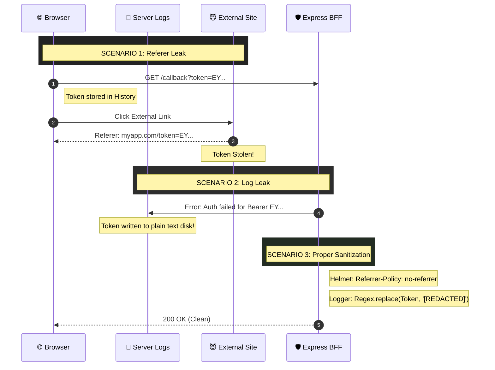
```mermaid
sequenceDiagram
    autonumber
    participant Browser as 🌐 Browser
    participant Log as 📄 Server Logs
    participant ThirdParty as 😈 External Site
    participant BFF as 🛡️ Express BFF

    rect rgb(35, 35, 35)
    Note over Browser, ThirdParty: SCENARIO 1: Referer Leak
    end
    Browser->>BFF: GET /callback?token=EY...
    Note right of Browser: Token stored in History
    Browser->>ThirdParty: Click External Link
    ThirdParty-->>Browser: Referer: myapp.com/token=EY...
    Note over ThirdParty: Token Stolen!

    rect rgb(45, 45, 45)
    Note over BFF, Log: SCENARIO 2: Log Leak
    end
    BFF->>Log: Error: Auth failed for Bearer EY...
    Note over Log: Token written to plain text disk!

    rect rgb(35, 45, 35)
    Note over BFF: SCENARIO 3: Proper Sanitization
    end
    Note right of BFF: Helmet: Referrer-Policy: no-referrer
    Note right of BFF: Logger: Regex.replace(Token, '[REDACTED]')
    BFF-->>Browser: 200 OK (Clean)

```

---

### BOLA (Broken Object Level Authorization) / IDOR (Insecure Direct Object Reference)

### Terminologies (BOLA/IDOR)

_**BOLA / IDOR**_

A vulnerability where an application provides access to an object (like a user profile, invoice, or message) based on a user-supplied ID without verifying if the requesting user has permission to access that specific object.

_**Object Reference**_

The unique identifier (e.g., `invoice_id`, `user_id`, or a UUID) used to retrieve a specific record from a database.

_**Direct Reference**_

Using the actual database primary key (like 12345) directly in the URL or API request.

_**Ownership Predicate**_

The logical condition in a database query that ensures the data belongs to the requester `(e.g., WHERE id = ? AND owner_id = ?)`.

_**Horizontal Privilege Escalation**_

An attack where a user accesses data belonging to another user of the same rank `(e.g., User A viewing User B’s private photos)`.

### Concept : Identity vs Permission

The Core of BOLA is a failure to distinguish between **Authorization** and **Object-Level Authorization**.

When a user logs in, your middleware confirms: "Yes, this is User 55." This is Authentication. However, when User 55 requests `GET /api/invoice/999`, the system must ask a second question: _"Does invoice 999 actually belongs to User 55?"_
If the system only checks if the user is logged in but fails to check the relationship between **User** and **Invoice**, an attacker can simply change the ID in the URL to view invoice in the system.

### Why it exists: The "Hidden" Logic Gap

BOLA exists because authorization logic is often "hidden" within the business logic of the code rather than being centralized in security middleware.

Developers often assume that because a URL is not linked in the UI, a user will never find it. They rely on "Security through Obscurity." However, attackers use automated tools to "fuzz" or increment IDs (changing` /api/user/101` to `/api/user/102`) to discover and scrape data. Because the code only checks `req.user.id` exists, but doesn't compare it to the resource's owner, the data is wide open.

### Internal Working: Probing the API

1. **Discovery**: An Attacker logs into their own account and sees their ID is `5001`.
2. **Manipulation**: They notice the URL is `/api/settings/5001`. They change it to `/api/settings/5000`.
3. **Exploitation**: If the server returns User 5000's private settings, the attacker now knows the system is vulnerable
4. **Automation**: The attacker writes a script to iterate from `1` to `10000`, downloading the private data of every user in the database

### Implementation: Vulnerable vs Secure

**The Vulnerable Way(BOLA present)**

The developer trusts the ID from the URL and only checks if the user is "logged in."

```js
app.get("/api/invoice/:id", authenticate, async (req, res) => {
    const invoice = await db.Invoices.findByPk(req.params.id);

    if (!invoices) return res.status(404).send("Not Found");

    res.json(invoice);
});
```

**The Secure Way(Ownership Check)**

We force the database query to include the `userId` from the verified JWT/Session

```js
app.get("/api/invoice/:id", authenticate, async (req, res) => {
    const invoice = await db.Invoices.findOne({
        where: {
            id: req.params.id,
            ownerId: req.user.id, //Critical Ownership Predicate
        },
    });

    if (!invoices) return res.status(404).send("Invoice Not Found");

    res.json(invoice);
});
```

### Visual Representation: BOLA Attack vs Defense

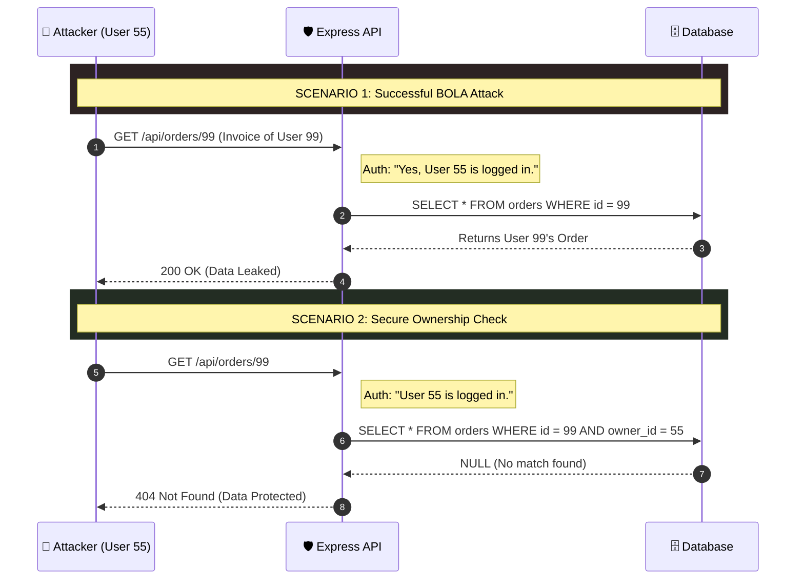
```mermaid
sequenceDiagram
    autonumber
    participant Attacker as 👺 Attacker (User 55)
    participant API as 🛡️ Express API
    participant DB as 🗄️ Database

    rect rgb(45, 35, 35)
    Note over Attacker, DB: SCENARIO 1: Successful BOLA Attack
    end
    Attacker->>API: GET /api/orders/99 (Invoice of User 99)
    Note right of API: Auth: "Yes, User 55 is logged in."
    API->>DB: SELECT * FROM orders WHERE id = 99
    DB-->>API: Returns User 99's Order
    API-->>Attacker: 200 OK (Data Leaked)

    rect rgb(35, 45, 35)
    Note over Attacker, DB: SCENARIO 2: Secure Ownership Check
    end
    Attacker->>API: GET /api/orders/99
    Note right of API: Auth: "User 55 is logged in."
    API->>DB: SELECT * FROM orders WHERE id = 99 AND owner_id = 55
    DB-->>API: NULL (No match found)
    API-->>Attacker: 404 Not Found (Data Protected)
```

---

## 6.2 Authorization Models

### RBAC (Role-Based Access Control)

RBAC is the most common starting point for any enterprise application. It simplifies management by grouping permissions into "Roles" and assigning those roles to users.

### RBAC Terminology

_**Subject**_

The user or service requesting access.

_**Role**_

A collection of permissions(e.g; "Support Tier 1").

_**Permission**_

A specific action on a specific resource (e.g., "READ_USER_EMAILS")

_**Assignment**_

The link between a Subject and a Role

_**Role Hierarchy**_

A structure where a "Super Admin" automatically possesses all permissions of a "Manager" and a "User"

### Concept: The "Middleware" of Identity

In RBAC, we don't ask, _"Who is this user?"_ We ask, _"What is this user's function?"_

Instead of assigning the "Delete User" permission to 50 individual employees, we create a role called "HR_MANAGER", give that role the "Delete User" permission, and then assign the employee to that role. This makes it easy to revoke access, you just remove the role from the user, and all associated permission vanish instantly.

### Why it exists: Management at Scale

Assigning individual permissions to thousands of users is a administrative nightmare and prone to human error. RBAC exists to provide an **abstraction layer**. It allows the security team to define "What a Manager can do" once, and them the operation team can simply move users in and out of that "Manager" bucket as their jobs change.

### Internal Working: The Hierarchy and Enforcement

1. **Identification**: The user provides a JWT containing their assigned roles (e.g `roles: ["editor"]`)
2. **Mapping**: The server maintains a mapping of which Roles have which permissions
3. **Hierarchy**: If a user is a "Admin," the logic check if "Admin" is higher than "Editor". If yes, the user is granted "Editor" rights.
4. **Enforcement**: A middleware checks the resolved roles against the requirement of the route.

### Implementation: Simple RBAC Middleware

In a Professional Express app, we use a middleware factory to check roles.

```js
//1. Define the Role Hierarchy/Mapping (Usually stored in DB or Config)
const rolesConfig = {
    admin: ["views_reports", "edit_users", "delete_users"],
    editor: ["views_reports", "edit_users"],
    viewer: ["views_reports"]
}

//2. The Middleware Factory
const authorizeRole = (requiredRole) => {
    return (req, res, next) => {
        const userRoles = res.user.roles; //Extracted from JWT earlier


        //Simple check: Does the user have the exact role
        // (In a real app, you would check hierarchy here)
        if(userRoles.includes(requiredRoles) || userRoles.includes('admin')) {
            return next();
        }

        return res.status(403).json({
            error: "Forbidden",
            message: `Requires ${requiredRole} role`.
        })
    }
}

//3. Usage in Routes
app.delete("api/users/:id" , authenticate, authorizeRole("admin"), (req, res) => {
    res.send("User deleted.");
})
```

### RBAC Hierarchy

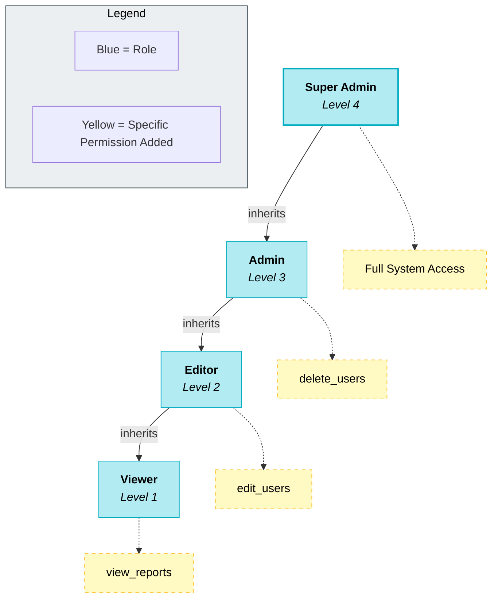
```mermaid
flowchart TD
    %% Role Hierarchy Nodes
    SA[<b>Super Admin</b><br/><i>Level 4</i>]
    A[<b>Admin</b><br/><i>Level 3</i>]
    E[<b>Editor</b><br/><i>Level 2</i>]
    V[<b>Viewer</b><br/><i>Level 1</i>]

    %% Permission Nodes
    P_SA[Full System Access]
    P_A[delete_users]
    P_E[edit_users]
    P_V[view_reports]

    %% Inheritance Connections (The Hierarchy)
    SA -- "inherits" --> A
    A -- "inherits" --> E
    E -- "inherits" --> V

    %% Permission Assignments
    SA -.-> P_SA
    A -.-> P_A
    E -.-> P_E
    V -.-> P_V

    %% Styling for Dark Mode Visibility
    style SA fill:#b2ebf2,stroke:#00acc1,color:#000,stroke-width:2px
    style A fill:#b2ebf2,stroke:#00acc1,color:#000
    style E fill:#b2ebf2,stroke:#00acc1,color:#000
    style V fill:#b2ebf2,stroke:#00acc1,color:#000

    style P_SA fill:#fff9c4,stroke:#fbc02d,color:#000,stroke-dasharray: 5 5
    style P_A fill:#fff9c4,stroke:#fbc02d,color:#000,stroke-dasharray: 5 5
    style P_E fill:#fff9c4,stroke:#fbc02d,color:#000,stroke-dasharray: 5 5
    style P_V fill:#fff9c4,stroke:#fbc02d,color:#000,stroke-dasharray: 5 5

    %% Grouping for Clarity
    subgraph Legend
        L1[Blue = Role]
        L2[Yellow = Specific Permission Added]
    end
    style Legend fill:#eceff1,stroke:#37474f,color:#000
```

---

### Permission-Based Authorization

Often called as Capability-Based Security.

### Permission-Based AuthZ Terminologies

_**Capability/Permission**_

A granular, atomic action that can be performed on a resource (e.g., `users:delete`, `reports:export`)

_**Decoupling**_

The practice of separating "identity" of the user from the "Actions" they are allowed to perform.

_**Granularity**_

The level of detail in your security rules. RBAC is "Coarse-grained" (big buckets); Permission-based is "Fine-grained" (tiny specific switched)

_**Atomic Action**_

An Action that cannot be broken down further (e.g., `READ` is an atom, but `MANAGE` is a collection of atoms).

### Concept "Can Do" vs "Is A"

In a traditional **RBAC** system, your code asks: **Is this user an Admin?** (`if(user.role === 'admin')`). This is a rigid "Is A" check.

In a **Permission-Based** system, you code asks: **Does this user have the permission to delete_user?** (`if(user.can('delete_user'))`)

The "Role" becomes nothing more than a "Label" or a "Folder" that holds a list of permissions. Tha application code never sees the role; It only see the permission. This allows you to create a new role (e.g; "Support_Lead") and give them the `delete_user` permission without ever changing a single line of your application code.

### Why it exists: Avoiding the "Role Explosion" and "Hardcoding"

When you hardcode `if (role === 'admin')` throughout 50 files in your project, your application is now "locked" into those specific roles.

If your business later decides they want a "Moderator" who can edit posts but not delete them, you have to find every place you checked from `admin` and manually update the logic to: `if (role === 'admin' || role === 'moderate)`;

As you add more roles, your `if` statement grow until they are unmanageable. Permission-based authorization removes this entirely by keeping the "Logic" constant while the "Configuration" changes.

### Internal Working: The Mapping Layer

1. **Identity**: The user logs in and the server identifies their **Role** (e.g., `Editor`)
2. **Lookup**: The system looks up the **Permission** associated with that role from a configuration file or database.
3. **Tokenization**: These permissions are either injected into the **JWT** (for statelessness) or cached in a **Session** (for statefulness)
4. **Enforcement**: The Express middleware check for the presence of a specific permission string (e.g., `article:publish`) before allowing the request to hit the controller.

### Implementation: Permission-Based Middleware

```js
//1. The Configuration (The Source of truth)
const rolePermissions = {
    admin: ["user:create", "user:delete", "report:view"],
    support: ["user:view", "report:view"],
    viewer: ["report:view"],
};

//2. The Permission Middleware Factory
const requirePermission = (permission) => {
    return (req, res, next) => {
        //Assume 'req.user.permissions' was populated during authentication
        // or looked up fro the 'rolePermissions' mao
        const userPermissions = req.user.permissions || [];

        if (userPermissions.includes(permission)) {
            return next();
        }

        return res.status(403).json({
            error: "Forbidden",
            message: `Missing required permission: ${permission}`,
        });
    };
};

//3. Usage: The business logic is now decoupled from the Role.

app.delete(
    "/api/users/:id",
    authenticate,
    requirePermission("user:delete"), //we check the ACTION, not  the ROLE
    (req, res, next) => {
        res.send("User removed from system");
    },
);
```

### Visual Representation: Permission-Based Authorization

```mermaid
sequenceDiagram
    autonumber
    participant Client
    participant Auth as Auth Middleware
    participant Store as Identity/RBAC Store
    participant Controller as Resource Controller

    Note over Client, Controller: 1. Identity Resolution
    Client->>Auth: HTTP Request (JWT in Header)
    Auth->>Auth: Extract Role (e.g., 'Editor')
    Auth->>Store: Lookup Permissions for 'Editor'
    Store-->>Auth: ['user:view', 'post:edit', 'post:create']

    Note over Client, Controller: 2. Enforcement Point
    Auth->>Auth: Validate Requirement ('post:edit')

    alt Permission Exists
        Auth->>Controller: Forward Request
        Controller-->>Client: 200 OK (Resource Data)
    else Permission Missing
        Auth-->>Client: 403 Forbidden (Access Denied)
    end
```

### Where this fits in Architecture

Permission Based Access Control is the "Gold Standard" for enterprise applications. It is often implemented using specialized languages like **Rego** (used by Open Policy Agent) or specialized libraries. It allows the authorization logic to be decoupled from the application entirely, sometimes even running as a separate microservice.

---

### ABAC (Attribute-Based Access Control)

In ABAC, access is not granted based on a static "string" in a JWT. Instead, it is calculated in real-time by looking at the characteristics of the user, the resource, and the environment

### ABAC Terminologies

**Attributes**

- The building blocks of ABAC. These are key-value pairs associated with four distinct categories:
    - _Subject Attributes_: Information about the user (e.g., `department: "Finance"`, `clearance_level: 5`, `age: 30`)
    - _Resource Attributes_: Information about the object being accessed (e.g., `is_confidential: true`, `owner_id: 101`, `region: "EU"`)
    - _Action Attributes_: What is being done (e.g., `read`, `write`, `approve`)
    - _Environment Attributes_: Information about the context of the request (e.g., `current_time: "14:00"` ,`ip_address: "192.168.1.1"`, `device_status: trusted`)

**Policy**

A boolean logic statement that evaluates these attributes(e.g., "Allow access if Subject.Department == Resource.Department").

**Context**

The total "snapshot" of all attributes at the exact momenta request is made.

### Concept: The "Logic Gate"

In RBAC, the gate is open if you have the right "key" (Role). In ABAC, the gate is controlled by a **Logic Engine**.

ABAC allows for incredibly specific rules that RBAC simply cannot handle. For example: "_A user can view a Financial Report if they are in "Accounting" department AND it is currently during business hours AND the report's region matches the user's region"_

Notice that we didn't create a new role called `Accounting_BusinessHours_EURegion`. We simply checked the **attributes** of the existing user and the specific report they requested.

### Why it exists: Avoiding Role Explosion

As organizations grows, RBAC becomes unmanageable. If you have 10 departments, 5 regions, and 3 security levels, you might end up with **150 different roles** to cover every possible combination. This is called **Role Explosion**.

ABAC solves this by keeping a small number of roles (or no roles at all) and instead focusing on relationships. It moves the complexity from "User Assignment" to "Policy Logic". If a user moves from the New York office to the London office, you don't change their role; you just update their `location` attribute, and the policies automatically adjust their access.

### Internal Working: The Evaluation Cycle

1. **Request**: User 55 attempts to `UPDATE` Document A.
2. **Attribute Collection**: The system fetches:
    - **Subject**: User 55 is in "Legal" and "London"
    - **Resource**: Document belongs to "Legal" and is "Status:Draft"
    - **Environment**: Time is 2:00PM: Connection is via VPN
3. **Policy Evaluation**: The engine runs the rule:
   `Allow if Subject.Dept == Resource.Dept AND Resource.Status == 'Draft'`
4. **Decision**: Both conditions match. Access is **GRANTED**

### Implementation: ABAC Logic in Express

```js

const abacRules = [
    {
        action : "document:edit"
        //This is a dynamic condition based on attributes
        canAccess: (subject, resource, environment) => {
            const isOwner = subject.id === resource.ownerId;
            const isSameDept = subject.department === resource.department;
            const isBusinessHour = environment.hour > 9 && environment.hours <= 17;
            const isTrustedNetwork = environment.isVpn;

        // Rule: Must be same dept AND (Owner OR Business Hours) AND on VPN
        return isSameDept && (isOwner || isBusinessHour) && isTrustedNetwork;
        }
    }
];


//2. The ABAC Middleware
const authorizeABAC = (action , getResource) => {
    return async (req, res, next) => {
        //Collect Attributes
        const subject = req.user; //From JWT/Session
        const resource = await getResource(req) //From Database
        const environment = {
            hour : new Date().getHours(),
            isVpn : req.headers['x-vpn-status'] == 'active'
        }

        //Find the rule for this action

        const rule = abacRules.find(r => r.action === action);

        if(rule && rule.canAccess(subject, resource, environment)){
            return next();
        }

        return res.status(403).json({ error: "ABAC Policy Denied access."})
    }
}

```

### Flow Diagram: ABAC Decision Mechanism

```mermaid
flowchart TD
    %% Input Layer
    REQ([HTTP Request])

    %% Attribute Gathering
    subgraph Attr_Collection [1. Attribute Collection]
        SUB[<b>Subject</b><br/>User Dept, Location, ID]
        RES[<b>Resource</b><br/>Owner, Status, Dept]
        ENV[<b>Environment</b><br/>Time, IP, VPN Status]
    end

    %% Decision Logic
    subgraph Decision_Engine [2. ABAC Decision Engine]
        POLICY{Evaluate Policy:<br/>Does Sub.Dept == Res.Dept<br/>& Environment == Secure?}
    end

    %% Outcomes
    GRANT([200 OK: Allowed])
    DENY([403 Forbidden: Denied])

    %% Connections
    REQ --> SUB
    REQ --> RES
    REQ --> ENV

    SUB --> POLICY
    RES --> POLICY
    ENV --> POLICY

    POLICY -- "Logic True" --> GRANT
    POLICY -- "Logic False" --> DENY

    %% Styling
    style REQ fill:#e0f7fa,stroke:#00838f,color:#000
    style Attr_Collection fill:#263238,stroke:#37474f,color:#fff
    style SUB fill:#b2ebf2,stroke:#00acc1,color:#000
    style RES fill:#b2ebf2,stroke:#00acc1,color:#000
    style ENV fill:#b2ebf2,stroke:#00acc1,color:#000

    style Decision_Engine fill:#263238,stroke:#37474f,color:#fff
    style POLICY fill:#fff9c4,stroke:#fbc02d,color:#000

    style GRANT fill:#c8e6c9,stroke:#2e7d32,color:#000
    style DENY fill:#ffcdd2,stroke:#c62828,color:#000
```

---

### PBAC (Policy-Based Access Control)

While ABAC provides the logic(using attributes), **PBAC** provides the _framework_ to manage that logic at an enterprise scale. In a PBAC system, we treat "Authorization" as a separate service entirely, decoupling the `"Rules of the Business"` from the` "Code of the Application"`

### PBAC Terminologies

To understand PBAC, you must learn the four standard components defined by the **XACML** (Extensible Access Control Markup Language) reference architecture.

- **PAP (Policy Administration Point)**: The place where policies are created and managed ("The Law Bool").
- **PDP (Policy Decision Point)**: The "Brain" or engine that evaluates the policies and makes a "Permit" or "Deny" decision.
- **PEP (Policy Enforcement Point)**: The part of your application (usually middleware) that protects the resource and carries out the PDP'd decision.
- **PIP (Policy Information Point)**: The source of extra data. If the PDP needs to know a user's department or a document's status to make a decision, it asks the PIP to fetch it.
- **Decoupling**: The architectural practice of removing authorization logic from your Express controllers and moving it into a centralized policy engine.

### Concept: The Externalized Judge

In previous models(RBAC, ABAC), the "Judge" (the logic that says Yes or No) lived inside your Express code. If the rules changed, you had to redeploy your code.

In **PBAC**, the Judge is external. Your Express app (the **PEP**) gathers the request details and send them to the Judge(the **PDP**). The Judge looks at the "Law Book" (the **PAP**) and asks for more evidence fi needed (from the **PIP**). The Judge returns a simple "Permit" or "Deny". Your application doesn't need to know _why_ the decision was made; it simply obeys the result.

### Why it exists: Governance and unified Security

In Large organization with hundreds of microservices, managing authorization becomes impossible if every team writes their own logic.

**PBAC exists to prove**:

1. **Centralized Governance**: A security officer can update a policy in the PAP. and it immediately applies to the Web App, the Mobile App, and the Internal API without any developer touching the code.
2. **Auditability**: Since all decisions go through the PDP, you have a single log file that shows exactly who was denied access and which policy caused the denial.
3. **Language Independence**: Since the PDP is usually a separate service(often using **OPA - Open Policy Agent**), your Node.js app, your Python app, and your Go app can all use the exact same policies.

### Internal Working: The Request Lifecycle

1. **Trigger**: A user tries to access `/api/finance/transfer`
2. **The Interception (PEP)**: The Express middleware stops the request. It creates a "JSON Authorization Request".
3. **The Decision Request**: The PEP sends this JSON to the **PDP**
4. **The Context Fetch(PIP)**: The PDP realizes it needs to know the user's "Daily Transfer Limit." It calls a database (the PIP) to get that number.
5. **Evaluation**: The PDP evaluates the policy: `Allow if TransferAmount < DailyLimit`
6. **Response**: The PDP returns `{ "result" : "permit" }`
7. **Execution**: The PEP allows the request to proceed to the controller.

### Implementation: The PBAC Middleware (BFF Model)

In Industry practice, we often use **Open Policy Agent(OPA)**. Here is how the Express "PEP" communicates with OPA "PDP".

```js
import axios from "axios";

//1. The Policy Enforcement Point(PEP) Middleware
const enforcePolicy = (policyPath) => {
    return async (req, res, next) => {
        //Prepare the input for the PDP
        const input = {
            user: req.user, // Subject Attribute
            action: req.method, // Action Attribute
            path: req.path, // Resource Attribute
            params: req.params,
            body: req.body,
            env: { time: new Date().toISOString() }, // Environment Attribute
        };

        try {
            //2. Call the Policy Decision Point(PDP) - This is usually a sidecar service

            const opaResponse = await axios.post(
                `http://opa-serive:8181/v/data/${policyPath}`,
                { input: input },
            );

            //3. Obey the decision
            if (opaResponse.data.result?.allow == true) {
                return next();
            }

            return res
                .status(403)
                .json({ error: "Access Denied by Central Policy" });
        } catch (error) {
            console.error("PDP Error:", error);
            res.status(500).send("Authorization Engine unreachable");
        }
    };
};

//4. Usage: No logic in the route, just an enforcement point

app.post(
    "/api/transfer",
    authenticate,
    enforcePolicy("finance/transfer_rules"),
    (req, res) => res.send("Transfer Successful"),
);
```

### Visual Representation (PBAC)

```mermaid
flowchart TD
    %% Node Definitions
    USER((User))

    subgraph Control_Plane [Authorization Layer]
        PEP[<b>PEP</b><br/>Policy Enforcement Point]
        PDP{<b>PDP</b><br/>Policy Decision Point}
    end

    subgraph Data_Layer [Data & Policy Storage]
        PAP[(<b>PAP</b><br/>Policy Administration Point)]
        PIP[(<b>PIP</b><br/>Policy Information Point)]
    end

    %% Process Flow
    USER -- "1. Request" --> PEP
    PEP -- "2. Decision Request" --> PDP

    PDP -. "3. Fetch Rules" .-> PAP
    PDP -. "4. Retrieve Attributes" .-> PIP
    PIP -. "5. Context Attributes" .-> PDP

    PDP -- "6. Permit / Deny" --> PEP
    PEP -- "7. Access / Block" --> USER

    %% Professional Styling
    classDef actor fill:#e1f5fe,stroke:#01579b,stroke-width:2px,color:#000
    classDef logic fill:#fff9c4,stroke:#fbc02d,stroke-width:2px,color:#000
    classDef storage fill:#c8e6c9,stroke:#2e7d32,stroke-width:2px,color:#000
    classDef middleware fill:#b2ebf2,stroke:#00acc1,stroke-width:2px,color:#000

    class USER actor
    class PDP logic
    class PAP,PIP storage
    class PEP middleware

```

---

## 6.3 Production Best Practices

### Token Rotation and Refresh Token Security

### Terminologies

_Refresh Token Rotation_

A security strategy when every time a Refresh token is used, the server issues a **new** Refresh Token and invalidates the **old** one.

_Reuse Detection_

A security mechanism where, if an old (already used) Refresh Token is presented, the server assumes a theft has occurred and immediately revokes all tokens in that user's session.

### Concept: The UX vs Security Balance

In a Perfect security world, we would use 5-minute tokens and make the user log in again every 5 minutes. This is secure but provides a terrible User Experience(UX)

TosSolve this, we use the **Refresh Token Pattern**. The browser (or BFF) holds a long-lived Refresh Token. When the Access Token expires, the application automatically goes to the "Back-channel" to trade the Refresh token for a fresh Access Token. This happens invisibly to the user.

**Rotation** add a layer of safety: By consulting changing the Refresh Token, we ensure that even if one is stolen, its "window to use" is extremely narrow.

### Why is exists: Mitigating Token Theft

If an Access Token is stolen, the attacker has 15 minutes to access. If a **static** Refresh Token is stolen, the attacker has access for weeks

Refresh Token Rotation, exists to solve the "**Stolen Token**" Problem. Since the token changes with every user, an attacker and a legitimate user will eventually "clash". If the attacker uses the token first, the legitimate user will later try to use an "old" token. The server will defect this "Reuse," realize something is wrong, and kill the entire session for everyone. This is a **Self-Healing** security mechanism

### Implementation: Refresh Token Rotation (Express + Redis)

```js
// ----THE REFRESH ENDPOINT----

app.post("/auth/refresh", async (req, res) => {
    const { refreshToken } = req.body;

    //1.Look up the token in Redis
    const tokenData = await redis.get(`refresh_token:${refreshToken}`);

    if (!tokenData) {
        return res.status(401).send("Invalid Refresh Token");
    }

    const { userId, status } = JSON.parse(tokenData);

    //2. REUSE DETECTION

    if (status === "used") {
        console.error("ALERT: Reuse detected for User ${usedId}!");

        //Revoke all tokens for this user for safety
        await redis.del(`user_session:${userId}`);
        return res
            .status(403)
            .send("Security Breach Detected. Please login again.");
    }

    //3. ROTATION:  Mark old token as used and issue new ones
    await redis.set(
        `refresh_token:${refreshToken}`,
        JSON.stringify({ usedId, status: "used" }),
        "EX",
        60,
    ); // Keep for 1 min to handle race conditions

    const newAccessToken = generateAccessToken(userId);
    const newRefreshToken = generateRandomString();

    await redis.set(
        `refresh_token:${newRefreshToken}`,
        JSON.stringify({ usedId, status: "active" }),
        "EX",
        60 * 60 * 264 * 7,
    );

    res.json({ accessToken: newAccessToken, refreshToken: newRefreshToken });
});
```

### Flow Diagram : Refresh Token Rotation & Reuse Detection

```mermaid

sequenceDiagram
    autonumber
    participant Client as 🌐 Client
    participant Server as 🛡️ Auth Server
    participant DB as 🗄️ Redis (Token Store)

    rect rgb(30, 40, 50)
    Note over Client, DB: NORMAL ROTATION
    end
    Client->>Server: POST /refresh (Token_A)
    Server->>DB: Is Token_A 'active'?
    DB-->>Server: Yes
    Server->>DB: Mark Token_A as 'used'
    Server->>DB: Store Token_B as 'active'
    Server-->>Client: New AccessToken + Token_B

    rect rgb(60, 40, 40)
    Note over Client, DB: ATTACK / REUSE DETECTION
    end
    Note over Client: Attacker tries to use stolen Token_A
    Client->>Server: POST /refresh (Token_A)
    Server->>DB: Is Token_A 'active'?
    DB-->>Server: No, it is 'USED'!
    Note right of Server: REUSE DETECTED
    Server->>DB: DELETE all tokens for this User
    Server-->>Client: 403 Forbidden (Session Revoked)

```

---

### If we are changing the token every few minutes (rotation), why do we bother setting an expiration date for 7 days or 30 days

### Refresh Token Expiry Terminology

- **Sliding Window:** A session management strategy where the expiration date is pushed further into the future every time the user interacts with the app.
- **Inactivity Timeout (Idle Timeout):** The maximum amount of time a user can be "away" from the app before they are forced to log in again.
- **Absolute Timeout:** A hard limit on a session (e.g., 30 days). No matter how active the user is, they **must** log in again after this time.
- **TTL (Time To Live):** The specific duration a piece of data (like a token) is allowed to exist in a database (like Redis) before it is automatically deleted.

### Concept: The "Sliding" Chain of Trust

Even though we rotate the **Refresh Token** (changing the string), the **expiration date** represents the "Inactivity Window."

Think of the 7-day expiry as a "use it or lose it" timer.

- If you use the app today, we give you a new token valid for 7 days from **now**.
- If you use it tomorrow, we give you another new token valid for 7 days from **tomorrow**.
- If you go on vacation for 8 days and don't open the app, your last token expires. When you return, the "Chain of Trust" is broken, and you must re-authenticate with a password.

The long expiry is there to ensure a **Seamless UX (User Experience)** so the user doesn't have to type their password every single morning.

### Why it exists: The UX-Security Trade-off

If we set the Refresh Token expiry to something short, like 1 hour (the same as an Access Token), the rotation becomes pointless. If the user closes their laptop for lunch and comes back 61 minutes later, they would be logged out.

**We set a long expiry because:**

1.  **Persistence:** We want the user to stay logged in across device restarts and app closes.
2.  **Inactivity Tracking:** We want to distinguish between an "Active User" (who keeps getting new 7-day windows) and an "Abandoned Session" (which we want to expire for security).
3.  **Offline Access:** Some apps (like Spotify or Mail) need to sync data in the background even when the user isn't actively looking at the screen.

### Internal Working: The "Rolling" Expiration

When the server performs a **Refresh Token Rotation**, it does two things to the timeline:

1.  **It creates a new Token ID:** This prevents "Replay Attacks" (using the same token twice).
2.  **It resets the Expiry Clock:** If the policy is "7 days of inactivity," the server looks at the current time and adds 7 days to it.

This creates the **Sliding Window**. As long as the user "refreshes" at least once every 6 days and 23 hours, they will **never** be logged out. The "long" 7-day period is simply the "Maximum allowed gap" between uses.

### Implementation: Redis TTL Logic

In your Express/Redis code, notice how we handle the `EX` (Expiry) parameter during rotation.

```javascript
// --- Inside the Refresh Logic ---

// 1. Generate new token
const newRefreshToken = generateRandomString();

// 2. Determine the "Inactivity Window" (e.g., 7 days)
const INACTIVITY_WINDOW = 60 * 60 * 24 * 7;

// 3. Save to Redis with a FRESH 7-day timer
// This "slides" the expiration forward!
await redis.set(
    `refresh_token:${newRefreshToken}`,
    JSON.stringify({ userId, status: "active" }),
    "EX",
    INACTIVITY_WINDOW,
);

// 4. Important: The OLD "used" token needs a very SHORT expiry (e.g. 1 min)
// We only keep it long enough to detect a breach or handle a network glitch.
await redis.set(
    `refresh_token:${oldToken}`,
    JSON.stringify({ userId, status: "used" }),
    "EX",
    60,
);
```

### Flowchart: The Sliding Window Mechanism

This diagram shows how the session stays alive as long as the user is active. Pale colors for high contrast.

```mermaid
flowchart LR
    %% Timeline
    T1[Day 1: Login]
    T2[Day 3: Refresh]
    T3[Day 11: Too Late]

    %% Tokens
    RT1[Token A<br/>Exp: Day 8]
    RT2[Token B<br/>Exp: Day 10]
    RT3[<b>EXPIRED</b>]

    %% Logic
    T1 --> RT1
    RT1 -- "Used on Day 3" --> RT2
    RT2 -- "No activity for 8 days" --> T3
    T3 --> RT3

    %% Styling
    style T1 fill:#e0f7fa,stroke:#00838f,color:#000
    style T2 fill:#e0f7fa,stroke:#00838f,color:#000
    style T3 fill:#ffcdd2,stroke:#c62828,color:#000

    style RT1 fill:#fff9c4,stroke:#fbc02d,color:#000
    style RT2 fill:#fff9c4,stroke:#fbc02d,color:#000
    style RT3 fill:#ef9a9a,stroke:#b71c1c,color:#000
```

### Real-world Implications

- **Security vs. Convenience:** Banking apps have short windows (e.g., 10 minutes). Social media apps have long windows (e.g., 90 days). You must choose based on the sensitivity of the data.
- **The "Used" Token Cleanup:** You never set a long expiry on a "Used" token. If you do, your database will fill up with millions of useless strings. Used tokens should expire in 30–60 seconds.
- **Device Theft:** If a user's phone is stolen, the "7-day" window is a danger. This is why we need **Global Revocation** (the ability to kill all tokens from the server-side immediately).

### Where this fits in Architecture

The long expiry duration is a **Business Policy** stored in your configuration. The **Rotation** is a **Security Mechanism** in your code. Together, they ensure that the user's session is "fresh" (rotated) but "persistent" (long-lived).

**Do you see how the long expiry defines the "allowed gap" rather than the life of a single string? Shall we move to 6.3.2: Logout and Global Revocation (how to kill that 7-day window early)?**

---

### Logout and Global Revocation

If a user's phone is stolen, or if they click "Log out of all devices," simply deleting the cookie on the browser is not enough. The token still exists and is cryptographically valid **Logout and Global Revocation** is the mechanism we use to "cancel" those tokens from the server-side.

### Terminologies

_**Local Logout**_

The act of clearing the authentication state on a single device(e.g., deleting the session cookie or clearing `localstorage`). This does NOT invalidate the token on the server.

_**Global Revocation**_

The process of invalidating a specific user's session(or all sessions) across the entire system. ANy request using those tokens will be rejected, even if the tokens haven't expired yet.

_**Denylist / Blacklist**_

A high-speed database (usually Redis) that stores the IDs of tokens that have been "Cancelled".

_**jti (JWT ID)**_

A standard claim in a JWT that provides a unique identifier for that specific token. We use this ID to track and revoke individual tokens.

_**Revocation List**_

A centralized registry of "dead" tokens that the API must check before granting access

### Concept: The "Bouncer" Check

In a basic JWT setup, the server is like an automated gate that only checks if a ticket has a valid signature and date. It doesn't ask, "Is this specific ticket stolen?"

**Global Revocation** turns the automated gate into a **Bouncer**. Even if the ticket has a valid signature and is not expired, the Bouncer checks a "Blacklist" (the Revocation List) before letting the user in. If the ticket's unique ID(`jti`) is on that list, the bouncer denies entry. This adds a "Stateful" check to a "Stateless" token/

### Why it exists: The Security Emergency

Standard JWTs are stateless, meaning the server doesn't need to look at a database to verify them. While this is great for performance, it is a security nightmare for three reasons.

1. **Stolen Devices**: If a user loses their laptop, an attacker can use the active session for days until the token naturally expires
2. **Password Changes**: When a user changes their password because they suspect a hack, all existing sessions must be killed immediately. Without revocation, the hacker stays logged in.
3. **Administrative Actions**: If an admin bans a user for malicious behavior, that user should lose access instantly. Without revocation, the banned user can continue using app until their token dies.

### Internal Working: The Revocation Logic

To make revocation work without slowing down every single API call, we follow this logic:

1. **Token Issuance**: Every time we create a JWT, we include `jti` (unique) inside the payload.
2. **The Revocation Trigger**: When a user clicks "Logout" or "Reset All Sessions," the server takes the `jti` (or the `userId`) and writes in into a **Redis** store with an expiration time equal to the token's remaining life.
3. **The Interceptor**: Every time a request hits a protected route, the middleware performs two checks;

- **Check A(Fast/Stateless)**: Is the signature valid and the date okay?
- **Check B(Fast/stateful)**; Is this `jti` in our Redis "Dead List"?

4. **Enforcement**: If check B finds the token in the "Dead List," the request is rejected as `401 authorized`

### Implementation: Global Revocation with Redis

```js
// --- LOGOUT ROUTE (Kill current session) ---
app.post("/auth/logout", authenticate, async (req, res) => {
    const { jti, exp, userId } = req.user; // Data extracted from JWT

    // 1. Calculate how much time is left on the token
    const remainingTime = exp - Math.floor(Date.now() / 1000);

    // 2. Add this specific token ID to the Blocklist in Redis
    // The key expires automatically when the token would have expired
    await redis.set(`blocklist:${jti}`, "revoked", "EX", remainingTime);

    res.status(200).send("Logged out successfully.");
});

// --- REVOCATION MIDDLEWARE (The Bouncer) ---
const checkRevocation = async (req, res, next) => {
    const { jti, userId } = req.user;

    // 1. Check if the specific token is revoked
    const isRevoked = await redis.get(`blocklist:${jti}`);
    if (isRevoked) {
        return res.status(401).json({ error: "Token has been revoked." });
    }

    // 2. Check if the user has a "Global Reset" flag
    // (e.g., if they changed their password at 2:00 PM, all tokens issued before 2:00 PM are dead)
    const lastReset = await redis.get(`user_reset:${userId}`);
    if (lastReset && req.user.iat < lastReset) {
        return res
            .status(401)
            .json({ error: "Session expired due to password change." });
    }

    next();
};

app.get("/api/secure-data", authenticate, checkRevocation, (req, res) => {
    res.send("Access granted to sensitive data.");
});
```

### Flow Diagram: Global Revocation Sequence

```mermaid
sequenceDiagram
    autonumber
    participant User as 🌐 Browser
    participant API as 🛡️ Express API
    participant Cache as ⚡ Redis (Blocklist)

    Note over User, API: Scenario: User uses a stolen token
    User->>API: GET /profile (Authorization: Bearer JWT_A)

    API->>API: 1. Validate Signature (Passes)
    API->>API: 2. Check Expiration (Passes)

    rect rgb(45, 45, 45)
    Note over API, Cache: The "Bouncer" Check
    API->>Cache: 3. Is JTI_A in Blocklist?
    Cache-->>API: Yes (Token was Revoked)
    end

    API-->>User: 4. 401 Unauthorized (Session Killed)
    Note over User: Attacker is blocked despite valid JWT
```

---

### Auditing & Logging

### Terminology

- **Security Audit Log:** A chronological, chronological record of security-relevant events. Unlike application logs (which track errors and performance), audit logs track **Identity and Intent**.
- **PII (Personally Identifiable Information):** Any data that can identify a specific individual (Email, Name, IP).
- **Trace ID / Correlation ID:** A unique string generated at the start of a request and passed through every microservice. It allows you to link a single user action to multiple log entries across different servers.
- **Immutability:** The security requirement that once a log is written, it can never be deleted or modified (even by an Admin).
- **Log Injection:** A vulnerability where an attacker sends malicious strings (like newline characters) into your input fields to "fake" or "scramble" your log entries.

### Concept: The "Who, What, When, Where"

In a Senior-level architecture, we distinguish between **Application Logging** ("The database is slow") and **Audit Logging** ("User 55 changed their password from IP 1.2.3.4").

A high-quality audit log must answer four questions for every security event:

1.  **Who:** The Subject (User ID, Actor ID).
2.  **What:** The Action (Login, Password Change, Data Export).
3.  **When:** Precise Timestamp (UTC).
4.  **Where:** The Source (IP address, User Agent, Service Name).

The most important rule of auditing: **The log must be enough to prove what happened in a court of law.**

### Why it exists: Forensic Analysis and Accountability

Logging exists for three primary reasons:

1.  **Forensics:** If a breach occurs, the audit log tells you exactly which accounts were compromised and what data was stolen. Without it, you are blind to the "Blast Radius."
2.  **Compliance:** Regulations like **SOC2, HIPAA, and GDPR** mandate that you track access to sensitive data. Failing to log access is an automatic audit failure.
3.  **Accountability:** It prevents "Repudiation"—a situation where a user says, "I didn't do that." A signed, immutable log provides evidence that the user's credentials were used for that specific action.

### Internal Working: Structured and Centralized Logging

1.  **Event Capture:** A global middleware or interceptor catches specific actions (e.g., successful logins, 403 Forbidden errors).
2.  **Metadata Injection:** The system injects the `trace_id` and the user's `session_id` into the log object.
3.  **Sanitization:** The system scrubs any sensitive data (it removes the password field, masks the middle of the email, and redacts the JWT).
4.  **Structured Output:** The log is written as a **JSON object**, not a plain-text string. This makes it searchable by machines.
5.  **Centralization:** The log is immediately shipped to a "Log Sink" (like Splunk, ELK, or Datadog) that is separate from the application server.

### Implementation: Security Audit Middleware

This code demonstrates how to implement a structured audit logger that captures security-sensitive events.

```javascript
import winston from "winston"; // Industry standard logging library
import { v4 as uuidv4 } from "uuid";

// 1. Configure the Secure Audit Logger
const auditLogger = winston.createLogger({
    level: "info",
    format: winston.format.json(), // JSON is mandatory for machine analysis
    transports: [
        new winston.transports.File({ filename: "security_audit.log" }),
        // In prod, this would send to an external secure API
    ],
});

// 2. The Audit Middleware
export const auditMiddleware = (req, res, next) => {
    // Generate a Correlation ID for this entire request
    req.traceId = req.headers["x-trace-id"] || uuidv4();

    // Helper to log security events
    req.logSecurityEvent = (action, status, metadata = {}) => {
        const auditEntry = {
            timestamp: new Date().toISOString(),
            traceId: req.traceId,
            userId: req.user?.id || "anonymous",
            ip: req.ip,
            action: action,
            status: status, // "SUCCESS", "FAILURE", "ATTEMPT"
            userAgent: req.get("User-Agent"),
            ...metadata,
        };

        // Ensure we NEVER log raw passwords or tokens
        delete auditEntry.password;
        delete auditEntry.token;

        auditLogger.info(auditEntry);
    };

    next();
};

// 3. Usage in an Endpoint
app.post("/auth/login", auditMiddleware, async (req, res) => {
    try {
        // ... login logic ...
        req.logSecurityEvent("USER_LOGIN", "SUCCESS", {
            email: req.body.email,
        });
        res.send("Logged in");
    } catch (err) {
        req.logSecurityEvent("USER_LOGIN", "FAILURE", { reason: err.message });
        res.status(401).send("Login Failed");
    }
});
```

### Flow Diagram: The Audit Log Pipeline

High-contrast pale colors (Cyan for App, Gold for Logic, Mint for Storage).

```mermaid
flowchart LR
    %% Components
    USER((User Request))
    APP[<b>Express APP</b><br/>Business Logic]
    AUDIT[<b>Audit Middleware</b><br/>Capture & Sanitize]
    SINK{<b>Log Sink</b><br/>Centralized Engine}
    SECURE[(<b>Secure Store</b><br/>Read-Only Archive)]

    %% Flow
    USER --> APP
    APP --> AUDIT
    AUDIT -- "1. Structured JSON" --> SINK
    SINK -- "2. Aggregate & Alert" --> SECURE

    %% Details
    subgraph Sanitization
        direction TB
        S1[Mask PII]
        S2[Redact Passwords]
        S3[Inject TraceID]
    end
    AUDIT -.-> Sanitization

    %% Styling
    style USER fill:#e1f5fe,stroke:#01579b,color:#000
    style APP fill:#b2ebf2,stroke:#00acc1,color:#000
    style AUDIT fill:#fff9c4,stroke:#fbc02d,color:#000
    style SINK fill:#c8e6c9,stroke:#2e7d32,color:#000
    style SECURE fill:#c8e6c9,stroke:#2e7d32,color:#000
```

### Real-world Implications

- **Log Poisoning:** If you log a user's input directly (e.g., `logger.info("User tried to login with: " + req.body.username)`), an attacker can provide a username that contains newline characters to start a "fake" log entry. **Always use structured JSON logging** to prevent this.
- **The Storage Problem:** Audit logs grow massive. Senior architects implement "Retention Policies"—storing logs in "Hot" storage (Redis/Elasticsearch) for 30 days and then moving them to "Cold" storage (S3 Glacier) for 7 years for legal compliance.
- **Alerting:** Logs are reactive; **Alerts** are proactive. If your audit log sees 50 `USER_LOGIN_FAILURE` events for the same account in 1 minute, it should trigger a Slack or PagerDuty alert.

### Where this fits in Architecture

Auditing is a **Cross-Cutting Concern**. It should be handled by a global utility or middleware that is called by all services. In a **Zero Trust** architecture, the Audit Log is the "Proof of Verification." Every successful and unsuccessful authentication/authorization attempt must be recorded to ensure the system's integrity can be verified at any time.

---

### Zero Trust Principles

### Terminology

- **Implicit Trust:** The dangerous assumption that a request is safe just because it comes from a specific IP address, a VPN, or an internal network. Zero Trust seeks to eliminate this.
- **Micro-segmentation:** The practice of breaking a network into small, isolated zones. Even if an attacker breaks into one zone (e.g., the Web Server), they cannot "laterally move" to another zone (e.g., the Database) without a new authentication check.
- **Continuous Authentication:** The principle that a single login at 9:00 AM is not enough. The system should periodically re-verify the user's context (Is their IP still the same? Is their device still healthy?) throughout the session.
- **Contextual Integrity:** Ensuring that the "Context" of a request matches the "Identity." For example, if a user with a "Manager" role suddenly tries to download 5,000 files from a new device in a different country, the system should block the request despite the valid JWT.
- **Signal-to-Noise Ratio:** In Zero Trust, we look for "Signals" (Device ID, IP, Time, Behavior) to distinguish a legitimate user from a "Noise" (an attacker using stolen credentials).

### Concept: "Never Trust, Always Verify"

The Zero Trust model moves the "Security Perimeter" from the Network to the **Identity**.

In a standard OIDC setup, once the user has a JWT, they are "trusted" until the token expires. In a **Zero Trust** setup, every single request is treated as a new attempt to access a resource. Before the server executes the request, it verifies not just the token, but the **Signals** around it.

If you are logged into your banking app and suddenly switch from your home Wi-Fi to a known malicious VPN, a Zero Trust system will detect that change in "Signal" and immediately demand a new Multi-Factor Authentication (MFA) check or revoke the session, even if the token is still valid.

### Why it exists: Preventing Lateral Movement

In most historical data breaches, hackers didn't break into the database directly. Instead, they broke into a low-security "Edge" device (like a printer or a marketing server) and then moved "laterally" through the internal network because the internal services trusted each other blindly.

**Zero Trust exists to:**

1.  **Stop Lateral Movement:** Every internal microservice requires its own authentication (often via mTLS or Internal JWTs).
2.  **Mitigate Stolen Credentials:** Even if an attacker steals a username and password, they likely won't have the "Trusted Device" or the "Expected IP," causing the Zero Trust engine to block the access.
3.  **Support Remote Work:** Since we no longer rely on a "Company Office Network," Zero Trust allows employees to work securely from anywhere by making the security travel with the user's identity.

### Internal Working: The Policy Decision Loop

Zero Trust operates on a constant evaluation loop for every request:

1.  **Verification of Identity:** Is the JWT valid? (The standard OIDC check).
2.  **Verification of Device:** Is this a company-managed laptop? Does it have the latest security patches?
3.  **Verification of Context:** Is the user's location and time of access normal for their role?
4.  **Least Privilege Access:** Does this specific request require the minimum amount of permission possible?
5.  **Risk Scoring:** Based on the above, the system assigns a "Risk Score." If the score is high, it triggers a "Step-up Authentication" (e.g., "Please scan your fingerprint").

### Implementation: Context-Aware Zero Trust Middleware

In this Express implementation, we don't just check the JWT. We check the **Contextual Signals** to ensure the session hasn't been hijacked.

```javascript
// --- ZERO TRUST CONTEXT CHECKER ---
const zeroTrustGuard = async (req, res, next) => {
    const { userId, originalIp, deviceId } = req.user; // Stored in JWT at login

    // 1. IP Consistency Check (Signal 1)
    // If the IP changes mid-session, it might be a session hijack.
    const currentIp = req.ip;
    if (currentIp !== originalIp) {
        // Log the anomaly for the Audit Log (from 6.3.3)
        req.logSecurityEvent("SESSION_ANOMALY", "FAILURE", {
            reason: "IP_CHANGE",
            expected: originalIp,
            actual: currentIp,
        });

        return res.status(403).json({
            error: "Context change detected. Re-authentication required.",
        });
    }

    // 2. Device Fingerprint Check (Signal 2)
    const currentDeviceId = req.headers["x-device-id"];
    if (currentDeviceId !== deviceId) {
        return res
            .status(403)
            .json({ error: "Access from unrecognized device." });
    }

    // 3. Continuous Risk Scoring (Simplified)
    const requestCount = await getRequestRate(userId);
    if (requestCount > 100) {
        // Suspiciously high activity
        return res
            .status(429)
            .json({ error: "Risk threshold exceeded. MFA required." });
    }

    next();
};

app.get("/api/sensitive-data", authenticate, zeroTrustGuard, (req, res) => {
    res.send("This data is protected by Zero Trust verification.");
});
```

### Flow Diagram: Perimeter vs. Zero Trust

This flowchart compares the old "Castle" model with the modern "Zero Trust" model. Colors: Cyan (Trust), Gold (Verification), Soft Red (Untrusted).

```mermaid
flowchart TD
    subgraph Castle_Model [Old Model: Castle & Moat]
        direction TB
        VPN[VPN / Office Network]
        C_Internal[Internal Service A]
        C_DB[Database]
        VPN -- "Trust Granted" --> C_Internal
        C_Internal -- "Implicit Trust" --> C_DB
    end

    subgraph ZT_Model [New Model: Zero Trust]
        direction TB
        User[User / Device]
        Gate{<b>Zero Trust Gate</b><br/>Verify ID + Device + IP}
        Z_Internal[Internal Service A]
        Z_DB[Database]

        User --> Gate
        Gate -- "Valid Context" --> Z_Internal
        Z_Internal -- "Verify Identity (mTLS)" --> Z_DB
    end

    %% Styling
    style Castle_Model fill:#263238,stroke:#37474f,color:#fff
    style ZT_Model fill:#263238,stroke:#37474f,color:#fff
    style Gate fill:#fff9c4,stroke:#fbc02d,color:#000
    style VPN fill:#c8e6c9,stroke:#2e7d32,color:#000
    style C_Internal fill:#c8e6c9,stroke:#2e7d32,color:#000
```

### Real-world Implications

- **Higher Friction:** Zero Trust can be annoying for users if not implemented carefully (e.g., asking for MFA too often). Senior architects use "Adaptive Auth" to only prompt for MFA when the risk score is high.
- **mTLS Requirement:** In the backend, microservices no longer trust each other just because they are in the same VPC. They use **mTLS (Mutual TLS)** to prove their identity to each other for every single call.
- **Identity is the Perimeter:** Everything depends on the strength of your Identity Provider (Google, Auth0, etc.). If your OIDC provider is weak, your Zero Trust model collapses.

### Where this fits in Architecture

Zero Trust is an **End-to-End Philosophy**. It starts at the **BFF (Identity)**, moves through the **Network (TLS)**, and ends at the **Data Access Layer (Authorization)**. It is the architectural glue that connects all the security phases we have studied so far.

---

# Phase 7 Platform and Network Security

## 7.1 TLS/HTTPS

### TLS/HTTPS Terminologies

- **TLS (Transport Layer Security)**: The cryptographic protocol that provides end-to-end security for data sent between applications over the internet. It is successor to **SSL (Secure Sockets Layer)**
- **HTTPS**: A Combination of the Hypertext Transfer Protocol(HTTP) with the TLS protocol to provide encrypted communication and secure identification of a network web server.
- **Cipher Suite**: A set of instructions (algorithms) that tells the server and browser how to encrypt the connection.It typically includes an algorithm for key exchange, bulk encryption, and message authentication.
- **Certificate Authority (CA)**: A trusted entity that issues digital certificates. These certificates verify that a specific Public key belongs to a specific domain (e.g, `app.myapp.com`)
- **HSTS (HTTP Strict Transport Security)**: A web security policy mechanism (a header) that forces browsers to interact with a website only using HTTPS, preventing "downgrade attacks".
- **Handshake**: The multi-step negotiation process where a client and server agree on encryption keys.

### Concept: The Integrity of th Pipe

Think of HTTP as a open conversation in a crowded room. Anyone standing nearby (ISPs, hackers on public Wi-Fi, malicious government nodes) can listen in and even shout over you to change what you are saying.

**TLS/HTTPS** creates a soundproof, armored tunnel between the browser and the server. This tunnel provide three core pillars of security:

1. **Encryption (Privacy)**: No one can eavesdrop(listen secretly) on the conversation
2. **Data Integrity**: No one can tamper with the data(e.g., changing the amount in a bank transfer) without being detected
3. **Authentication (Trust)**: The browser can prove it is talking to the real server and not an imposter.

### Why it exists: OAuth/OIDC Hard Requirement

Modern identity protocols like **OAuth 2.0 and OIDC** are fundamentally broken without TLS. If you attempt to use them over plain HTTP. the following disasters occur:

- **Bearer Token Theft**: Any attacker on the network path can see the `Authorization: Bearer <token>` header in plain text and instantly hijack the session.
- **Credential Exposure**: When a user types their password into a login form, it travels as a plain text string.
- **Redirect Hijacking**; During the OIDC flow, an attacker could intercept the `302 Redirect` and change the `redirect_uri` to a malicious site they control.

Because of these risks, Identity Providers(Google, AuthO, Microsoft) **refuse** to allow non-HTTPS redirect URI's (with the sole exception of `localhost` for development)

### Internal Working: The TLS 1.3 Handshake

In Modern 1.3 (the industry standard since 2018), the process has been streamlined to reduce latency(only one "round trip" required).

1. **Client Hello**: The browser sends its supported cipher suites and a "Key Share" (a mathematical guess of the secret)
2. **Server Hello & Certificate**: The server picks the strongest cipher, sends it own "Key Share," and provides its **Digital Certificate**
3. **Authentication**: The browser checks the certificate's digital signature against its pre-installed list of trusted **Root CAs**. if it matches, the server's identity is verified.
4. **Symmetric Key Generation**: Using a process called **Diffie-Hellman**, both side combines their Key Share to create the same **Symmetric Session Key**. Crucially, the key itself is never actually sent over the wire.
5. **Encrypted Application Date**: All subsequent HTTP traffic (Header, Cookie, Body) is encrypted using this Session key.

### Implementation: Express with HTTPS and HSTS

```js
import https from `https`;
import fs from `fs`;
import express from 'express';
import helmet from `helmet`;

const app = express();

//1. Mandatory security Headers
//Helmet,s hsts header tells the browser:
//"Only talk to me via HTTPS for the next year"

app.use(helmet.hsts({
    maxAge: 315360000, // 1 year in seconds
    includeSubDomains: true,
    preload: true
}))

//2. Load TLS certificate
const options = {
    key: fs.readFileSync('./certs/private-key.pem'),
    cert: fs.readFileSync('./certs/public-cert.pem'),
}

app.get('/api/secure' (req, res) => {
    res.json({ message : "This data traveled through a TLS 1.3 tunnel"});
})

//3. Start the Secure Server
https.createServer(options, app).listen(443, () => {
    console.log("Production Secure Server running on port 443");
})

```

### Flow Diagram: TLS 1.3 Handshake

```mermaid
sequenceDiagram
    autonumber
    participant Browser as 🌐 Browser
    participant Server as 🖥️ Express Server (Port 443)

    rect rgb(35, 45, 55)
    Note over Browser, Server: Phase 1: Negotiation & Identity
    end
    Browser->>Server: 1. Client Hello (Ciphers + Key Share A)
    Server->>Browser: 2. Server Hello (Key Share B) + Certificate

    Note over Browser: 3. Verify Certificate against Root CA

    rect rgb(35, 55, 45)
    Note over Browser, Server: Phase 2: Secure Tunnel Established
    end
    Note over Browser, Server: Both derive Session Key via Diffie-Hellman

    Browser->>Server: 4. Encrypted GET /api/secure (Key used)
    Server-->>Browser: 5. Encrypted Response (Key used)

```

---

## 7.2 CSRF (Cross-Site Request Forgery)

### Terminology

- **CSRF**: An attack that tricks victim's browser into performing an unwanted action on a different website where the victim is currently authenticated.
- **Ambient Authority**: A Security concept where the browser automatically attaches credentials (like Cookies or Basic Auth) to _every request_ made to a specific domain, regardless of which site initiated that request.
- **Same-Origin Policy(SOP)**: A fundamental browser security mechanism that prevents a script on `site-a.com` from reading data from `site-b.com`. **Crucially, SOP does not prevent "sending" a request; it only prevents "reading" that response**
- **Anti-CSRF Token (Synchronized Token)**: A unique, secret, and unpredictable string generated by the server and required to be present in state-changing requests (POST, PUT, DELETE).
- **SameSite Attribute**: A cookie flag(`Strict`, `Lax`, or `None`) that instructs the browser whether to include the cookie in cross-site requests.

### Concept: The "Automatic Trust" Problem.

The core concept of CSRF is that **Browsers are helpful--too helpful**

If you are logged into your bank (`bank.com`) and your browser has a session cookie for it, the browser will "helpfully" attach that cookie to **any** request going to `bank.com`. If you visit a malicious site (`attacker.com`) while still logged in, that site can trigger a hidden request to `bank.com/transfer`. Your browser sees the destination is `bank.com`, sees the session cookie, and attaches to it. To the bank, the request looks 100% legitimate because it has your session cookie.

### Why it exists: The State-Changing Blind Spot

CSRF exists because of a legacy design choice in the web: **Cross-site navigation was intended to be open**.

standard HTTP was designed so that Site A could link to Site B. When we added "State" (Cookies) to this model, we created a vulnerability where an external site could not "link" to a page, but "trigger an action" on that page. Because the attacker cannot _read_ the response(SOP), they cannot steal you data, but they can **change** it. This makes CSRF a "write-only" attack.

### Internal Working: Malicious Trigger

1.  **Victim Logs In**: The user authenticates with `bank.com`. The server sets an `httpOnly` session cookie.
2.  **Attacker Lure**: The victim visits `evil-cat-videos.com` (the attacker's site)
3.  **The Forge**: Inside the HTML of the cat video page, there is hidden form:

    ```html
    <form action="https://bank.com/tranfer" method="POST" id="csrf-form">
        <input type="hidden" name="to" value="attacker_id" />
        <input type="hidden" name="amount" value="5000" />
    </form>
    <script>
        document.getElementById("csrf-token").submit();
    </script>
    ```

4.  **Automatic Submission**: The Javascript executes immediately. The browser sends a POST request to `bank.com`
5.  **Ambient Authority**: The browser finds the `bank.com` session cookie and attaches it to the request.
6.  **Server Execution**: The bank's server validated the cookie, sees a valid session, and processes the $5,000 transfer.

### Implementation: Double-Submit Cookie Pattern (BFF)

```js
// OLD - csurf not in user
import csurf from "csurf";
import cookieParser from "cookie-parser";

//1.Setup Cookie Parsing
app.use(cookieParser("secret-key"));

//2. CSRF Protection Middleware
//This will expect a `_csrf` token in the request body or headers

const csrfProtection = csurf({ cookie: true });

//3. Endpoint to fetch the CSRF Token
//The frontend calls this one at startup
app.get("/api/csrf-token", csrfProtection, (req, res) => {
    //Pass the token to the frontend (e.g., in a JSON response)
    res.json({ csrfToken: req.csrfToken() });
});

//4. Protected State-Changing Route
app.post("/api/user/update", csrfProtection, (req, res) => {
    res.send("Profile updated securely");
});

// --------------------------------------------------------------------

// Latest - csrf-csrf
import express from "express";
import cookieParser from "cookie-parser";
import { doubleCsrf } from "csrf-csrf";

const app = express();

// 1. Basic Setup
app.use(express.json());
app.use(cookieParser("your-very-secure-cookie-secret"));

// 2. Configure CSRF-CSRF
const {
    invalidCsrfTokenError, // Error to throw if validation fails
    generateToken, // Function to create tokens
    doubleCsrfProtection, // The actual middleware
} = doubleCsrf({
    getSecret: (req) => "your-very-secure-logic-secret",
    cookieName: "x-csrf-token",
    cookieOptions: {
        httpOnly: true, // Crucial: JS cannot read this cookie
        sameSite: "lax",
        secure: true, // Only over HTTPS
    },
    size: 64, // 64-byte tokens for high entropy
    getTokenFromRequest: (req) => req.headers["x-csrf-token"], // Look here for validation
});

// 3. Endpoint for the Frontend to get the token
// The browser gets the cookie AND the JSON response
app.get("/api/csrf-token", (req, res) => {
    const token = generateToken(req, res);
    res.json({ token });
});

// 4. Global Error Handler for CSRF
app.use((error, req, res, next) => {
    if (error === invalidCsrfTokenError) {
        res.status(403).json({ error: "CSRF Validation Failed" });
    } else {
        next();
    }
});

// 5. Apply Protection to state-changing routes
app.post("/api/update-profile", doubleCsrfProtection, (req, res) => {
    res.json({ message: "Profile updated securely!" });
});
```

### Flow : CSRF Attack vs. Token Defense

```mermaid
sequenceDiagram
    autonumber
    participant Browser as 🌐 Browser (User)
    participant Bank as 🖥️ Secure BFF (Bank)
    participant Evil as 👺 Malicious.com

    rect rgb(35, 45, 55)
    Note over Browser, Bank: Scenario: THE ATTACK
    end
    Browser->>Bank: 1. Login (Sets Session Cookie)
    Browser->>Evil: 2. Visit Malicious Site
    Evil->>Browser: 3. Hidden Form (POST to Bank)
    Browser->>Bank: 4. POST /transfer + Cookie (Auto-attached)
    Bank-->>Browser: 5. 💰 Money Transferred (Attack Success)

    rect rgb(35, 55, 45)
    Note over Browser, Bank: Scenario: THE DEFENSE (Anti-CSRF Token)
    end
    Browser->>Bank: 6. GET /csrf-token
    Bank-->>Browser: 7. Return SecretToken: "XYZ"
    Browser->>Bank: 8. POST /transfer + Cookie + Header(X-CSRF: "XYZ")
    Note right of Bank: Logic: Header "XYZ" matches Session "XYZ"?
    Bank-->>Browser: 9. 200 OK (Legitimate Request)

    rect rgb(45, 35, 35)
    Note over Evil, Bank: Attacker attempt during defense
    end
    Evil->>Browser: 10. Trigger POST /transfer
    Browser->>Bank: 11. POST /transfer + Cookie (No Header!)
    Note right of Bank: Logic: Required Header Missing!
    Bank-->>Browser: 12. 403 Forbidden (Attack Blocked)

```

---

## 7.3 CORS (Cross-Origin Resource Sharing)

### Terminologies

- **Origin**: The combination of **Protocol** (http/https), **Domain** (example.com), and **Port** (3000). If any of these three changes, it is a different origin.
- **Simple Request**: Certain requests (like basic GET or POST with standard content types) that the browser allows without checking first.
- **Preflight Request (OPTIONS)**: For "non-simple" requests(like those with custom headers or JSON bodies), the browser sends an automatic `OPTIONS` request to the server first to ask for permission.
- **Allow-Credentials**: A specific CORS header that must be set to `true` if the frontend need to send or receive **Cookies** or **Authorization headers**.
- **Allow-Control-Allow-Origin**: The response header that specifies which frontend origins are allowed to see the response.

### Concept: The Browser's Security Guard

The core concept of CORS it that **the browser enforces the rules, not the server**.

When your React app at `localhost:3000` tries to fetch data from your Express BFF at `localhost:4000`, the browser stops the request. It says, "Wait, these are different origins!", The browser then looks at the headers coming back from the server. If the server doesn't explicitly say "I allow localhost:3000," the browser will block the Javascript code from reading the response, even if the server successfully processed the request.

### Why it exists : Protecting User Privacy

CORS exists because without the **Same-Origin Policy**, any website you visit could steal your data.

Imagine you are logged into your private email at `mail.com`. You then visit `malicious-site.com` in another tab. Without SOP, the JavaScript on `malicious-site.com` could make a background request to `mail.com/inbox` and read all your messages. Because your browser would automatically attach your `mail.com` cookies, the request would succeed. CORS provides a controlled way for `mail.com` to say: "I only allow my official mobile app or my trusted partner domains to read this inbox data."

### Internal Working: The Preflight Dance

1. **The Trigger**: The frontend attempts a `POST` request with `Content-Type: application/json`. The browser identifies this as a "non-simple request"
2. **The Preflight(OPTIONS)**: Before sending the actual POST, the browser sends an `OPTIONS` request to the server. It includes header like `Origin: http://localhost:3000` and `Access-Control-Request-Method: POST`
3. **The Server Decision**: The Express server receives the OPTIONS request. It checks its "Allow-list". If the origin is trusted, it responds with `Access-Control-Allow-Origin: http://localhost:3000`
4. **The Actual Request**: If the Preflight succeeds, the browser finally sends the real `POST` request.
5. **The Final Check**: The browser receives the response. It checks for the `Allow-Origin` header again. If it matches, the data is passed to your JavaScript Code.

### Implementation: Using the `cors` Package in Express

```js
import express from "express";
import cors from "cors";

const app = express();

//1. Define your trusted origins
const allowedOrigins = [
    "http://localhost:3000", //Local Development
    "https://app.production.com", //Production frontend
];

//2. Configure CORS Options
const corsOptions = {
    origin: (origin, callback) => {
        //Allow request with no origin (like mobile apps or curl)
        if (!origin) return callback(null, true);

        if (allowedOrigins.indexOf(origin) !== -1) {
            callback(null, true);
        } else {
            callback(new Error("Not allowed by CORS"));
        }
    },

    methods: ["GET", "POST", "PUT", "DELETE"],
    allowedHeaders: ["Content-Type", "Authorization", "x-csrf-token"],
    credentials: true, //MANDATORY for BFFs using Cookies
    optionsSuccessStatus: 200, // Some legacy browsers choke on 204
};

//3. Apply the middleware
app.use(cors(corsOptions));

app.post("/api/data", (req, res) => {
    res.json({ success: true });
});
```

### Flow : The CORS Preflight Mechanism

```mermaid
sequenceDiagram
    autonumber
    participant Browser as 🌐 Browser (Origin: A)
    participant Server as 🖥️ Express BFF (Origin: B)

    rect rgb(35, 45, 55)
    Note over Browser, Server: Phase 1: The Preflight Check
    end
    Browser->>Server: OPTIONS /api/data (Preflight)
    Note right of Browser: Header: Origin: Origin_A<br/>Header: Access-Control-Request-Method: POST

    Note right of Server: Is Origin_A in Whitelist?
    Server-->>Browser: 200 OK
    Note left of Server: Header: Access-Control-Allow-Origin: Origin_A<br/>Header: Access-Control-Allow-Credentials: true

    rect rgb(35, 55, 45)
    Note over Browser, Server: Phase 2: The Actual Request
    end
    Browser->>Server: POST /api/data (with JSON + Cookies)
    Server-->>Browser: 200 OK (JSON Response)
    Note over Browser: Browser verifies headers again and<br/>passes JSON to the JS code.
```

---

## 7.4 Rate Limiting and Brute Force Protection

### Terminologies

- **Rate Limiting**: A Strategy to limit the number of requests a user or an IP address can make within a specific time window.
- **Brute Force Attacks**: A trail-and-error method used by attackers to guess passwords or session tokens by sending thousands of combinations rapidly.
- **Credentials Stuffing**: A type of brute force where attackers use list of compromised usernames and passwords from other data breaches to try and gain access to your system.
- **Throttling**: The process of slowing down a user's requests instead of completely blocking them(e.g., adding a 2-second delay to every failed login attempt)
- **Fixed Window vs Sliding Window**
    - _Fixed window_: Resets every hour (e.g., 100 requests allowed from 1:00 to 2:00)
    - _Sliding window_: Resets relative to the last request(e.g., 100 requests allowed in any 60-minute period)
- **429 Too Many Requests:** The standard HTTP status code used a rate limit is exceeded.

### Concept: The "GateKeeper"

The core concept of Rate Limiting is **Resource Preservation**

An authentication endpoint is computationally "expensive". It involves database lookups and cryptographic password hashing (like `bcrypt`), which is intentionally designed to be slow to prevent hacking. If an attacker sends thousands of login requests, you CPU will spike to 100%, and your legitimate users will be unable to login (a Denial of Service). The Rate Limiter acts as a gatekeeper that counts requests and shuts the door if it sees "unhuman" behavior.

### Why it exists: Asymmetry of Attack

In Security, there is an **Asymmetry**: It costs an attacker very little to send a request, but it costs your server a lot of resources to verify a password.

Without rate limiting:

1. **Password Guessing**: An attacker can guess thousands of passwords per minute.
2. **Resource Exhaustion**: An attacker can crash your database by flooding it with authentication queries.
3. **Cost**: If you use paid identity Provider (like AuthO or AWS Cognito), an attacker can inflate your bill by triggering millions of authentication attempts.

### Internal Working: The Counter Logic

1. **Identity Identification**: The system identifies the requester, usually by their **IP Address** or their **User ID** (if logged in).
2. **The Bucket/Window**: For every IP, the system creates a "bucket" in a fast, in-memory store (like **Redis**)
3. **Increment & Check**:
    - Each request increments the counter
    - If the Counter > Max Allowed, return `429`

4. **Expiry**: After the time window(e.g., 15 minutes), the bucket is automatically deleted, and the user can try again.

### Implementation: Production-Grade Rate Limiting

```js
import rateLimit from "express-rate-limit";
import RedisStore from "rate-limit-redis";
import { createClient } from "redis";

//1. Setup Redis (centralized Store)
const redisClient = createClient({ url: "redis://localhost:6379" });
await redisClient.connect();


//2. Define the Login Limiter(Strict)
const loginLimiter = rateLimit({
    windowMs: 15 * 60 * 1000, //15 minutes
    max: 5, //Limit each IP to 5 failed attempts per window
    message: "Too many login attempts. Please try again after 15 minutes",
    standardHeaders: true, //Return RateLimit headers
    legacyHeaders: false,
    store: new RedisStore({
        sendCommand: (...args) => redisClient.sendCommand(args),
    })
    //custom logic: Only count the request if the login fails
    skipSuccessfulRequests: true,
})

//3. Define a General API Limiter (Lax)
const apiLimiter = rateLimit({
    windowMs: 60 * 1000 , //1 minute
    max: 100, // 100 requests per minute
    store: new RedisStore({
         sendCommand: (...args) => redisClient.sendCommand(args),
    })
})


//4. Apply to routes
app.use('/api' , apiLimiter);
app.post('/auth/login' , loginLimiter , (req, res) => {
    //Login logic here
    res.send("Login process");
})
```

### Flow Diagram : Rate Limiting Logic

```mermaid
flowchart TD
    %% Nodes
    A(["Incoming Request"])
    B{"Identify Requester<br/>(IP or UserID)"}
    C["Check Redis Store"]
    D{"Counter > Max?"}
    E["Increment Counter"]
    F(["429 Too Many Requests"])
    G(["Allow to Route"])

    %% Styling
    style A fill:#e0f7fa,stroke:#00838f,color:#000
    style B fill:#fff9c4,stroke:#fbc02d,color:#000
    style C fill:#b2ebf2,stroke:#00acc1,color:#000
    style D fill:#fff9c4,stroke:#fbc02d,color:#000
    style E fill:#b2ebf2,stroke:#00acc1,color:#000
    style F fill:#ffcdd2,stroke:#c62828,color:#000
    style G fill:#c8e6c9,stroke:#2e7d32,color:#000

    %% Connections
    A --> B
    B --> C
    C --> D
    D -- "YES" --> F
    D -- "NO" --> E
    E --> G
```

---

## 7.5 Secrets and Key Management

### Terminologies

1. **Secrets**: Sensitive pieces of data used to prove identity or decrypt information, such as API keys, Database passwords, OIDC Client secrets, and JWT Private Keys.
2. **Hardcoding**: The dangerous practice of embedding secrets directly into the source code (e.g., `const secret = "12345`)
3. **KMS (Key Management Service)**: A managed service(like AWS KMW or Goggle Cloud KMW) that handles the creation, rotation, and lifecycle of cryptographic keys.
4. **Vault**: A specialized tool(like HashiCorp Vault) designed specifically to store, secure, and tightly control access to secrets and other sensitive data.
5. **Secret Rotation**: The security process of periodically changing secrets to reduce the "window of opportunity" for an attacker if a secret is leaked.
6. **Environment Variables**: A set of dynamic values that can affect the way running processes will behave on a computer, used to inject secrets into an application without them being in the code.

### Concept: Separation of Concerns

The core concept of Secrets Management is the absolute **Separation of Code and Configuration**

Your source code (the `.js` files) should be considered "Public" in you mental mode. Even if your repo is private, employees, CI/CD tools, and third-party auditors see it. Secrets, however, are "Private". They belongs to the **Environment** where the code is running (Development, Staging or Production). By Keeping secrets outside the code, you ensure that a leak of the source code does not lead to a total compromise of the production database or the identity provider.

### Why it exists: The "GitHub Leak" and the "Trust Problem"

The most common ways companies are hacked it through **Credentials Leakage**

1. **Accidental Commits**: A developer accidentally pushes a .env file to a public Github repo. Bots scan Github 24/7 for these strings and will find your secret within seconds
2. **The "Eggshell" Security**: If an attacker gets access to one developer's laptop, and that laptop contains the production `CLIENT_SECRET` in text file, the attacker now has full access to the production environment.
3. **Rotation Requirement**: Security compliance (SOC2/PCI) requires that secrets be changed every 90 days. If secrets are hardcoded, you have to rebuild and redeploy you entire application just to change a password.

### Internal Working: The Runtime Injection

1. **Storage**: Secrets are stored in a secure "Secret Manager" (Vault or AWS Secrets Manager). They are encrypted at rest using a Master key.
2. **Access Control**: The Express server is given a specific **IAM Role** (Identity and Access Management) only this role has permission to "Read" the specific secrets it needs.
3. **Bootstrap Phase**: When the Express server start, it performs a "Secret Fetch". It calls the Secret Manager API, proves its identity (via its IAM Role), and receives the secret in memory.
4. **Injection**: These secrets are usually injected into `process.env`. They exist only in the server's RAM and never touch the hard drive or the source code.

### Implementation: Development vs Production

```js
import dotenv from "dotenv";
import {
    GetSecretValueCommand,
    SecretsManagerClient,
} from "@aws-sdk/client-secrets-manager";

//1.Development logic
if (process.env.NODE_ENV !== "production") {
    dotenv.config({ path: "../env" });
    console.log("Secrets loaded from local .env file");
}

//2. Production logic(BFF senior standard)
async function loadProdSecrets() {
    if (process.env.NODE_ENV === "production") {
        const client = new SecretsManagerClient({ region: "us-east-1" });
        const response = await client.send(
            new GetSecretValueCommand({ SecretId: "prod/bff/google-creds" }),
        );

        const secrets = JSON.parse(response.SecretString);

        //Inject into process.env at runtime
        process.env.CLIENT_SECRET = secrets.CLIENT_SECRET;
        process.env.DB_PASSWORD = secrets.DB_PASSWORD;
        console.log("Production secrets fetched from KMS/Vault");
    }
}
```

### Flow Diagram: Secret Lifecycle

```mermaid
flowchart TD
    %% Nodes
    A[Admin/DevOps]
    B[(<b>Vault / AWS Secrets Manager</b><br/>Encrypted Storage)]
    C[CI/CD Pipeline]
    D[Express App Instance]
    E[IAM Role / Identity]

    %% Flow
    A -- "1. Uploads Secret" --> B
    C -- "2. Deploys Code<br/>(No Secrets Inside)" --> D
    D -- "3. Presents Identity" --> E
    E -- "4. Authorizes" --> B
    B -- "5. Injects Secret<br/>(In-Memory Only)" --> D

    %% Styling
    style A fill:#e1f5fe,stroke:#01579b,color:#000
    style B fill:#c8e6c9,stroke:#2e7d32,color:#000
    style C fill:#fff9c4,stroke:#fbc02d,color:#000
    style D fill:#b2ebf2,stroke:#00acc1,color:#000
    style E fill:#f3e5f5,stroke:#7b1fa2,color:#000

```

---

# Phase 8 Common Implementation

## 8.1 Keycloak

Keycloak is an **Open Source** Identity & Access Management System

- Provides **authentication** to applications
- Deals with **Storing** and **authenticating** users
- User federation
- User management
- Fine grained authorization

Standard protocols support (OpenID Connect, OAuth 2.0 & SAML)

### Terminologies

- **Identity and Access Management(IAM)** : A framework of policies and technologies to ensure that the right users have the appropriate access to technology resources.
- **Authorization Server**: The specialized server that authenticates the user and issues the OIDC tokens(ID Token, Access Token, Refresh Token)
- **Self-Hosted IdP**: Unlike AuthO or Google (Saas IdPs), keycloak is a software package you run on your own infrastructure (Docker, Kubernetes)
- **Realm**; A Keycloak-specific term for a "Security Silo". It's an isolated space containing users, roles, and clients
- **User Federation**: The ability of keycloak to link with existing user database like LDAP or Active Directory

### Concept: The "Source of Truth"

Keycloak is the "Brain" of the entire operation. In all our previous code examples, we used `https://accounts.google.com` or `https://auth0.com` as our **Issuer URL**. If you use keycloak, that URL simply changes to your domain(e.g., `https://sso.mycompany.com`).

keycloak centralized the security logic. Instead of your Express app checking passwords against a database, it delegates that work to keycloak. keycloak handles the multi-factor authentication (MFA), password reset emails, and social login buttons, then hands back a cryptographically signed JWT that your BFF can trust.

### Why it exists: Control, Privacy, and Cost

Why would a Senior Architect choose Keycloak over a paid service like AuthO?

1. **Data Sovereignty**: In highly regulated industries(Banking, Government), you cannot send user data to a third-party cloud. Keycloak allows you to keep the "Identity Data" inside your own private network.
2. **Customization**: keycloak is open-source. You can customize the login themes, the authentication flow logic, and the user registration process to a degree the SaaS providers often don't allow.
3. **Cost at Scale**: Saas providers charge "per active user". If you have 10 million users, your monthly bill could be $50,000. With keycloak, you pay only for the server hardware you run it.

### Internal Working: The Keycloak Integration

keycloak follow the **OIDC Discovery** standard perfectly.

1. **Discovery**: Your BFF calls
   `https://keyclock/realms/myreal/.well-know/openid-configuration`
2. **Endpoints**: Keycloak exposes the `/auth` , `/token` and `/userinfo`.
3. **Verification**: Keycloak publishes its public key via the **JWKS** endpoint. You Express app uses these keys to verify the RS256 signature of the token keycloak issues.

### Implementation: Keycloak Configuration

```Bash
# .env file
# Instead of Google, we point to our local Keycloak instance
ISSUER_URL=https://sso.mycompany.com/realms/production
CLIENT_ID=my-bff-app
CLIENT_SECRET=generated-in-keycloak-dashboard
REDIRECT_URI=http://localhost:3000/callback
```

### Flow Diagram : System Architecture with Keycloak

```mermaid
sequenceDiagram
    autonumber
    participant User as 🌐 Browser
    participant BFF as 🛡️ Express BFF
    participant KC as 🔑 Keycloak (IdP)
    participant API as ⚙️ Internal API

    rect rgb(35, 45, 55)
    Note over User, KC: THE IDENTITY DANCE
    end
    User->>BFF: 1. GET /login
    BFF-->>User: 2. 302 Redirect to Keycloak
    User->>KC: 3. Enter Username/Password
    KC-->>User: 4. 302 Redirect to /callback?code=XYZ

    rect rgb(35, 55, 45)
    Note over BFF, KC: BACK-CHANNEL EXCHANGE
    end
    User->>BFF: 5. GET /callback?code=XYZ
    BFF->>KC: 6. POST /token (Code + Secret)
    KC-->>BFF: 7. ID Token + Access Token

    rect rgb(45, 45, 35)
    Note over BFF, API: RESOURCE ACCESS
    end
    BFF->>BFF: 8. Create Session (Cookie)
    BFF->>API: 9. Forward request (Bearer Access Token)
```

##check

---

# Glossary

## A. Delegated Access

Delegated access is a security mechanism that allow an entity (the "delegate" or "proxy"), to perform an action or access a resource on behave of another (owner or delegator), without sharing owner primary login credentials

## B. Cookies

Cookies are small text files placed on a user's device by a website to remember information, such as login status, shopping cart items, or site preferences

## C. Vague

not clear or definite / not thinking or understanding correctly

## D. Liability

Liability in security refers to the legal responsibility of individuals, businesses, or property owners for failing to provide adequate protection
